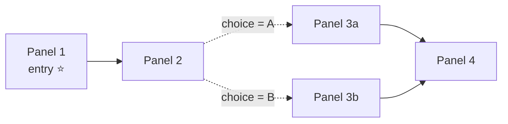

Every chapter of your work has a **flow graph**: the panels are the stations of your story, and **edges** are the arrows that tell the reader (and the player) which panel comes next. A chapter with one straight line of edges reads like a classic comic. As soon as a panel has *two or more* outgoing edges, your story branches.

The Graph Editor is where you see and shape that flow visually — as a map of connected nodes on a zoomable canvas.

<Callout kind="info">
New to branching stories? Read [Graph Navigation](/concepts/graph-navigation) first for the big picture, and see [the graph in the format reference](/schema/graph) if you want to know what is stored under the hood.
</Callout>

## Opening the Graph Editor

<Steps>
  <Step title="Open your work's Backstage">
    From the editor, switch to the Backstage area of your work. The Backstage sidebar lists all work-level tools.
  </Step>
  <Step title="Choose Graph Editor">
    Click **Graph Editor** in the sidebar. The graph opens full-screen with a toolbar at the top and the canvas below.
  </Step>
  <Step title="Pick a chapter">
    Use the **Chapter:** dropdown in the header to switch between chapters — each chapter has its own graph.
  </Step>
</Steps>

<Callout kind="tip">
A brand-new chapter shows *"This chapter has no graph yet. The graph will be automatically created when you add panels."* Add panels to the chapter first (see [Pages & Panels](/cms/editor/pages-panels)), then come back to shape the flow.
</Callout>

## Reading the map

Each **node** on the canvas is one panel of the chapter, labeled with the panel's title. The **Legend** (top right) explains the color coding:

| Element | Appearance | Meaning |
|---|---|---|
| Start Node | Green node | The chapter's entry panel — where reading begins |
| Panel Node | Blue node | A regular panel |
| End Node | Red node | A panel with no outgoing edges — the flow stops here |
| Unconditional edge | Solid green line | Always followed |
| Conditional edge | Dashed orange line | Only followed when its condition is true |

The **entry panel** is additionally marked with a star and an orange border. It is determined by the chapter itself (the panel where the chapter starts — normally the first panel in reading order); the Graph Editor displays it but you do not pick it here.

Two more helpers live on the canvas:

- **Minimap** (bottom right) — a bird's-eye view of the whole graph with your current viewport marked.
- **Footer** — a live count of nodes and edges, plus **Fit to View** and **Close** buttons.



## Moving around

| Action | How |
|---|---|
| Zoom | Mouse wheel, or the **+** / **−** zoom buttons (10%–300%, current level shown as a percentage) |
| Pan | Click and drag any empty spot on the canvas |
| Fit everything on screen | **Fit to View** button (or the maximize icon in the header) |
| Tidy up the layout | **Auto-Layout** button or press <kbd>L</kbd> |

**Auto-Layout** arranges the graph left-to-right by story depth, minimizing crossing lines — ideal after a chapter has grown messy. Node positions (both auto-laid-out and hand-dragged) are remembered per chapter in your browser, so the map looks the same the next time you open it.

## Selecting and arranging

- **Click a node** to select it. **Ctrl+Click** adds or removes nodes from a multi-selection; **Ctrl+A** selects all.
- **Drag a node** to reposition it (layout only — this never changes the story).
- **Click an edge** to select it; the **Edge** panel appears (see below). Node and edge selection are mutually exclusive.
- **Esc** clears the selection; **Delete** / **Backspace** removes what is selected.

When nodes are selected, an info panel (bottom left) lists them and reminds you of the keyboard commands.

<Callout kind="alert">
Deleting an **edge** permanently removes that connection from the story. Deleting a **node** only removes it and its connections from the graph view — the panel itself still exists and is managed in the [structure tree](/cms/editor/pages-panels).
</Callout>

## Creating branches (connecting panels)

To draw a new edge between two panels, use **connect mode**:

<Steps>
  <Step title="Select the source panel">
    Click the panel the reader will be coming *from* (or reach it with the arrow keys).
  </Step>
  <Step title="Press C">
    The info panel shows *"Connecting from … — arrow keys pick the target, Enter creates the edge, Esc cancels."*
  </Step>
  <Step title="Pick the target and confirm">
    Use the arrow keys to highlight the target panel, then press <kbd>Enter</kbd>. The new edge is created and saved to your work immediately.
  </Step>
</Steps>

New edges start out **unconditional** (solid green). Give a panel a second outgoing edge and you have a branch — then use conditions to decide which path each reader takes.

Connections are persisted as you make them; the **Save** button in the toolbar re-saves any connection that could not be stored right away (you'll see *Saving…* and then *"Graph saved successfully"*).

## Edge conditions

Select a single edge and the **Edge** panel opens (bottom left). It shows the route (*source → target*) and one field:

> **Condition (JSON Logic; empty = always follow)**

Leave it empty for an unconditional edge. Type a condition to make the edge conditional (it turns dashed orange). Conditions are written in **JSON Logic** — a small, safe rule format that reads almost like a sentence once you know the pattern. A rule always asks a question about your [story variables](/cms/editor/variables):

```json
{"==": [{"var": "choice"}, "A"]}
```

*"Is the variable `choice` equal to `"A"`?"* — if yes, the reader follows this edge.

More examples you can adapt:

```json
{">": [{"var": "trustLevel"}, 50]}
```

*Follow this edge when `trustLevel` is greater than 50.*

```json
{"and": [
  {"==": [{"var": "hasKey"}, true]},
  {">=": [{"var": "score"}, 100]}
]}
```

*Follow this edge when `hasKey` is true **and** `score` is at least 100.*

<Callout kind="tip">
A typical branch has one conditional edge per choice plus one unconditional edge as the fallback, so the reader can never get stuck. The Graph Editor's validation (below) warns you about dead ends. To learn how variables get their values in the first place, see [Variables & Conditions](/cms/editor/variables).
</Callout>

### Transitions and edge effects

The PanelWave format also lets an edge carry a **transition** (how the switch to the next panel is animated) and variable mutations. In the CMS you configure panel-to-panel transitions on the **Navigate (Go To Panel/Page)** action of a hotspot — with a **Transition Effect** of None, Fade, Slide, Zoom, or Crossfade — rather than in the Graph Editor. See [Hotspots](/cms/editor/hotspots).

## Simulating the flow

Press the **Simulate** button in the toolbar to walk through your story the way a reader would:

- The simulation starts at the entry panel and shows your **path so far** as a breadcrumb.
- Under **"Where to next?"** every outgoing edge of the current panel is listed as a button — conditional edges show their condition inline (*if …*).
- Click an option to follow it (the canvas selects that node), use **Step back** to retrace, and press <kbd>Esc</kbd> or the close button to stop.
- When you reach a panel with no outgoing edges, the panel reports *"End of flow — no outgoing edges."*

Prefer a text view? The **List** toggle renders the whole graph as a nested list in reading order (with *entry* and *end* badges) — every entry is clickable and it is fully screen-reader friendly.

<Callout kind="info">
The simulator walks the *structure* of the graph; it does not evaluate conditions against variable values. To test conditions with real values, use the variable overrides in [Preview](/cms/preview).
</Callout>

## Validation

The Graph Editor checks your flow continuously and shows a **Validation** panel (press <kbd>V</kbd> to re-run it, including deeper server-side checks). Issues come in three levels:

| Level | Example message | What it means |
|---|---|---|
| Error | `Entry node '…' does not exist` | The chapter's entry points at a missing panel — readers could not start. Must be fixed. |
| Warning | `2 node(s) are unreachable from the entry node` | Panels no path leads to — readers will never see them. |
| Warning | `1 cycle(s) detected in the graph` | The flow loops back on itself. Loops can be intentional, so this is only a heads-up. |
| Info | `1 isolated node(s) with no connections` | A panel with no edges at all. |
| Info | `2 node(s) have no outgoing edges` | Dead ends — fine if they are meant as endings. |

Clicking an issue highlights the affected nodes on the canvas. Some issues offer one-click **quick fixes**: **Auto-layout graph** (for unreachable nodes, so you can see them) and **Connect to entry node** (creates an edge from the entry to an orphaned panel).

When everything is clean you'll see: *"No issues found - graph is valid!"*

Work-wide checks (including unreachable flow nodes across the whole work) also run in [Validation / Preflight](/cms/validation) before publishing.

## Keyboard shortcuts

| Keys | Action |
|---|---|
| <kbd>←</kbd> <kbd>↑</kbd> <kbd>→</kbd> <kbd>↓</kbd> | Move the selection to the nearest node in that direction |
| <kbd>C</kbd> | Start connecting from the selected node |
| <kbd>Enter</kbd> | Create the pending connection |
| <kbd>Ctrl</kbd>+<kbd>A</kbd> | Select all nodes |
| <kbd>Delete</kbd> / <kbd>Backspace</kbd> | Delete the selection |
| <kbd>L</kbd> | Auto-layout |
| <kbd>V</kbd> | Run validation |
| <kbd>Esc</kbd> | Cancel connect mode / stop simulation / clear selection / close |

The full editor-wide reference lives on the [Keyboard Shortcuts](/cms/editor/shortcuts) page.

## Related pages

<Columns cols={3}>
  <Card title="Variables & Conditions" icon="variable" href="/cms/editor/variables">
    Define the variables your edge conditions test.
  </Card>
  <Card title="Graph Navigation" icon="route" href="/concepts/graph-navigation">
    How the player walks the graph at reading time.
  </Card>
  <Card title="Graph in the format" icon="braces" href="/schema/graph">
    The `graph`, `entry`, and `Edge` objects in the manifest.
  </Card>
</Columns>
