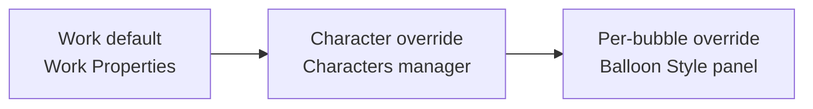

Speech bubbles carry your dialogue. In PanelWave they are real comic balloons — rendered by the same balloon engine the open-source player uses — so what you see in the editor is exactly what readers get. Balloons size themselves to their text automatically and inherit their look from a style cascade you control at three levels.

## Adding a bubble

<Steps>
  <Step title="Pick the Speech Bubble tool">
    Select **Speech Bubble** in the tool palette (shortcut `S`), or right-click the canvas and open the **Add Speech Bubble** submenu.
  </Step>
  <Step title="Click where the balloon should sit">
    A balloon appears at the click point, styled by your work's default balloon style, and the inline text editor opens immediately.
  </Step>
  <Step title="Type the dialogue">
    The balloon grows and shrinks live as you type. Press **Ctrl+Enter** (or **Cmd+Enter**) or click outside to commit; **Escape** cancels.
  </Step>
</Steps>

The right-click **Add Speech Bubble** submenu lists every balloon type directly — **Normal**, **Rectangle**, **Narrator**, **Thought**, **Shout**, **Whisper**, and **Connector** are placed at the click point, while the placement entries snap to the panel border for you:

- **Narrator Top / Narrator Top-Left / Narrator Top-Right** — a sharp-cornered narrator caption box, flush against the panel's top border (centered, in the left corner, or in the right corner), created without a tail.
- **Panel Top / Panel Top-Left / Panel Top-Right** — the corresponding *cut* balloon types, whose open cut edge sits exactly on the panel border.

To edit text later, **double-click the bubble** on the canvas — the inline editor reopens, using the balloon's own font and size. You can also edit the text in the Inspector's **Text** field.

## Moving, resizing, and the tail

With a bubble selected:

- **Drag the body** to move the balloon — its tail moves with it.
- **Drag a resize handle** to change the balloon's maximum width/height. The balloon still auto-sizes to its text within those limits, so it never clips your dialogue.
- **Drag the tail tip** to point the tail at a speaker. The editor converts your drag into the tail's angle and length, and the tail base stays attached to the balloon edge automatically.

Fine-grained tail settings (position angle, length, curve direction, curve amount) live in the **Balloon Style** panel described below.

<Callout kind="tip">
  When you drag a **Narrator** or **Panel Top** caption box, the panel border is **magnetic**: within a small distance the box snaps flush to the top or bottom edge, the left or right edge, or the horizontal center — so hitting the border by hand is easy.
</Callout>

## The ten balloon types

The **Type** dropdown in the Balloon Style panel offers ten shapes:

| Type | Use it for |
|---|---|
| **Normal** | Standard rounded speech balloon |
| **Rectangle** | Caption/dialogue box with slightly softened corners |
| **Narrator** | True sharp-cornered rectangle for narration caption boxes |
| **Panel Top** | Balloon cut flat along the panel's top edge |
| **Panel Top-Right** | Balloon tucked into the panel's top-right corner |
| **Panel Top-Left** | Balloon tucked into the panel's top-left corner |
| **Thought** | Cloud-style thought balloon |
| **Shout** | Jagged burst for yelling |
| **Whisper** | Dashed outline for quiet speech |
| **Connector** | Joined balloon segment for multi-balloon dialogue chains |

## Caption boxes stay on the border

The **Panel Top / Top-Left / Top-Right** types are glued to the panel's top border by definition — the cut edge *is* the border. The editor enforces this everywhere: in panel view, in page view, after text edits, and after switching device formats, the top edge always sits exactly on the panel border (corners additionally keep their side). Narrator boxes re-glue to whichever border edges they touch, but you can also place them freely anywhere in the panel.

## One work, many formats

Bubble geometry is stored **relative to the panel artwork** (the same normalized `shape` box the [format defines](/schema/speech-bubbles)), so a bubble keeps its position on every device format — author in DIN A4, and the balloon points at the same spot on the artwork in Square or Bigscreen layouts, in the editor and in the player.

Lettering size is handled **per format**: text keeps the same comfortable reading size on each target screen — unchanged in A4-sized formats, moderately larger on big screens, smaller on phone formats — instead of growing with the artwork. Balloons re-measure around their anchored position when you open a panel in another format, so captions never end up half-empty or overflowing. The open-source player applies the exact same rule at playback time (see [Balloon renderer](/player/balloon-renderer)), so what you letter is what readers get on every device.

In **page view**, panels are much smaller than in panel view, so balloons get a readability boost: they may grow until their text is comfortably legible at your current zoom, but never beyond three quarters of their panel, never below their authored size — and tail tips and glued border edges stay exactly where they belong.

## The style cascade

You rarely style bubbles one by one. A bubble's effective look is resolved through three levels, each overriding the one before:

1. **Work default** — in **Work Properties**, the **Speech Balloon Style (Work Default)** section defines the base style for every balloon in the work.
2. **Character override** — each character in the [Characters manager](/cms/characters) can carry its own balloon style. Assign a speaker to a bubble and the character's style applies on top of the work default.
3. **Per-bubble override** — anything you change in a bubble's **Balloon Style** panel is stored for that bubble only.

Only the fields you explicitly change are stored at each level. That means restyling the work default (or a character) instantly updates every bubble that didn't override that field — across the whole work, in the editor and in the published player output.

<Callout kind="tip">
  If a bubble has its own overrides, a **Reset to inherited style** button appears under the Balloon Style panel. Click it to drop all per-bubble changes and fall back to the character/work style.
</Callout>

## The Balloon Style panel

Select a bubble and open the Inspector's balloon tab. Under **Balloon Style** you get a live preview plus:

- **Type** — the ten balloon types above.
- **Roundness** — corner roundness slider (hidden for Rectangle, Thought, and Shout, which have fixed shapes).
- **Max Width** / **Max Height** — the size limits the auto-sizing works within.
- **Font** and **Font Size** — comic lettering fonts, grouped in the dropdown.
- **Fill** and **Stroke** colors, and **Border Width**.
- **Tail** — enable/disable, plus **Position** (0–359°, compass-style), **Length**, **Curve** (Straight / Curve Left / Curve Right), and **Curve Amount**.
- **Hide Border Segment** — hide part of the outline (set **Angle** and **Arc Width**), useful for balloons that bleed off a panel edge.
- **Reset to Defaults** — reset the panel's controls.

## Assigning a speaker

In the bubble's **Basic Properties**, the **Speaker** dropdown lists every character defined for the work (or **— None —**). Assigning a speaker:

- applies that character's balloon style (level 2 of the cascade), and
- shows the character's name as a small label above the bubble on the canvas, so you can see who says what at a glance.

If the dropdown is empty, add your cast in the [Characters manager](/cms/characters) first.

## Dialogue in multiple languages

Bubble text is localized. The Inspector's text field is labeled with the locale you are editing — for example **Text (en-US)** — and the locale switcher in the editor header changes which language you are writing. Enter each language's dialogue while that locale is active, or manage translations in bulk on the [Localization](/cms/localization) screen. Balloons re-measure per language, so longer translations still fit. See [Localization concepts](/concepts/localization) for how fallback locales work.

## Audio and TTS

The bubble's **Audio** section lets you attach an audio asset (voice acting) or click **Generate TTS** to create text-to-speech audio from the bubble text. See [Audio](/cms/editor/audio).

## Conditional bubbles

The **Visibility Condition** section (**Visible If** + **Build Condition**) shows or hides a bubble based on story variables — for example, only show a line if the reader made a certain choice. Conditions reference the variables you define in the [Variables designer](/cms/editor/variables); see [Variables concepts](/concepts/variables) for the underlying model.

## Related pages

<Columns cols={3}>
  <Card title="Characters" icon="users" href="/cms/characters">
    Define your cast and per-character balloon styles.
  </Card>
  <Card title="Speech bubbles in the format" icon="message-circle" href="/schema/speech-bubbles">
    How balloons are stored in the PanelWave manifest.
  </Card>
  <Card title="Balloon renderer" icon="pen-tool" href="/player/balloon-renderer">
    The open-source engine that draws every balloon.
  </Card>
</Columns>
