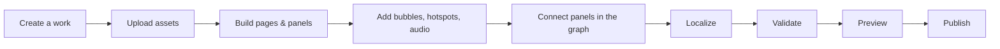

The PanelWave CMS is the authoring environment for interactive graphic novels. You create a **work**, build its chapters, pages, and panels in a visual editor, wire panels together in a navigation graph, translate it, and publish it as a [PanelWave manifest](/concepts/manifest) that the [PanelWave Player](/player/overview) renders for readers.

The CMS embeds the open-source player for previews, so what you see in **Preview** is exactly what readers get.

## The main areas of the app

After signing in you land on **My Works** — everything else is reached from there.

### My Works

The home screen at `/works`. Browse, search, and filter all your works, create new ones with the **Create New Work** wizard, import existing manifests, manage statuses, and open the Trash. See [Works](/cms/works).

### The Editor

Opening a work takes you to the visual editor, arranged in four zones:

- **Left sidebar** with three tabs: **Tree** (the structure of chapters, pages, and panels), **Assets** (your media library), and **Tools**.
- **Canvas** in the center, where you arrange artwork layers, speech bubbles, and hotspots on the selected panel or page.
- **Inspector** on the right with **Panel**, **Layer**, **Hotspot**, **Speech**, and **A11y** tabs for editing the selected element's properties.
- **Timeline** at the bottom for animations and audio tracks.

The editor header shows the save status (auto-save is enabled), undo/redo, a locale switcher, global search (<kbd>Cmd/Ctrl</kbd>+<kbd>K</kbd>), **Work Properties**, **Preview**, **Preflight**, and **Publish**. See [Editor Layout](/cms/editor/layout).

### Backstage

Every work also has a **Backstage** area — a set of management tools that sit outside the panel-by-panel editor. The Backstage sidebar ("Backstage Tools") links to:

| Tool | What it's for |
|---|---|
| **Editor** | Back to the visual editor |
| **Characters** | Your cast, portraits, and per-character balloon styles — [Characters](/cms/characters) |
| **Extras** | Bonus content such as covers, bonus art, interviews — [Extras](/cms/extras) |
| **Graph Editor** | The branching navigation graph between panels — [Graph](/cms/editor/graph) |
| **Preview** | The embedded player — [Preview](/cms/preview) |
| **Paywall** | Monetization rules — [Monetization](/cms/monetization) |
| **Entitlement** | Simulate what a reader with/without purchases sees |
| **Localization** | The translation workshop — [Localization](/cms/localization) |
| **Audio** | Per-locale voice audio and text-to-speech |
| **Validation** | Preflight checks before publishing — [Validation](/cms/validation) |
| **Analytics** | Reader metrics — [Analytics](/cms/analytics) |

### Account, Team, and Profile

The user menu (top right, on every screen) leads to **Profile**, **Settings**, and **Team**, plus theme and font toggles, keyboard shortcuts, help, and logout. See [Account & Team](/cms/account).

## From idea to published work

1. **Create a work** with the 3-step wizard — title, URL slug, languages, age rating, and tags. Optionally start from a template. See [Works](/cms/works).
2. **Upload your artwork** (and audio, video, fonts) into the Assets library. Files are processed automatically into optimized variants. See [Assets](/cms/assets).
3. **Build the structure**: add chapters, pages, and panels in the Tree tab, then compose each panel from layers on the canvas. See [Pages & Panels](/cms/editor/pages-panels) and [Layers](/cms/editor/layers).
4. **Add dialogue and interactivity**: speech bubbles (with [character](/cms/characters) styling), [hotspots](/cms/editor/hotspots), [animations](/cms/editor/animations), and [audio](/cms/editor/audio).
5. **Connect the story** in the [Graph Editor](/cms/editor/graph) — an entry panel plus edges, optionally with conditions for branching narratives.
6. **Localize** text and audio for every language you support. See [Localization](/cms/localization).
7. **Validate** with Preflight and fix any errors — errors block publishing. See [Validation](/cms/validation).
8. **Preview** the work in the embedded player, then **publish** it. See [Publishing](/cms/publishing) for the current state of the publish flow.

<Callout kind="tip">
New to PanelWave? Follow the step-by-step tutorial: [Your First Graphic Novel](/help-center/guides/first-graphic-novel).
</Callout>

## Where your content ends up

Everything you author is stored against the open [PanelWave format](/schema/overview). Publishing produces a `panelwave.json` manifest plus your processed assets; you can also [export](/cms/export) works and later [import](/cms/import) them again — there is no lock-in to the CMS.

<Columns cols={3}>
  <Card title="Works" icon="library" href="/cms/works">Create and manage your projects.</Card>
  <Card title="Editor" icon="square-pen" href="/cms/editor/layout">The four-zone visual editor.</Card>
  <Card title="Publishing" icon="rocket" href="/cms/publishing">Ship your work to readers.</Card>
</Columns>
