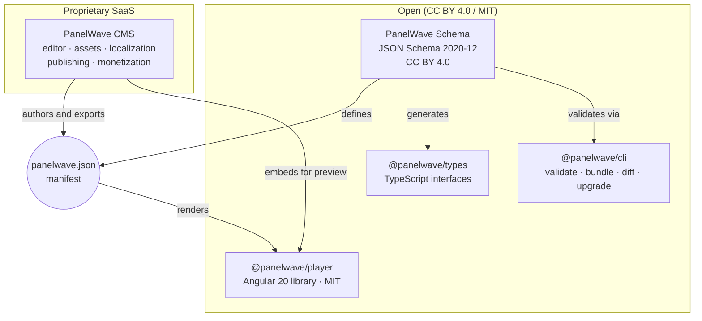

PanelWave is built around one central idea: **the format is the contract**. Everything else — the player, the CMS, the SDK packages — either produces or consumes manifests that conform to the PanelWave JSON Schema.

## The pieces



### Schema — the contract

The [JSON Schema](/schema/overview) (draft 2020-12) defines every object in a manifest: metadata, chapters, panels, layers, the navigation graph, assets, variables, paywall rules, tracking, and UI settings. It lives at:

```
https://panelwave.org/schema/1.0/panelwave.schema.json
```

Minor versions are additive and ship in-place inside the `1.0/` major-version directory — the current format version is **1.1**, and every valid 1.0 manifest remains valid. See [Versioning](/schema/versioning).

Because the schema is the single source of truth, a format change ripples outward deliberately: schema first, then `@panelwave/types`, then player and CMS. Consumers must tolerate unknown fields, and custom data is namespaced with `x-` prefixes (see [Extensions](/schema/extensions)) so third parties can extend manifests without breaking anyone.

### Player — the renderer

[`@panelwave/player`](/player/overview) is an MIT-licensed Angular 20 library. It loads a manifest URL and provides the complete reading experience: graph-based navigation with conditional edges, layered panels, SVG speech bubbles, hotspots, WebAudio mixing, video playback, localization with fallback chains, accessibility features, and paywall gates via a pluggable [entitlement adapter](/player/paywall-entitlement).

The player deliberately contains **all rendering logic**. Anything a reader sees is implemented once, in the player.

### CMS — the authoring tool

The [PanelWave CMS](/cms/overview) is a proprietary SaaS for creators. Its visual editor produces manifest content; its pipeline manages [assets](/cms/assets) (generating the variants the format expects), [localization](/cms/localization), [validation](/cms/validation), [publishing](/cms/publishing), [export](/cms/export), and [monetization](/cms/monetization).

Crucially, the CMS **embeds the open-source player** for preview rather than reimplementing rendering. This guarantees that what a creator sees in [Preview](/cms/preview) is exactly what readers get, and it keeps a single rendering codebase.

### SDK packages

Two npm packages support developers working with the format directly:

- **`@panelwave/types`** — TypeScript interfaces mirroring the schema, for type-safe manifest handling.
- **`@panelwave/cli`** — command-line `validate`, `bundle`, `diff`, and `upgrade` for manifests. See [CLI](/schema/cli).

## Open-core licensing

| Component | License | What that means |
|-----------|---------|-----------------|
| Schema (format + docs) | **CC BY 4.0** | Anyone may implement readers, writers, and tools for the format, with attribution. |
| Player, types, CLI | **MIT** | Free to use, embed, and modify — including in commercial products. |
| CMS | **Proprietary** | Commercial SaaS; the revenue side of the open-core model. |

The format does not impose any license on **content**: works you create in the PanelWave format remain yours.

## Data flow in practice

1. A creator authors a work in the CMS (or writes a manifest by hand / with tools).
2. The CMS exports a `panelwave.json` manifest plus its assets; the [CLI](/schema/cli) or CMS [validation](/cms/validation) checks it against the schema.
3. The player — embedded in a website, an app, or the CMS preview — loads the manifest, resolves [localized content](/concepts/localization) and [asset variants](/concepts/assets), and walks the [navigation graph](/concepts/graph-navigation) as the reader interacts.
4. Optional layers hook in at runtime: [variables](/concepts/variables) drive conditions, an entitlement adapter enforces [paywall rules](/concepts/monetization), and [tracking](/player/tracking) emits analytics events.

## Related pages

- [The manifest at a glance](/concepts/manifest)
- [Player architecture](/player/architecture) — services, components, data flow inside the player
- [Schema overview](/schema/overview) — the full format reference
