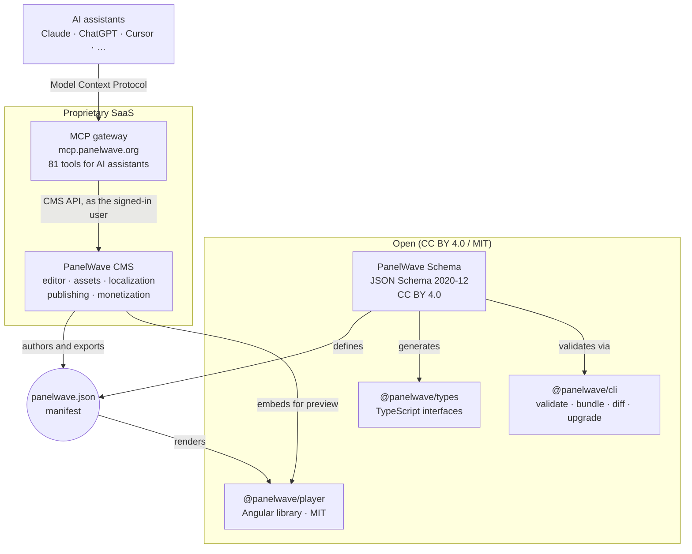

PanelWave is built around one central idea: **the format is the contract**. Everything else — the player, the CMS, the SDK packages — either produces or consumes manifests that conform to the PanelWave JSON Schema.

## The pieces


```mermaid
graph TD
    subgraph Open["Open (CC BY 4.0 / MIT)"]
        SCHEMA["PanelWave Schema<br/>JSON Schema 2020-12<br/>CC BY 4.0"]
        TYPES["@panelwave/types<br/>TypeScript interfaces"]
        CLI["@panelwave/cli<br/>validate · bundle · diff · upgrade"]
        PLAYER["@panelwave/player<br/>Angular library · MIT"]
    end
    subgraph Proprietary["Proprietary SaaS"]
        CMS["PanelWave CMS<br/>editor · assets · localization<br/>publishing · monetization"]
        MCP["MCP gateway<br/>mcp.panelwave.org<br/>81 tools for AI assistants"]
    end
    AI["AI assistants<br/>Claude · ChatGPT · Cursor · …"]
    MANIFEST(("panelwave.json<br/>manifest"))

    AI -->|Model Context Protocol| MCP
    MCP -->|CMS API, as the signed-in user| CMS

    SCHEMA -->|defines| MANIFEST
    SCHEMA -->|generates| TYPES
    SCHEMA -->|validates via| CLI
    CMS -->|authors and exports| MANIFEST
    MANIFEST -->|renders| PLAYER
    CMS -->|embeds for preview| PLAYER
```

### Schema — the contract

The [JSON Schema](/schema/overview) (draft 2020-12) defines every object in a manifest: metadata, chapters, panels, layers, the navigation graph, assets, variables, paywall rules, tracking, and UI settings. It is identified by the `$id`:

```
https://panelwave.org/schema/1.0/panelwave.schema.json
```

That URL is an identifier and is not publicly served yet; the file itself lives in the [panelwave/schema](https://github.com/panelwave/schema) repository on GitHub, and `@panelwave/cli` bundles a copy for offline validation.

Minor versions are additive and ship in-place inside the `1.0/` major-version directory — the current format version is **1.7**, and every valid 1.0 manifest remains valid. See [Versioning](/schema/versioning).

Because the schema is the single source of truth, a format change ripples outward deliberately: schema first, then `@panelwave/types`, then player and CMS. Consumers must tolerate unknown fields, and custom data is namespaced with `x-` prefixes (see [Extensions](/schema/extensions)) so third parties can extend manifests without breaking anyone.

### Player — the renderer

[`@panelwave/player`](/player/overview) is an MIT-licensed Angular library (Angular 20; 21 and 22 from player 1.2.0), published on [npm](https://www.npmjs.com/package/@panelwave/player) and developed in [panelwave/player](https://github.com/panelwave/player). It loads a manifest URL and provides the complete reading experience: graph-based navigation with conditional edges, layered panels, SVG speech bubbles, hotspots, WebAudio mixing, video playback, localization with fallback chains, accessibility features, and paywall gates via a pluggable [entitlement adapter](/player/paywall-entitlement).

The player deliberately contains **all rendering logic**. Anything a reader sees is implemented once, in the player.

### CMS — the authoring tool

The [PanelWave CMS](/cms/overview) is a proprietary SaaS for creators. Its visual editor produces manifest content; its pipeline manages [assets](/cms/assets) (generating the variants the format expects), [localization](/cms/localization), [validation](/cms/validation), [publishing](/cms/publishing), [export](/cms/export), and [monetization](/cms/monetization).

Crucially, the CMS **embeds the open-source player** for preview rather than reimplementing rendering. This guarantees that what a creator sees in [Preview](/cms/preview) is exactly what readers get, and it keeps a single rendering codebase.

### MCP gateway — the interface for AI assistants

The [MCP gateway](/cms/integrations/mcp-overview) at `https://mcp.panelwave.org/mcp` is part of the CMS. It speaks the open [Model Context Protocol](https://modelcontextprotocol.io), so any MCP client — Claude, ChatGPT, Cursor, Claude Code, VS Code — can create and manage works: from a script to a complete work in one call, bulk uploads and artwork attachment, lettering, the story graph, translation, validation and publishing. The [tool reference](/cms/integrations/tool-reference) lists all 81 tools.

The gateway adds no second set of rules. Every tool calls the CMS API **with the user's own sign-in**, so team roles, plan limits and validation apply exactly as in the editor. On top of that:

- **Permissions** — assistants connect through OAuth sign-in with a consent screen (or a personal access token for scripts) and only see the tools the granted permissions allow.
- **Confirmation** — anything destructive, such as deleting panels or publishing to production, needs the user's confirmation in the assistant's own dialog.
- **Audit and control** — every tool call is logged without its text, connections can be disconnected at any time, and the operators can pause the gateway platform-wide.

For files on the creator's computer, the open-source local bridge [`@panelwave/mcp`](https://www.npmjs.com/package/@panelwave/mcp) connects desktop assistants and uploads whole folders of artwork straight to storage. See [Local bridge](/cms/integrations/local-bridge).

### SDK packages

Three npm packages are developed together in the [panelwave/packages](https://github.com/panelwave/packages) monorepo. Two support developers working with the format directly, the third connects AI assistants:

- **[`@panelwave/types`](https://www.npmjs.com/package/@panelwave/types)** — TypeScript interfaces mirroring the schema, for type-safe manifest handling (`npm install @panelwave/types`).
- **[`@panelwave/cli`](https://www.npmjs.com/package/@panelwave/cli)** — command-line `validate`, `bundle`, `diff`, and `upgrade` for manifests (`npm install -g @panelwave/cli`). Its bundled schema copy is checked against panelwave/schema on every build. See [CLI](/schema/cli).
- **[`@panelwave/mcp`](https://www.npmjs.com/package/@panelwave/mcp)** — the local MCP bridge for desktop assistants: mirrors the hosted MCP gateway and adds sandboxed tools to read scripts and upload folders of artwork (`npx -y @panelwave/mcp`). See [Local bridge](/cms/integrations/local-bridge).

## Open-core licensing

| Component | License | What that means |
|-----------|---------|-----------------|
| Schema (format + docs) — [panelwave/schema](https://github.com/panelwave/schema) | **CC BY 4.0** | Anyone may implement readers, writers, and tools for the format, with attribution. |
| Player, types, CLI — [panelwave/player](https://github.com/panelwave/player), [panelwave/packages](https://github.com/panelwave/packages) | **MIT** | Free to use, embed, and modify — including in commercial products. |
| CMS | **Proprietary** | Commercial SaaS; the revenue side of the open-core model. |

The format does not impose any license on **content**: works you create in the PanelWave format remain yours.

## Data flow in practice

1. A creator authors a work in the CMS (or writes a manifest by hand / with tools).
2. The CMS exports a `panelwave.json` manifest plus its assets; the [CLI](/schema/cli) or CMS [validation](/cms/validation) checks it against the schema.
3. The player — embedded in a website, an app, or the CMS preview — loads the manifest, resolves [localized content](/concepts/localization) and [asset variants](/concepts/assets), and walks the [navigation graph](/concepts/graph-navigation) as the reader interacts.
4. Optional layers hook in at runtime: [variables](/concepts/variables) drive conditions, an entitlement adapter enforces [paywall rules](/concepts/monetization), and [tracking](/player/tracking) emits analytics events.

## Related pages

- [The manifest at a glance](/concepts/manifest)
- [Player architecture](/player/architecture) — services, components, data flow inside the player
- [Schema overview](/schema/overview) — the full format reference

