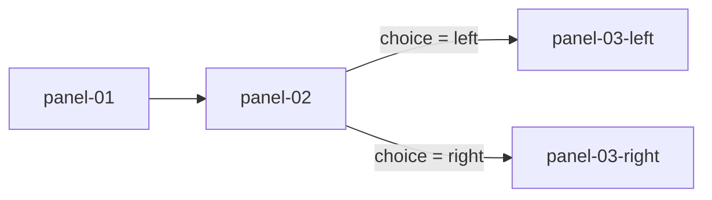

In PanelWave, a chapter's reading flow is not a page order — it is a **directed graph**. Panels are the nodes; **edges** define which panel can follow which, under what condition, and with what visual transition. The player's flow engine evaluates the graph at every step to decide where the reader can go next.

## Why a graph instead of linear pages?

- **Branching is native.** A choice is just two or more outgoing edges with different conditions — no special "decision page" construct.
- **Non-linearity stays consistent.** Loops, detours, optional scenes, and re-converging paths are all ordinary graph shapes; history and back-navigation still work.
- **Linear stories cost nothing.** A conventional comic is simply a chain of unconditional edges. You only pay for complexity where you use it.
- **State and flow compose.** Because edges can test [variables](/concepts/variables) and mutate them, the same graph can route differently on a second read-through.

## Anatomy of a graph

Each chapter has a `graph` with a required `entry` (the starting panel ID — or an array of candidate entry IDs) and a required list of `edges`:

```json
{
  "graph": {
    "entry": "panel-01",
    "edges": [
      { "from": "panel-01", "to": "panel-02" },
      {
        "from": "panel-02",
        "to": "panel-03-left",
        "condition": { "==": [{ "var": "story.choice" }, "left"] }
      },
      {
        "from": "panel-02",
        "to": "panel-03-right",
        "condition": { "==": [{ "var": "story.choice" }, "right"] }
      }
    ]
  }
}
```

That graph looks like this:



An edge supports these properties (full reference: [Graph](/schema/graph)):

| Property | Purpose |
|----------|---------|
| `from`, `to` | Panel IDs (required). |
| `condition` | JSON Logic expression; the edge is only available when it evaluates truthy. |
| `action` | List of variable [mutations](#mutations) applied when the edge is traversed. |
| `transition` | Visual transition for the panel change. |
| `priority` | Orders competing edges when several conditions match. |

## Conditions: a JSON Logic primer

Conditions are [JSON Logic](https://jsonlogic.com/) expressions — small JSON trees where the key is an operator and the value holds its arguments. Variables are read with `{ "var": "name" }`:

```json
{ "==": [{ "var": "story.choice" }, "left"] }
```

reads as *"story.choice equals the string `left`"*. Operators compose:

```json
{
  "and": [
    { ">=": [{ "var": "user.age" }, 16] },
    { "==": [{ "var": "prefs.explicit" }, true] }
  ]
}
```

Common operators: `==`, `!=`, `>`, `>=`, `<`, `<=`, `and`, `or`, `!`, `in`, `if`. The same condition language is used everywhere in the format — edges, [panel variants](/schema/variants), and conditional content — and is evaluated by the player against the current [variable state](/concepts/variables). See [State &amp; conditions in the player](/player/state-and-conditions).

An edge with **no** condition is always available. When multiple edges leave the same panel, the player evaluates their conditions and uses `priority` to break ties.

## Transitions

An edge can describe how the panel change looks:

```json
{ "type": "slide", "dir": "left", "durationMs": 500, "easing": "ease-in-out" }
```

- `type`: `none`, `cut`, `fade`, `slide`, `zoom`, `push`, or `cover`
- `dir`: `left`, `right`, `up`, `down` (for directional types)
- `durationMs`: 0–60000
- `easing`: `linear`, `ease`, `ease-in`, `ease-out`, `ease-in-out`

## Mutations

Traversing an edge (via `action`) or clicking a hotspot can **mutate variables**:

```json
{ "op": "set", "var": "story.choice", "value": "left" }
```

Operations: `set`, `increment`, `toggle`, `append`, `remove`. In practice, choices usually work like this: a [hotspot](/schema/hotspots) on the panel sets a variable (`goTo` actions can carry mutations too), and outgoing edges test that variable to route the reader. See [Variables](/concepts/variables) for scopes and lifetime.

## How the player walks the graph

1. The chapter opens at `entry`.
2. When the reader advances (tap, key, autoplay, or hotspot `goTo`), the flow engine collects the current panel's outgoing edges, evaluates each `condition`, and picks the winner (using `priority` if needed).
3. Edge `action` mutations are applied, the `transition` plays, and the target panel renders.
4. The step is pushed onto history, so back-navigation restores both position and state.

## Related pages

- [Graph schema reference](/schema/graph) — every property, with constraints
- [Hotspots](/schema/hotspots) — interactive regions and the `goTo` / `setVariables` actions
- [Editing the graph in the CMS](/cms/editor/graph) — the visual graph editor
- [Variables](/concepts/variables) — the state that conditions read
