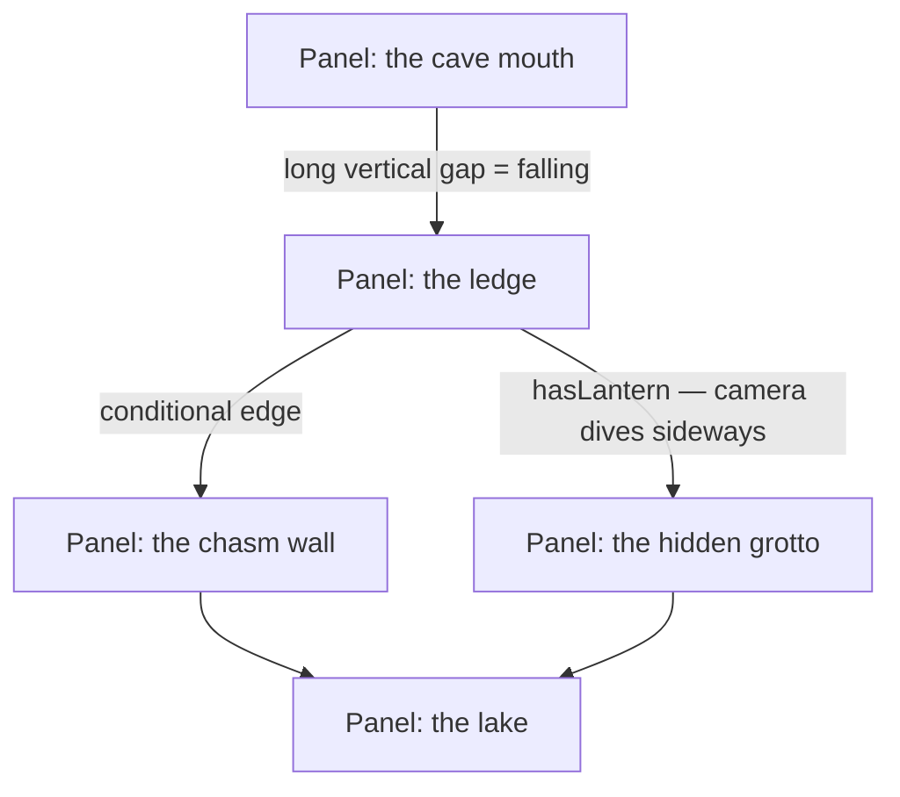

In print, the page is the mandatory unit of composition: every pacing and
layout decision is negotiated against its boundary. On a screen that
container is arbitrary. The **infinite canvas**¹ proposes treating the screen
as a **window**: all panels of a story live on one continuous plane, and the
reader's viewport travels across it.

PanelWave implements this idea natively since format **1.4**.

## Space is time

Comics already equate space with time — on the canvas, the *distance between
panels* becomes an expressive variable. Wide gaps slow the action; tightly
packed panels accelerate it. Panel size and shape follow only the story, and
the shape of the reading path itself can carry meaning: a long descent for a
fall, a sideways drift for a detour, a zoom for a revelation.

## The graph is the trail

Historical infinite-canvas experiments mostly failed on **navigation** —
readers got lost on the plane. PanelWave sidesteps this because the
[story graph](/concepts/graph-navigation) already defines what comes next:
the canvas only adds *where panels sit*. The camera follows edges, conditions
route it to different regions of the plane, and branching structure becomes
physically tangible — parallel timelines run as parallel columns, a secret
path sits visibly off the road, and hidden panels stay veiled until visited.

Two subsets of the same model:

| Layout shape | Result |
|---|---|
| One column, guided camera | A **webtoon-style vertical strip** — the proven mainstream format |
| Free 2D placement + camera trails | The **full infinite canvas** — a capability unique to graph-based comics |

## Where things live

- **Format** — [`Chapter.canvas`](/schema/canvas) holds world-space
  placements, camera policy, and decorations; `Edge.cameraMove` holds the
  travel choreography; `FormatPreset.canvasView` gates the mode per output
  format. Everything is additive: works without a canvas are untouched, and
  print always uses [pages](/schema/chapters-and-pages).
- **Player** — [canvas view](/player/canvas-view) renders the plane with a
  gliding camera, guided or free-roam input, an overview zoom, and full
  reduced-motion and screen-reader support.
- **CMS** — the [Canvas Layout Board](/cms/editor/canvas-layout) is the
  authoring surface: spatial placement, camera-move inspection with path
  ghosting, gap calipers for pacing, reveal modes, and decorations.

<Callout kind="tip">
  Start with the vertical strip. It ships a familiar, phone-friendly reading
  experience from the same data model — and you can grow individual chapters
  into full 2D canvases later without changing anything else about the work.
</Callout>

---

¹ The term *infinite canvas* was introduced by comics theorist Scott
McCloud, first sketched in a 1995 lecture and formalized in his book
*Reinventing Comics* (2000).
