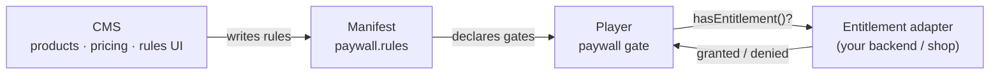

PanelWave separates the three questions of paid content across its three layers:

- **What is gated?** → paywall **rules** in the manifest (schema).
- **What can be bought?** → **products and pricing** in the CMS.
- **Does this reader have access?** → **entitlement checks** in the player, delegated to your backend via an adapter.

This split keeps the open format free of any payment provider, and the player free of any business logic.



## Paywall rules in the manifest

The optional top-level `paywall` section lists rules. Each rule names a **scope** — `work`, `chapter`, `panel`, or `extras` — and the **entitlement** a reader must hold:

```json
{
  "paywall": {
    "rules": [
      {
        "id": "rule-ch2",
        "scope": "chapter",
        "refId": "ch-02",
        "requireEntitlement": "chapter-2-unlock",
        "previewPanels": 3
      },
      {
        "id": "rule-mature",
        "scope": "work",
        "requireEntitlement": "full-access",
        "ageGate": 16
      }
    ]
  }
}
```

- `scope: "work"` gates the entire work (no `refId`); the other scopes require a `refId` pointing at the chapter, panel, or extras block.
- `requireEntitlement` is an opaque string — the format does not define what an entitlement *is*, only that content requires one.
- `previewPanels` lets a gated chapter show its first N panels as a teaser.
- `ageGate` adds an age verification requirement independent of purchase.

The manifest never contains provider IDs, checkout URLs, or secrets. Full property reference: [Paywall schema](/schema/paywall).

## Products and pricing in the CMS

Creators configure the commercial side in the CMS [Monetization area](/cms/monetization): define **products** (what readers buy), attach **prices**, and build **paywall rules** in a visual editor that references chapters, panels, and extras of the work. On publish/export, the CMS writes the corresponding `paywall.rules` into the manifest, so the open format stays in sync with the commercial configuration.

Rules authored in the CMS can also carry descriptive fields the schema reserves for this purpose (rule `name`, `entitlementType`, subscription tiers, an embedded display price) — metadata for storefront UI, not enforcement.

## Entitlement checks in the player

The player enforces rules but never decides them. It exposes an **`EntitlementAdapter`** interface; the host application supplies an implementation that talks to its own account/payment system:

- When the reader navigates toward gated content, the player asks the adapter whether the required entitlement is held.
- If **granted**, navigation proceeds normally.
- If **denied**, the player blocks the content and shows its paywall overlay (honoring `previewPanels` teasers), from which the host can launch its own purchase flow.
- Age gates prompt for verification independently of entitlements.

Two built-in adapters help during development: a null adapter (everything granted) and a mock adapter for simulating gates. How to implement and register an adapter: [Player paywall &amp; entitlement](/player/paywall-entitlement).

<Callout kind="info">
  Client-side gating is a UX layer, not a security boundary. For content that must not reach unentitled readers at all, keep it off the CDN until the reader is authorized — the manifest/asset delivery side must enforce that.
</Callout>

## The flow end to end

1. Creator defines products, prices, and rules in the [CMS](/cms/monetization).
2. Publish/export writes `paywall.rules` into the manifest ([schema reference](/schema/paywall)).
3. The player loads the manifest, maps rules onto the [navigation graph](/concepts/graph-navigation), and gates accordingly.
4. At each gate, the player queries the host's entitlement adapter ([player reference](/player/paywall-entitlement)); purchases happen in the host system, after which the adapter reports the new entitlement and the gate opens.

## Related pages

- [Paywall schema reference](/schema/paywall)
- [Player paywall &amp; entitlement](/player/paywall-entitlement)
- [CMS monetization](/cms/monetization)
- [Extras](/schema/extras) — bonus content, which can also be gated
