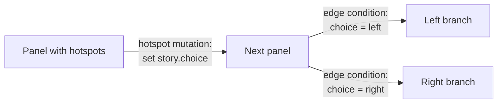

Variables are the state layer of a PanelWave work. They are **typed, declared up front** in the manifest, and read by every conditional feature in the format: graph edges, panel variants, conditional layers, and hotspot logic. Without variables, a work is static; with them, it remembers choices and adapts.

## Declaring variables

Variables live under the top-level `variables.definitions` array:

```json
{
  "variables": {
    "definitions": [
      { "id": "user.age", "type": "integer", "scope": "global", "default": 18, "readOnly": true },
      { "id": "prefs.hints", "type": "boolean", "scope": "persistent", "default": true },
      {
        "id": "story.choice",
        "type": "enum",
        "enum": ["door-left", "door-right", "none"],
        "scope": "chapter",
        "default": "none"
      }
    ]
  }
}
```

Each definition requires `id`, `type`, and `scope`:

- **`id`** — dot-namespaced name (e.g. `story.choice`, `user.age`). Conditions reference it verbatim.
- **`type`** — `boolean`, `number`, `integer`, `string`, `enum`, `date`, `time`, or `datetime`. Enum variables must list their allowed values in `enum`.
- **`default`** — the initial value (validated against the declared type).
- **`readOnly`** — the work cannot mutate it (useful for values the host application injects, like `user.age`).
- **`visibility`** — `public` (default) or `private`.

Full property reference: [Variables schema](/schema/variables).

## The five scopes

`scope` controls a variable's **lifetime** — when it resets:

| Scope | Lifetime | Typical use |
|-------|----------|-------------|
| `global` | The whole work, for the current reading session | Cross-chapter story state, injected user context |
| `chapter` | Resets when the reader enters a different chapter | Per-chapter choices and puzzle state |
| `page` | Resets when the reader leaves the current page | Transient interaction state within a page |
| `session` | The browser/app session | UI state that should not survive a restart |
| `persistent` | Saved across sessions | Reader preferences, unlocked content, completion flags |

The player's variable store enforces these lifetimes and persists `persistent` variables between visits (see [Saving progress](/player/saving-progress)).

## How variables drive behavior

### Edge conditions

Graph edges test variables with [JSON Logic](/concepts/graph-navigation#conditions-a-json-logic-primer) to route the reader:

```json
{
  "from": "panel-02",
  "to": "panel-03-left",
  "condition": { "==": [{ "var": "story.choice" }, "door-left"] }
}
```

### Panel variants

A [panel variant](/schema/variants) swaps or overrides panel content when its `when` condition matches — same panel node, different artwork or dialogue:

```json
{
  "id": "variant-injured",
  "when": { "==": [{ "var": "hero.injured" }, true] },
  "overrides": {
    "layers": [{ "kind": "image", "id": "bg", "assetId": "img-scene-injured", "z": 0 }]
  }
}
```

### Hotspot and edge mutations

Variables change through **mutations** — on hotspot actions (`goTo` with `mutations`, or a dedicated `setVariables` action) and on edge `action` lists:

```json
{
  "type": "goTo",
  "to": "panel-03",
  "mutations": [
    { "op": "set", "var": "story.choice", "value": "door-left" },
    { "op": "increment", "var": "stats.doorsOpened", "value": 1 }
  ]
}
```

Mutation operations: `set`, `increment`, `toggle`, `append`, `remove`.

## The choice pattern

The three pieces combine into the standard branching pattern:



1. **Declare** an enum variable for the choice.
2. **Mutate** it from hotspots (the reader clicks a door).
3. **Test** it on outgoing edges (the graph routes accordingly) or in panel variants (the artwork reflects it).

## Related pages

- [Variables schema reference](/schema/variables) — all properties and constraints
- [Graph navigation](/concepts/graph-navigation) — conditions and mutations on edges
- [State &amp; conditions in the player](/player/state-and-conditions) — the runtime variable store
- [Variables designer in the CMS](/cms/editor/variables) — defining variables visually
