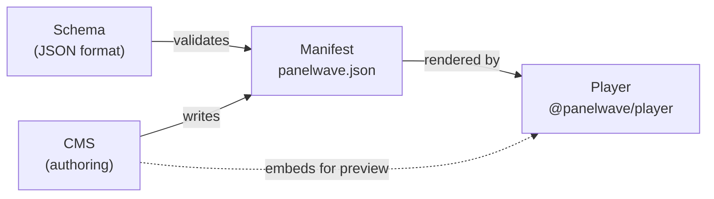

PanelWave is an ecosystem for building and publishing **interactive graphic novels**. Instead of a fixed sequence of pages, a PanelWave work is a **directed graph**: panels are nodes, and readers move between them along edges that can carry transitions and conditions. Panels themselves are composed of layered artwork, speech bubbles, hotspots, audio, and video — all described in a single JSON manifest.

## The three layers

PanelWave is open-core. The format and the player are open; the authoring tool is a commercial product built on top of them.

| Layer | What it is | License |
|-------|-----------|---------|
| **PanelWave Schema** | A JSON Schema (2020-12) that defines the manifest format — the single source of truth for the whole ecosystem. Current format version: **1.1**. | CC BY 4.0 |
| **PanelWave Player** | `@panelwave/player`, an Angular 20 library that loads a manifest and renders the full reading experience: graph navigation, layers, speech bubbles, hotspots, audio, video, localization, paywalls. | MIT |
| **PanelWave CMS** | A SaaS application for authoring and publishing works: a visual editor, asset pipeline, localization workflow, monetization, analytics, and export. It **embeds the open-source player** for preview, so what you see while authoring is what readers get. | Proprietary |

The layers connect through the manifest: the CMS *writes* manifests, the player *reads* them, and the schema *validates* both. Tooling for developers lives in two npm packages: `@panelwave/types` (TypeScript interfaces generated from the format) and `@panelwave/cli` (validate, bundle, diff, and upgrade manifests).

## What a manifest can express

- **Branching narratives** — edges with [JSON Logic conditions](/concepts/graph-navigation) route readers based on their choices and state.
- **Layered panels** — image, video, text, audio, and plugin layers with z-ordering and parallax.
- **Speech bubbles** — comic-book balloons rendered as SVG, with per-work, per-character, and per-bubble styling.
- **Hotspots** — clickable regions that navigate, set variables, open extras, or trigger plugins.
- **Localization** — every user-facing string is a [LocalizedString](/concepts/localization) keyed by BCP-47 locale, with fallback chains; assets can have per-locale variants.
- **Variables** — typed state in [five scopes](/concepts/variables) that drives conditions, panel variants, and mutations.
- **Monetization** — [paywall rules](/concepts/monetization) that gate the work, chapters, panels, or extras behind entitlements.

## Who this documentation is for

<Columns cols={2}>
  <Card title="Format &amp; Schema" icon="braces" href="/schema/overview">
    For developers building tools or readers, and advanced creators hand-editing manifests. Full reference for every object in the format, plus validation and the CLI.
  </Card>
  <Card title="Player" icon="play-circle" href="/player/overview">
    For developers embedding the player in an Angular app — installation, inputs and outputs, configuration — and for contributors who want to understand its architecture.
  </Card>
  <Card title="CMS" icon="pen-tool" href="/cms/overview">
    For graphic novel creators using the PanelWave CMS: the editor, assets, localization, publishing, monetization, and analytics — no coding required.
  </Card>
  <Card title="Help Center" icon="life-buoy" href="/help-center">
    FAQs, troubleshooting for common validation and embedding problems, and step-by-step guides.
  </Card>
</Columns>

## Where to start

- New to PanelWave? Read the [architecture overview](/concepts/architecture), then the [manifest at a glance](/concepts/manifest).
- Want to try it right now? Follow the [quickstart](/quickstart) — validate a manifest, embed the player, or create a work in the CMS in a few minutes each.
