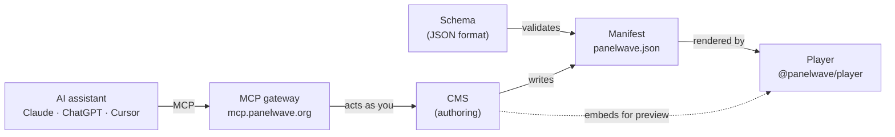

PanelWave is an ecosystem for building and publishing **interactive graphic novels**. Instead of a fixed sequence of pages, a PanelWave work is a **directed graph**: panels are nodes, and readers move between them along edges that can carry transitions and conditions. Panels themselves are composed of layered artwork, speech bubbles, hotspots, audio, and video — all described in a single JSON manifest.

## The three layers

PanelWave is open-core. The format and the player are open; the authoring tool is a commercial product built on top of them.

| Layer | What it is | License |
|-------|-----------|---------|
| **PanelWave Schema** | A JSON Schema (2020-12) that defines the manifest format — the single source of truth for the whole ecosystem. Current format version: **1.7**. | CC BY 4.0 |
| **PanelWave Player** | `@panelwave/player`, an Angular library that loads a manifest and renders the full reading experience: graph navigation, layers, speech bubbles, hotspots, audio, video, localization, paywalls. | MIT |
| **PanelWave CMS** | A SaaS application for authoring and publishing works: a visual editor, asset pipeline, localization workflow, monetization, analytics, and export. It **embeds the open-source player** for preview, so what you see while authoring is what readers get. | Proprietary |

The layers connect through the manifest: the CMS *writes* manifests, the player *reads* them, and the schema *validates* both. On top of the CMS sits the **MCP gateway**, which lets AI assistants do the authoring work with you (see [below](#working-with-ai-assistants)). Tooling for developers lives in three npm packages: [`@panelwave/types`](https://www.npmjs.com/package/@panelwave/types) (TypeScript interfaces mirroring the format), [`@panelwave/cli`](https://www.npmjs.com/package/@panelwave/cli) (validate, bundle, diff, and upgrade manifests) and [`@panelwave/mcp`](https://www.npmjs.com/package/@panelwave/mcp) (the local bridge that connects desktop AI assistants and uploads artwork folders).

```mermaid
graph LR
    A["AI assistant<br/>Claude · ChatGPT · Cursor"] -->|MCP| G["MCP gateway<br/>mcp.panelwave.org"]
    G -->|acts as you| C["CMS<br/>(authoring)"]
    S["Schema<br/>(JSON format)"] -->|validates| M["Manifest<br/>panelwave.json"]
    C -->|writes| M
    M -->|rendered by| P["Player<br/>@panelwave/player"]
    C -.->|embeds for preview| P
```

## What a manifest can express

- **Branching narratives** — edges with [JSON Logic conditions](/concepts/graph-navigation) route readers based on their choices and state.
- **Layered panels** — image, video, text, audio, and plugin layers with z-ordering and parallax.
- **Speech bubbles** — comic-book balloons rendered as SVG, with per-work, per-character, and per-bubble styling.
- **Hotspots** — clickable regions that navigate, set variables, open extras, or trigger plugins.
- **Localization** — every user-facing string is a [LocalizedString](/concepts/localization) keyed by BCP-47 locale, with fallback chains; assets can have per-locale variants.
- **Variables** — typed state in [five scopes](/concepts/variables) that drives conditions, panel variants, and mutations.
- **Monetization** — [paywall rules](/concepts/monetization) that gate the work, chapters, panels, or extras behind entitlements.

## Working with AI assistants

Creating an interactive graphic novel involves a lot of structured work around the art: breaking a script into chapters and panels, lettering hundreds of balloons, attaching artwork, wiring the story graph, translating, checking and publishing. PanelWave exposes all of it to AI assistants through the open [Model Context Protocol](https://modelcontextprotocol.io) (MCP), so you can hand that work to Claude, ChatGPT, Cursor or any other MCP client and keep your time for the creative decisions.

- **From script to work in one step.** The assistant reads your screenplay or outline and creates the chapters, pages, panels, characters and speech balloons. It shows you a dry run first.
- **Bulk work on a finished draft.** Upload a folder of panel art, attach each file to the right panel, rename a character everywhere, or letter many panels at once.
- **Languages and release.** Add languages, machine-translate and review, run the preflight checks with their automatic fixes, publish a review link for feedback, then publish.
- **Answers about your works.** "Which panels still have no artwork?" or "How did chapter 2 perform?"

The assistant always works **as you**: with your team role, your plan limits and only the permissions you granted when connecting. It asks before anything destructive, every action is logged, and you can disconnect it at any time. Start with [AI Assistants (MCP)](/cms/integrations/mcp-overview).

## Who this documentation is for

<Columns cols={2}>
  <Card title="Format &amp; Schema" icon="braces" href="/schema/overview">
    For developers building tools or readers, and advanced creators hand-editing manifests. Full reference for every object in the format, plus validation and the CLI.
  </Card>
  <Card title="Player" icon="play-circle" href="/player/overview">
    For developers embedding the player in an Angular app — installation, inputs and outputs, configuration — and for contributors who want to understand its architecture.
  </Card>
  <Card title="CMS" icon="pen-tool" href="/cms/overview">
    For graphic novel creators using the PanelWave CMS: the editor, assets, localization, publishing, monetization, and analytics — no coding required.
  </Card>
  <Card title="AI Assistants (MCP)" icon="bot" href="/cms/integrations/mcp-overview">
    For creators and teams who want Claude, ChatGPT, Cursor or another assistant to build, letter, translate and publish works with them — setup, permissions and every available tool.
  </Card>
  <Card title="Help Center" icon="life-buoy" href="/help-center">
    FAQs, troubleshooting for common validation and embedding problems, and step-by-step guides.
  </Card>
</Columns>

## Open source

The open layers are developed in public on GitHub under [github.com/panelwave](https://github.com/panelwave), and the libraries install from npm:

| Repository | Contents | npm | Current version | License |
|---|---|---|---|---|
| [panelwave/schema](https://github.com/panelwave/schema) | The JSON Schema (`1.0/panelwave.schema.json`) | — | Format 1.7.0 | CC BY 4.0 |
| [panelwave/player](https://github.com/panelwave/player) | The Angular player library and demo app ([live demo](https://panelwave.github.io/player/)) | [`@panelwave/player`](https://www.npmjs.com/package/@panelwave/player) | 1.2.0 | MIT |
| [panelwave/packages](https://github.com/panelwave/packages) | The SDK: TypeScript types, the CLI and the local MCP bridge for AI assistants | [`@panelwave/types`](https://www.npmjs.com/package/@panelwave/types), [`@panelwave/cli`](https://www.npmjs.com/package/@panelwave/cli), [`@panelwave/mcp`](https://www.npmjs.com/package/@panelwave/mcp) | types 1.2.0, cli 1.2.0 (format 1.7.0), mcp 0.1.0 | MIT |

Which format each release reads and writes: [Versioning → Current releases](/schema/versioning#current-releases).

Bug reports and contributions go to the issue tracker of the matching repository.

## Where to start

- New to PanelWave? Read the [architecture overview](/concepts/architecture), then the [manifest at a glance](/concepts/manifest).
- Want to try it right now? Follow the [quickstart](/quickstart) — validate a manifest, embed the player, or create a work in the CMS in a few minutes each.
- Have a script and finished artwork? [Connect an AI assistant](/cms/integrations/mcp-overview) and let it build the work with you.

