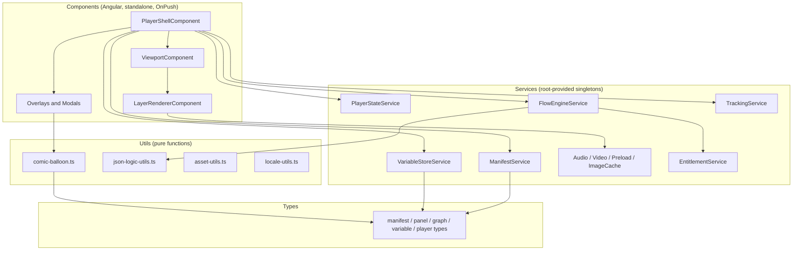
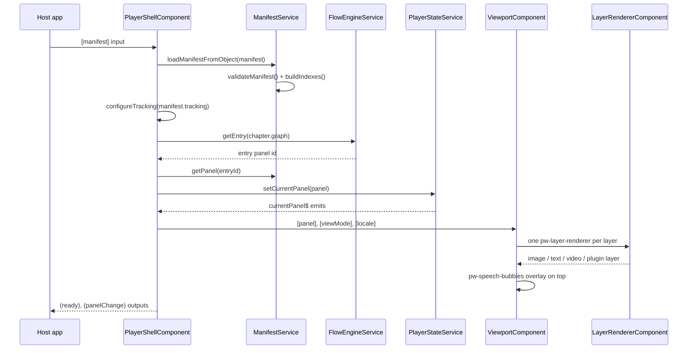

This page describes the internal architecture of `@panelwave/player` for contributors and developers doing deep integrations. If you just want to embed the player, start with [Installation](/player/installation) and [Embedding Quickstart](/player/quickstart-embed).

## Workspace layout

The player lives in an Angular CLI workspace with two projects:

| Project | Path | Purpose |
|---|---|---|
| `player` | `projects/player/` | The publishable library (`ng-packagr`, entry point `src/public-api.ts`) |
| `demo` | `projects/demo/` | A demo application used for local development (`npm start`) |

Inside the library, `projects/player/src/lib/` is organized into four layers:

```
src/lib/
├── types/        Pure TypeScript interfaces (manifest, panel, graph, variables, …)
├── utils/        Framework-free pure functions (ComicBalloon, JSON Logic, assets, locales)
├── services/     Injectable singletons (manifest, state, flow, media, tracking, …)
└── components/   Standalone Angular components (shell, viewport, layers, overlays, modals)
```



Key design rules:

- **Types have no dependencies.** Everything in `src/lib/types/` is interface-only and stays aligned with `@panelwave/types` and the [PanelWave schema](/schema/overview).
- **Utils are framework-free.** `comic-balloon.ts`, `balloon-config.ts`, `json-logic-utils.ts`, `asset-utils.ts`, `locale-utils.ts`, `video-config-utils.ts`, and `animation-utils.ts` are plain functions/classes with no Angular imports, which is what allows the [balloon renderer](/player/balloon-renderer) to be shared with the CMS.
- **Services are `providedIn: 'root'` singletons.** They own all cross-component state and side effects.
- **Components are standalone with `ChangeDetectionStrategy.OnPush`.** There are no NgModules; each component declares its own `imports`.

## State management

The player's runtime state is managed with **RxJS**, not with a state-management library and not with Angular signals:

- Services expose `BehaviorSubject`-backed observables (`PlayerStateService.currentPanel$`, `VariableStoreService.store`, `VideoControllerService.events$`, …).
- Components subscribe with `takeUntil(destroy$)` and hold plain fields for template binding under OnPush change detection.
- Preferences, tracking consent, and `persistent`-scope variables are persisted to `localStorage` (keys `pw-preferences`, `pw-tracking-consent`, `pw-variables-persistent`).

<Callout kind="info">
There are two `PlayerStateService` implementations in the source tree. The one exported from the public API and injected by `PlayerShellComponent` is `src/lib/services/player-state.service.ts` — a small store exposing `currentPanel$` and `locale$`. A richer store implementing the full `PlayerState` interface (overlays, preferences, viewport, event bus) exists at `src/lib/state/player-state.service.ts` but is currently **not exported and not wired into the shell**. When contributing, check which one your change targets.
</Callout>

## Data flow: from manifest to rendered panel



Step by step:

1. **Load.** The host passes a `PanelWaveManifest` object to `PlayerShellComponent` (the `manifestUrl` path exists as an input but URL loading is not implemented in the shell yet; `ManifestService.loadManifestFromUrl()` is available for hosts that fetch themselves).
2. **Validate and index.** `ManifestService` performs structural validation (required `panelwave.version`, `meta`, non-empty `chapters`, per-chapter `panels` and `graph.entry`) and builds `Map` indexes for panels, chapters, and assets so all later lookups are O(1).
3. **Initialize context.** If an entitlement adapter is provided, its context is written into the global variable scope. The initial locale is applied to both content (`PlayerStateService.setLocale`) and GUI strings (`TranslationService.setLanguage`). The manifest's `tracking` section configures `TrackingService` (consent requirement, event whitelist, endpoint).
4. **Navigate to entry.** The shell resolves the chapter's `graph.entry` via `FlowEngineService` and sets the current panel.
5. **Render.** `ViewportComponent` receives the current panel (or page, in page view) and renders each layer through `LayerRendererComponent`, which delegates to the type-specific layer components. `SpeechBubblesComponent` renders balloons on top using the [ComicBalloon engine](/player/balloon-renderer).
6. **Navigate onward.** User input (keys, swipes, toolbar, hotspots) triggers graph traversal through `FlowEngineService` with the current [variable context](/player/state-and-conditions).

## View modes

The player renders in one of two `ViewMode`s (`'panel' | 'page'`):

- **Panel view** (default): one panel at a time; navigation follows the chapter graph edge by edge.
- **Page view**: a whole comic page with its `layout.placements`; navigation moves page by page, and `Page.readingOrder` drives things like video sequencing. Page view is only offered when at least one chapter defines `pages`.

The shell owns the mode switch (`onToggleView()`) and re-arms autoplay and the video sequencer when it changes.

## Where to go next

<Columns cols={2}>
  <Card title="Core services" icon="server" href="/player/services">
    Responsibilities and public methods of every injectable service.
  </Card>
  <Card title="Component tree" icon="layout-grid" href="/player/components">
    What each component renders, from shell to helper widgets.
  </Card>
  <Card title="State & conditions" icon="git-branch" href="/player/state-and-conditions">
    Variables, JSON Logic, edges, and variant evaluation at runtime.
  </Card>
  <Card title="Performance" icon="zap" href="/player/performance">
    Preloading, image caching, and asset variant selection.
  </Card>
</Columns>
