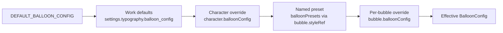

Speech bubbles in the player are drawn by **ComicBalloon**, a framework-free SVG renderer in `projects/player/src/lib/utils/comic-balloon.ts`, configured through helpers in `utils/balloon-config.ts` and driven by `SpeechBubblesComponent` (`pw-speech-bubbles`). For the manifest format of bubbles, see [Speech Bubbles](/schema/speech-bubbles).

## How a balloon is drawn

`ComicBalloon` is a plain TypeScript class — no Angular dependencies:

```typescript
import { ComicBalloon, createBalloon } from '@panelwave/player';

const balloon = new ComicBalloon(containerElement, {
  maxWidth: 140,
  fontSize: 12,
  strokeColor: '#000',
  fillColor: '#fff',
});
const result = balloon.render('HELLO WORLD!', { position: 180, length: 45 });
// result: { width, height, svg, balloon, update(), updateTail(), updateText() }
```

`render(text, tailOptions)` performs these steps:

1. **Measure the text** with a hidden, absolutely positioned `<div>` using the target font, size, and line height (text is rendered uppercase, matching classic comic lettering).
2. **Size the balloon** from the measured text plus padding (default 14/18/14/18 px), with extra padding for shout and thought shapes; `maxWidth`/`maxHeight` win when set.
3. **Compute the tail tip.** A tail can be given as absolute coordinates (`x`/`y`) or as `position` (degrees, 0° = top, 180° = bottom) plus `length`; the tail base is found on the balloon outline at that angle.
4. **Build the outline path.** The body is a *squircle* — a superellipse sampled at 180 points with exponent `n = 2 + (1 - cornerRadius) * 3`, so `cornerRadius: 1` is a pure ellipse and `cornerRadius: 0` becomes a rounded rectangle. Thought and shout types use their own path generators (`createThoughtBalloonPath`, `createShoutBalloonPath`).
5. **Integrate the tail into the outline** (except for thought balloons, which get a chain of three shrinking bubble circles instead). Tails can be `straight` or curved `left`/`right` using quadratic Béziers scaled by `curveAmount`.
6. **Emit SVG**: a `<path>` for the balloon (split into separate fill and stroke paths when needed), an optional `<clipPath>` for the hide-border effect, and a `<foreignObject>` containing the text `<div>` centered in the balloon.

The returned `BalloonRenderResult` exposes `update()`, `updateTail()`, and `updateText()` for cheap re-renders, plus the final `width`/`height` and the `SVGSVGElement`.

## The nine balloon types

`BalloonConfig.balloonType` selects the shape; `balloonConfigToRenderOptions()` maps it onto the renderer flags:

| Type | Rendering |
|---|---|
| `normal` | Squircle body with the configured `cornerRadius` |
| `rectangle` | Squircle with `cornerRadius` forced to `0` (rounded rectangle) |
| `thought` | Cloud outline with pseudo-random bumps; tail is three shrinking circles |
| `shout` | Jagged burst outline with randomized spikes; the tail replaces the nearest spike |
| `whisper` | Normal shape with a dashed stroke (`stroke-dasharray: 6 4`) |
| `cutTop` | Top edge flattened/clamped — for bubbles bleeding off the panel top |
| `cutTopRight` | Top and right edges clamped |
| `cutTopLeft` | Top and left edges clamped |
| `connector` | Open tail: fill stays closed but the stroke is left open at the tail, visually connecting two bubbles |

The pseudo-random bumps and spikes are seeded deterministically (`Math.sin`-based), so the same balloon always renders identically.

## Tails and the hide-border effect

Tail options (part of `BalloonConfig.tail`):

| Property | Meaning |
|---|---|
| `enabled` | Whether to draw a tail at all (connectors always get their open tail) |
| `position` | Angle on the outline in degrees (0 = top, 90 = right, 180 = bottom, 270 = left) |
| `length` | Distance from the balloon edge to the tail tip, in pixels |
| `curve` | `straight`, `left`, or `right` |
| `curveAmount` | Curvature strength (default `0.4`) |

`hideBorder` (`{ enabled, angle, arc }`) suppresses a segment of the outline stroke — an `arc`-degree window centered on `angle` is clipped away with an SVG `<clipPath>` polygon while the fill stays intact. Letterers use this where a bubble merges with the panel border or another bubble.

## The configuration cascade

The effective style of every bubble is computed in `SpeechBubblesComponent.resolveEffectiveConfig()` by merging four levels with `mergeBalloonConfig(base, override)` (a deep merge for the nested `tail` and `hideBorder` objects):



1. **Base**: the work-level config (`settings.typography.balloon_config`) merged onto `DEFAULT_BALLOON_CONFIG` (`normal` type, `cornerRadius: 0.5`, `maxWidth: 120`, `maxHeight: 80`, `'Ames Italic', sans-serif` at 12 px, 2 px black stroke, white fill, tail enabled at 180°/45 px) — partial work configs keep sane defaults for whatever they leave unset. When the `workBalloonConfig`/`characters` inputs are not bound, both are read from the loaded manifest via `ManifestService`.
2. **Character**: if the bubble has a `characterId` and that character defines `balloonConfig`, it is merged on top — this is how each character gets a consistent voice style.
3. **Named preset** (schema 1.3+): if the bubble sets `styleRef`, the matching entry from `settings.typography.balloonPresets` is merged next. Unknown names are ignored.
4. **Bubble**: the bubble's own `balloonConfig` override wins last.

The merged config is converted for the renderer with `balloonConfigToRenderOptions()` and `balloonConfigToTailOptions()` (which returns `null` when the tail is disabled and the type is not `connector`). All four symbols — `DEFAULT_BALLOON_CONFIG`, `mergeBalloonConfig`, `balloonConfigToRenderOptions`, `balloonConfigToTailOptions` — are exported from the public API.

## Rendering pipeline in the player

`SpeechBubblesComponent` renders bubbles imperatively (it owns a DOM container rather than templating each balloon):

- Localized text is resolved per bubble with locale fallback (exact locale → same base language → first available). Bubbles with no text for the current locale are skipped.
- Position comes from the bubble's normalized `shape` box (`x`/`y`/`w`/`h` in 0–1 coordinates) multiplied by the container size; the balloon is centered on the box center.
- Because the CMS stores the *measured* balloon size in the shape box, the natural-size SVG is scaled to `shape.w × containerWidth` with a CSS transform, clamped to 0.25–4× as protection against legacy geometry.
- Balloons are re-rendered on input changes and once more on `document.fonts.ready`, so late-arriving comic fonts cannot leave stale text measurements.
- Each balloon wrapper gets `role="img"`, an `aria-label` with the text, keyboard activation (Enter/Space), and click handling that emits `bubbleClick` and — when the bubble has an `audioAssetId` — `bubbleAudioPlay`.

## Why the renderer is shared with the CMS

The PanelWave CMS embeds this player for preview, but its **editor** draws balloons on a Canvas 2D surface (via `Path2D` built from the same public path generators: `createSquirclePath`, `createThoughtBalloonPath`, `createShoutBalloonPath`) and auto-sizes bubbles by running this renderer headless. The CMS therefore keeps a synchronized fork of `comic-balloon.ts` and the config model.

The sync policy (documented in the player repo at `docs/BALLOON_RENDERER_SYNC.md`):

- **The player copy is canonical.** Geometry changes — path formulas, the superellipse exponent, tail math, padding, dash patterns, hide-border behavior, `DEFAULT_BALLOON_CONFIG`, and the merge/converter functions — land in the player first and are ported to the CMS fork in the same change set. Any geometry divergence is a WYSIWYG bug: what a creator letters in the editor must match what readers see.
- **Editor-only surface stays in the CMS** (font registry, override diffing, tail-drag math) and must not be ported into the player.

<Callout kind="tip">
If you change anything in `utils/comic-balloon.ts` or `utils/balloon-config.ts`, run the drift check described in `docs/BALLOON_RENDERER_SYNC.md` and update the CMS fork in the same change set.
</Callout>
