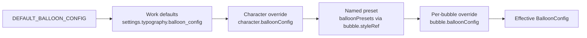

Speech bubbles in the player are drawn by **ComicBalloon**, a framework-free SVG renderer in `projects/player/src/lib/utils/comic-balloon.ts` (with its geometry helpers in `utils/balloon-geometry.ts`), configured through helpers in `utils/balloon-config.ts` and driven by `SpeechBubblesComponent` (`pw-speech-bubbles`). For the manifest format of bubbles, see [Speech Bubbles](/schema/speech-bubbles).

## How a balloon is drawn

`ComicBalloon` is a plain TypeScript class — no Angular dependencies:

```typescript
import { ComicBalloon, createBalloon } from '@panelwave/player';

const balloon = new ComicBalloon(containerElement, {
  maxWidth: 140,
  fontSize: 12,
  strokeColor: '#000',
  fillColor: '#fff',
});
const result = balloon.render('HELLO WORLD!', { position: 180, length: 45 });
// result: { width, height, svg, balloon, update(), updateTail(), updateText() }
```

`render(text, tailOptions)` performs these steps:

1. **Measure the text** with a hidden, absolutely positioned `<div>` using the target font, size, and line height (text is rendered uppercase, matching classic comic lettering).
2. **Size the balloon** from the measured text plus padding (default 14/18/14/18 px), with extra padding for shout and thought shapes; `maxWidth`/`maxHeight` cap the size when set. A value of `0` means "no cap" — the balloon takes its natural size in that direction.
3. **Compute the tail tip.** A tail can be given as absolute coordinates (`x`/`y`) or as `position` (degrees, 0° = top, 180° = bottom) plus `length`; the tail base is found on the balloon outline at that angle.
4. **Build the outline path.** The body is a *squircle* — a superellipse sampled at 180 points with exponent `n = 2 + (1 - cornerRadius) * 3`, so `cornerRadius: 1` is a pure ellipse and `cornerRadius: 0` becomes a rounded rectangle. Thought and shout types use their own path generators (`createThoughtBalloonPath`, `createShoutBalloonPath`).
5. **Integrate the tail into the outline** (except for thought balloons, which get a chain of three shrinking bubble circles instead). Tails can be `straight` or curved `left`/`right` using quadratic Béziers scaled by `curveAmount` (an explicit `0` draws a straight tail).
6. **Emit SVG**: a `<path>` for the balloon (split into separate fill and stroke paths when needed), an optional `<clipPath>` for the hide-border effect, and a `<foreignObject>` containing the text `<div>` centered in the balloon.

The returned `BalloonRenderResult` exposes `update()`, `updateTail()`, and `updateText()` for cheap re-renders, plus the final `width`/`height` and the `SVGSVGElement`. From the release after 1.2.0 it also reports `textOverflows`: `true` when the text needs more height than a non-zero `maxHeight` allows, so the text is cut off (the CMS uses it to warn about overflowing balloons).

## The ten balloon types

`BalloonConfig.balloonType` selects the shape; `balloonConfigToRenderOptions()` maps it onto the renderer flags:

| Type | Rendering |
|---|---|
| `normal` | Squircle body with the configured `cornerRadius` |
| `rectangle` | Squircle with `cornerRadius` forced to `0` (rounded rectangle with a subtle 8 px corner) |
| `narrator` | True rectangle with sharp 90° corners (`cornerRadius: 0` **plus** the `sharpCorners` render flag) — narration caption boxes |
| `thought` | Cloud outline with pseudo-random bumps; tail is three shrinking circles |
| `shout` | Jagged burst outline with randomized spikes; the tail replaces the nearest spike |
| `whisper` | Normal shape with a dashed stroke (`stroke-dasharray: 6 4`) |
| `cutTop` | Top edge flattened/clamped — for bubbles bleeding off the panel top |
| `cutTopRight` | Top and right edges clamped |
| `cutTopLeft` | Top and left edges clamped |
| `connector` | Open tail: fill stays closed but the stroke is left open at the tail, visually connecting two bubbles |

The pseudo-random bumps and spikes are seeded deterministically (`Math.sin`-based), so the same balloon always renders identically.

## Tails and the hide-border effect

Tail options (part of `BalloonConfig.tail`):

| Property | Meaning |
|---|---|
| `enabled` | Whether to draw a tail at all (connectors always get their open tail) |
| `position` | Angle on the outline in degrees (0 = top, 90 = right, 180 = bottom, 270 = left) |
| `length` | Distance from the balloon edge to the tail tip, in pixels |
| `curve` | `straight`, `left`, or `right` |
| `curveAmount` | Curvature strength (default `0.4`; `0` is honoured as no curvature) |

`hideBorder` (`{ enabled, angle, arc }`) suppresses a segment of the outline stroke — an `arc`-degree window centered on `angle` is clipped away with an SVG `<clipPath>` polygon while the fill stays intact. Letterers use this where a bubble merges with the panel border or another bubble.

## The configuration cascade

The effective style of every bubble is computed in `SpeechBubblesComponent.resolveEffectiveConfig()` by merging four levels with `mergeBalloonConfig(base, override)` (a deep merge for the nested `tail` and `hideBorder` objects):


```mermaid
graph LR
    D[DEFAULT_BALLOON_CONFIG] --> W[Work defaults<br/>settings.typography.balloon_config]
    W --> C[Character override<br/>character.balloonConfig]
    C --> P[Named preset<br/>balloonPresets via bubble.styleRef]
    P --> B[Per-bubble override<br/>bubble.balloonConfig]
    B --> R[Effective BalloonConfig]
```

1. **Base**: the work-level config (`settings.typography.balloon_config`) merged onto `DEFAULT_BALLOON_CONFIG` (`normal` type, `cornerRadius: 0.5`, `maxWidth: 120`, `maxHeight: 80`, `'Ames Italic', sans-serif` at 12 px, 2 px black stroke, white fill, tail enabled at 180°/45 px) — partial work configs keep sane defaults for whatever they leave unset. When the `workBalloonConfig`/`characters` inputs are not bound, both are read from the loaded manifest via `ManifestService`.
2. **Character**: if the bubble has a `characterId` and that character defines `balloonConfig`, it is merged on top — this is how each character gets a consistent voice style.
3. **Named preset** (schema 1.3+): if the bubble sets `styleRef`, the matching entry from `settings.typography.balloonPresets` is merged next. Unknown names are ignored.
4. **Bubble**: the bubble's own `balloonConfig` override wins last.

The merged config is converted for the renderer with `balloonConfigToRenderOptions()` and `balloonConfigToTailOptions()` (which returns `null` when the tail is disabled and the type is not `connector`). All four symbols — `DEFAULT_BALLOON_CONFIG`, `mergeBalloonConfig`, `balloonConfigToRenderOptions`, `balloonConfigToTailOptions` — are exported from the public API.

## Rendering pipeline in the player

`SpeechBubblesComponent` renders bubbles imperatively (it owns a DOM container rather than templating each balloon):

- Localized text is resolved per bubble with locale fallback (exact locale → same base language → first available). Bubbles with no text for the current locale are skipped.
- Position comes from the bubble's normalized `shape` box (`x`/`y`/`w`/`h` in 0–1 panel coordinates): the balloon anchors on the box center — and edges of the authored box that sit flush on the panel border stay **glued** to that border, so narrator and Panel-Top caption boxes keep sitting exactly on the edge at every screen size.
- Display size follows the **per-screen reading scale**, not the box: the natural-size SVG is scaled by the `readingScale` input (player viewport height relative to the DIN A4 authoring frame, 1123 px). Lettering keeps the same comfortable reading size on every screen — moderately larger on big displays, smaller on phones — instead of growing proportionally with the panel. The scale is capped so a balloon never exceeds its panel container (page view) and clamped to 0.25–4×.
- Balloons are re-rendered on input changes and once more on `document.fonts.ready`, so late-arriving comic fonts cannot leave stale text measurements.
- Each balloon wrapper gets `role="img"`, an `aria-label` with the text, keyboard activation (Enter/Space), and click handling that emits `bubbleClick` and — when the bubble has an `audioAssetId` — `bubbleAudioPlay`.

## Fonts and Ames Pro

Balloons are lettered with the font family their config names (`fontFamily`); the default is `'Ames Italic', sans-serif`. The open-licensed lettering fonts (SIL OFL 1.1 — Comic Neue, Bangers and others) ship with the package; include their CSS once as described in [Installation](/player/installation#application-setup).

**Ames Pro** (Blambot) is a commercial font, so it is handled differently depending on who runs the player:

| Where the work is read | Ames Pro |
|---|---|
| PanelWave's own players — the CMS [preview](/cms/preview) and [read.panelwave.org](/guides/publishing) | Loaded under PanelWave's license, which covers PanelWave's domains only |
| `@panelwave/player` from npm, and works exported from the CMS | **Not included** |
| Your own host | Only with your own license from [blambot.com](https://blambot.com) |

To use Ames in a work you host yourself, license it and add your own `@font-face` declarations for the families `'Ames Italic'`, `'Ames Bold Italic'` and `'Ames Regular'`. Without them, balloons fall back to **Comic Neue** (the engine's default font stack is `'Ames Italic', 'Comic Neue', sans-serif`).

## Why the engine is shared with the CMS

The PanelWave CMS embeds this player for preview, and its **editor** draws and auto-sizes balloons with the very same engine (on a Canvas 2D surface via `Path2D`, using the public path generators `createSquirclePath`, `createThoughtBalloonPath`, `createShoutBalloonPath`, and running the renderer headless for measurement). Any geometry difference between the two would be a WYSIWYG bug: what a creator letters in the editor must be exactly what readers see.

To rule that out, the engine exists as **one master copy with a synced copy**:

- **The CMS editor holds the master** — `comic-balloon.ts` and `balloon-geometry.ts` (tail tip ↔ compass config, squircle edge points, thought-trail circles). Balloons are designed and tested there.
- **The player holds a synced copy** of both files. They start with a *"SYNCED FROM panelwave-cms … DO NOT EDIT HERE"* banner; a sync script in the CMS repository copies them over, and a drift check reports any difference.
- **The config model stays in the player**: `balloon-config.ts` (`DEFAULT_BALLOON_CONFIG`, `mergeBalloonConfig`, `balloonConfigToRenderOptions`, `balloonConfigToTailOptions`) and the interfaces in `src/lib/types` are the player's own and follow the [format](/schema/speech-bubbles).

<Callout kind="tip">
Contributing a balloon **geometry** fix to the player? Change the behavior in [`comic-balloon.ts`](https://github.com/panelwave/player/blob/master/projects/player/src/lib/utils/comic-balloon.ts) in your pull request and say so in its description — maintainers land it in the CMS master and re-sync, so the fix reaches editor and reader together. A hand edit that isn't carried into the master is overwritten by the next sync.
</Callout>
