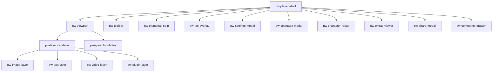

All components live under `projects/player/src/lib/components/`, are **standalone** (no NgModules), use the `pw-` selector prefix, and run with `ChangeDetectionStrategy.OnPush`. This page describes what each component renders and its role; for the injectable services behind them see [Core Services](/player/services).

## Tree at a glance

## Shell

### PlayerShellComponent (`pw-player-shell`)

`components/player-shell/` — the main orchestrator and the component hosts embed. It:

- loads the manifest via `ManifestService` (from the `manifest` input; the `manifestUrl` input exists but URL loading is not implemented in the shell yet),
- seeds entitlement context variables and configures `TrackingService` from `manifest.tracking`,
- owns navigation (`navigateNext`/`navigatePrevious`/`navigateToPanel`/`navigateToChapter`, page-view `navigateToNextPage`/`navigateToPreviousPage`) through `FlowEngineService`,
- owns the `'panel' | 'page'` view-mode switch and autoplay (wall-clock timer per panel, or media-driven advance for video panels via `VideoControllerService.passComplete$` and `VideoSequencerService.queueComplete`, with a stall watchdog),
- handles keyboard shortcuts (`ArrowLeft`/`ArrowRight` navigate, `T` toggles toolbar, `Escape` hides it) and swipe gestures forwarded by the viewport,
- toggles all modal/overlay visibility flags.

Key inputs: `manifest`, `manifestUrl`, `entitlementAdapter`, `locale`, `initialChapterId`, `initialPanelId`, `autoplay`, `secondsPerPanel`, `reducedMotion`, `showToolbar`. Key outputs: `ready`, `panelChange`, `chapterChange`, `localeChange`, `variableChange`, `navigationAttempt`, `error`. The full integrator-facing contract is documented in [Inputs & Outputs](/player/inputs-outputs).

## Viewport and layers

### ViewportComponent (`pw-viewport`)

`components/viewport/` — the rendering surface for the current panel (panel view) or page (page view, using `Page.layout.placements` and the `panels` map). Implements:

- mouse drag panning, touch panning, pinch zoom, and swipe detection (min 50 px within 300 ms), emitting `swipe`, `transformChange`, `navigatePrevious`/`navigateNext`,
- hover navigation arrows in the outer 15% zones and overflow indicators,
- optional viewport culling (`enableViewportCulling`) and lazy loading (`enableLazyLoading`),
- a `performanceMetrics` output (`renderTime`, panel counts, culled count, transform calculation time),
- passing `workBalloonConfig` and `characters` down to the speech-bubble overlay for the [balloon config cascade](/player/balloon-renderer#the-configuration-cascade).

### LayerRendererComponent (`pw-layer-renderer`)

`components/layer-renderer/` — renders exactly one manifest layer, switching on `layer.kind`, and applies positioning styles (`x`/`y`/`w`/`h`/`z`, defaulting to full-size). For video layers it resolves the effective play/start/muted configuration via `resolvePlayMode` / `resolveStartMode` / `resolveMuted` (`utils/video-config-utils.ts`, cascading layer → asset → `settings.ui` defaults) and forwards sequencing metadata (`panelId`, `placementId`, `readingOrderIndex`, placement z/y/x).

### Layer components (`components/layers/`)

| Component | Selector | Renders |
|---|---|---|
| `ImageLayerComponent` | `pw-image-layer` | An `` with loading/error states, base-URL resolution, lazy loading, and `object-fit` control |
| `TextLayerComponent` | `pw-text-layer` | Localized text layers |
| `VideoLayerComponent` | `pw-video-layer` | A `<video>` implementing the playback core: play modes `once`/`loop`/`pingpong`/`loop-from`, start modes `on-view`/`on-hover`/`on-click`, autoplay-policy handling (start muted until a user gesture, with an unmute affordance), reduced-motion degradation (`on-view` → `on-click`), pass-completion signaling, and registration with the page-view sequencer |
| `PluginLayerComponent` | `pw-plugin-layer` | Embeds plugin content in its own sandboxed `<iframe>` and exchanges `postMessage` traffic with it |

## Overlays (`components/overlays/`)

Overlays render on top of the viewport content:

| Component | Selector | Role |
|---|---|---|
| `SpeechBubblesComponent` | `pw-speech-bubbles` | Renders all of a panel's speech bubbles with the [ComicBalloon SVG engine](/player/balloon-renderer); resolves localized text, positions bubbles from normalized `shape` coordinates, re-renders when comic fonts finish loading, emits `bubbleClick` and `bubbleAudioPlay` |
| `HotspotsOverlayComponent` | `pw-hotspots-overlay` | Interactive clickable areas (`rect`, `circle`, `polygon`) with keyboard focus/activation; emits `hotspotClick`, `hotspotActivate`, `hotspotFocus` |
| `PaywallOverlayComponent` | `pw-paywall-overlay` | The paywall gate UI; emits `PaywallAction`s (see [Paywall & Entitlement](/player/paywall-entitlement)) |
| `AgeGateComponent` | `pw-age-gate` | Age verification prompt; emits an `AgeVerificationResult` |
| `ContentWarningOverlayComponent` | `pw-content-warning-overlay` | Content warning interstitial before gated content |
| `ThumbnailStripComponent` | `pw-thumbnail-strip` | Panel thumbnail navigation strip; emits navigation targets |

## Modals (`components/modals/`)

Modal dialogs opened from the toolbar; each has a visibility input and a close output managed by the shell:

| Component | Selector | Role |
|---|---|---|
| `TocOverlayComponent` | `pw-toc-overlay` | Table of contents; emits `{ chapterId, panelId? }` navigation targets |
| `SettingsModalComponent` | `pw-settings-modal` | Reader preferences (speech, audio, autoplay speed, accessibility) |
| `LanguageModalComponent` | `pw-language-modal` | Locale picker fed from `meta.locales` |
| `CharacterRosterComponent` | `pw-character-roster` | Character gallery mapped from `meta.characters` (portrait, name, bio) |
| `ExtrasViewerComponent` | `pw-extras-viewer` | Bonus content from the manifest's `extras` section |
| `ShareModalComponent` | `pw-share-modal` | Sharing options |
| `CommentsDrawerComponent` | `pw-comments-drawer` | Comments side drawer (UI surface; persistence is host-provided) |

## Toolbar

### ToolbarComponent (`pw-toolbar`)

`components/toolbar/` — the bottom control bar. Inputs reflect the current state (`locale`, `availableLocales`, `viewMode`, `pageViewAvailable`, `speechEnabled`, `audioEnabled`, `sfxEnabled`, `autoplayEnabled`, `secondsPerPanel`, `autoplayProgress`, `thumbnailsVisible`, `hasAlternatives`, `hasBranches`, `showSocial`); outputs fire one event per control (toggle view/speech/audio/SFX/autoplay, open ToC/settings/characters/extras/share/comments, locale change, thumbnails, like/bookmark). The shell shows it on viewport click and auto-hides it after 5 seconds. See [Reader Interface](/player/reader-interface) for the user-facing description.

## Helper components (`components/helpers/` and others)

| Component | Selector | Role |
|---|---|---|
| `PwIconComponent` | `pw-icon` | Inline SVG icon set used across all player UI |
| `TopHudComponent` | `pw-top-hud` | Top heads-up display showing work/chapter/panel titles and quick actions |
| `WaveFabComponent` | `pw-wave-fab` | Circular floating action button that toggles the toolbar |
| `ToastContainerComponent` | `pw-toast-container` | Transient toast notifications |
| `PluginSandboxComponent` | `pw-plugin-sandbox` | Sandboxed iframe host for a plugin instance, paired with `PluginHostService` |
| `VariantSelectorComponent` | `pw-variant-selector` | UI for manually cycling through variants during development/testing (pairs with `VariantService` manual overrides) |

## Public API exports

Only a subset of components is exported from `public-api.ts` for direct use by hosts: `PlayerShellComponent`, `PwIconComponent`, `SpeechBubblesComponent`, `PaywallOverlayComponent`, `AgeGateComponent`, `PluginSandboxComponent`, `VariantSelectorComponent`, and `VideoLayerComponent`. Everything else is an internal building block reached through the shell. If you need an internal component externally, export it deliberately through `public-api.ts` (see [Development](/player/development)).
