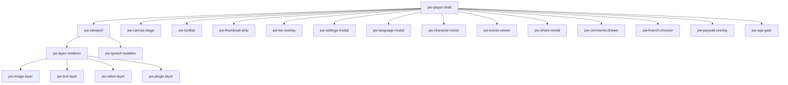

All components live under `projects/player/src/lib/components/`, are **standalone** (no NgModules), use the `pw-` selector prefix, and run with `ChangeDetectionStrategy.OnPush`. This page describes what each component renders and its role; for the injectable services behind them see [Core Services](/player/services).

## Tree at a glance

```mermaid
graph TD
    SHELL[pw-player-shell] --> VP[pw-viewport]
    SHELL --> CS[pw-canvas-stage]
    SHELL --> TB[pw-toolbar]
    SHELL --> TS[pw-thumbnail-strip]
    SHELL --> TOC[pw-toc-overlay]
    SHELL --> SET[pw-settings-modal]
    SHELL --> LANG[pw-language-modal]
    SHELL --> CHAR[pw-character-roster]
    SHELL --> EXT[pw-extras-viewer]
    SHELL --> SHARE[pw-share-modal]
    SHELL --> COM[pw-comments-drawer]
    SHELL --> BR[pw-branch-chooser]
    SHELL --> PW[pw-paywall-overlay]
    SHELL --> AG[pw-age-gate]
    VP --> LR[pw-layer-renderer]
    VP --> SB[pw-speech-bubbles]
    LR --> IL[pw-image-layer]
    LR --> TL[pw-text-layer]
    LR --> VL[pw-video-layer]
    LR --> PL[pw-plugin-layer]
```

## Shell

### PlayerShellComponent (`pw-player-shell`)

`components/player-shell/` — the main orchestrator and the component hosts embed. It:

- loads the manifest via `ManifestService` (`manifestUrl` over HTTP, or the `manifest` object),
- arms the paywall (`PaywallService` with the manifest's rules and the host's entitlement snapshot, restoring a stored age verification), seeds `initialVariables` and entitlement context variables, and configures `TrackingService` from `manifest.tracking`,
- restores the reader's like/bookmark for the work and resumes the bookmark when the host gives no start position,
- owns navigation (`navigateNext`/`navigatePrevious`/`navigateToPanel`/`navigateToChapter`, page-view `navigateToNextPage`/`navigateToPreviousPage`) through `FlowEngineService` (`getNextInChapter` / `getPreviousInChapter`, so chapters without edges follow their reading order),
- owns the `'panel' | 'page' | 'canvas'` view-mode switch and autoplay (wall-clock timer per panel — the author's `durationMs` or the reader's speed, summed over the page in page view — or media-driven advance for video panels via `VideoControllerService.passComplete$` and `VideoSequencerService.queueComplete`, with a stall watchdog),
- picks page view's page sequence for the screen (`pageFormat`, re-picked on window resize) and shows the work's cover before the first panel (`showCover`),
- feeds the viewport its reading-order look-ahead (`preloadTargets`) and warms the first panel or page while the cover is up,
- handles keyboard shortcuts (`ArrowLeft`/`ArrowRight` navigate, `T` toggles toolbar, `O`/`+`/`-` in canvas view, `Escape` closes the topmost dialog or else hides the toolbar — with a dialog open, the other shortcuts are ignored) and swipe gestures forwarded by the viewport,
- derives the effective reduced-motion state (host input, reader setting, live OS media query) and passes it to the viewport and canvas stage,
- raises the paywall overlay or age gate when a navigation hits a locked panel (the entry panel on load included) or a page-view lock placeholder is activated, resumes the interrupted navigation after a passed age gate, keeps a locked panel's audio silent, and turns `PaywallService` enforcement off while a host `entitlementAdapter` decides access,
- computes the branch choices (outgoing edges whose conditions pass) for the Choices button, shown only when at least two are open, and traverses the chosen edge,
- toggles all modal/overlay visibility flags.

Key inputs: `manifestUrl`, `manifest`, `locale`, `initialChapterId`, `initialPanelId`, `initialVariables`, `entitlementSnapshot`, `entitlementEndpoint`, `readerToken`, `entitlementAdapter`, `viewModeOverride`, `pageFormat`, `showCover`, `reducedMotion`, `secondsPerPanel`, `autoplay`, `showToolbar` — all of them may change after init (`ngOnChanges`: a new manifest reloads via the public `reload()`, the rest apply live; `showCover` and the initial-position inputs are read on load). Key outputs: `ready`, `panelChange`, `chapterChange`, `localeChange`, `variableChange`, `navigationAttempt`, `cameraChange`, `paywallAction`, `ageVerified`, `likeChange`, `bookmarkChange`, `error`. The full integrator-facing contract is documented in [Inputs & Outputs](/player/inputs-outputs).

## Viewport and layers

### ViewportComponent (`pw-viewport`)

`components/viewport/` — the rendering surface for the current panel (panel view) or page (page view, using `Page.layout.placements` and the `panels` map). Implements:

- mouse drag panning, touch panning, pinch zoom, and swipe detection (min 50 px within 300 ms), emitting `swipe`, `transformChange`, `navigatePrevious`/`navigateNext`,
- hover navigation arrows in the outer 15% zones and overflow indicators,
- optional viewport culling (`enableViewportCulling`) and lazy loading (`enableLazyLoading`),
- a `performanceMetrics` output (`renderTime`, panel counts, culled count, transform calculation time),
- the locked placeholder (`pw-locked-panel-placeholder`) in place of any panel that is an `x-locked` stub or that `PaywallService.isPanelLocked()` reports, repainted on `PaywallService.changes$`; in page view the placeholder is a button whose activation emits `lockedPanelActivate` (the panel id) so the shell can raise that panel's gate,
- page view's page box in the page's format aspect ratio (`pageAspectRatio`), filling the screen,
- warming the out-edge targets (panel view) and the host's `preloadTargets` (`{ panelId, panel, widthFraction? }[]`, both views) at the image variant each will render at,
- passing `workBalloonConfig` and `characters` down to the speech-bubble overlay for the [balloon config cascade](/player/balloon-renderer#the-configuration-cascade).

### LayerRendererComponent (`pw-layer-renderer`)

`components/layer-renderer/` — renders exactly one manifest layer, switching on `layer.kind`, and applies positioning styles (`x`/`y`/`w`/`h`/`z`, defaulting to full-size). For video layers it resolves the effective play/start/muted configuration via `resolvePlayMode` / `resolveStartMode` / `resolveMuted` (`utils/video-config-utils.ts`, cascading layer → asset → `settings.ui` defaults) and forwards sequencing metadata (`panelId`, `placementId`, `readingOrderIndex`, placement z/y/x). Image layers of the panel currently on screen (`viewActive`) load eagerly with `fetchpriority="high"`; every other panel's artwork loads lazily.

### Layer components (`components/layers/`)

| Component | Selector | Renders |
|---|---|---|
| `ImageLayerComponent` | `pw-image-layer` | An `` with loading/error states, base-URL resolution, lazy loading, and `object-fit` control |
| `TextLayerComponent` | `pw-text-layer` | Localized text layers |
| `VideoLayerComponent` | `pw-video-layer` | A `<video>` implementing the playback core: play modes `once`/`loop`/`pingpong`/`loop-from`, start modes `on-view`/`on-hover`/`on-click`, autoplay-policy handling (start muted until a user gesture, with an unmute affordance), reduced-motion degradation (`on-view` → `on-click`), pass-completion signaling, and registration with the page-view sequencer |
| `PluginLayerComponent` | `pw-plugin-layer` | Embeds plugin content in its own sandboxed `<iframe>` and exchanges `postMessage` traffic with it |

## Overlays (`components/overlays/`)

Overlays render on top of the viewport content:

| Component | Selector | Role |
|---|---|---|
| `SpeechBubblesComponent` | `pw-speech-bubbles` | Renders all of a panel's speech bubbles with the [ComicBalloon SVG engine](/player/balloon-renderer); resolves localized text, positions bubbles from normalized `shape` coordinates, scales lettering per screen (`readingScale`), re-renders when comic fonts finish loading, emits `bubbleClick` and `bubbleAudioPlay` |
| `HotspotsOverlayComponent` | `pw-hotspots-overlay` | Renders a panel's [hotspots](/schema/hotspots) from their normalized manifest geometry (`rect`, `circle`, `polygon`), filters them by `visibleIf` against the current variables, resolves localized labels/`ariaLabel`s, and shows a gentle pulse indicator (respecting reduced motion). Click and keyboard activation (`Enter`/`Space` at the shape centroid) emit `hotspotActivate` with normalized coordinates; the shell executes the action and records the click. In canvas view only the current panel's overlay is interactive; the stage re-emits its activations with the panel id |
| `PaywallOverlayComponent` | `pw-paywall-overlay` | The paywall gate UI; emits `PaywallAction`s (see [Paywall & Entitlement](/player/paywall-entitlement)) |
| `AgeGateComponent` | `pw-age-gate` | Birth-date prompt for age-gate rules (rejects impossible dates); emits an `AgeVerificationResult` |
| `ContentWarningOverlayComponent` | `pw-content-warning-overlay` | Content warning interstitial before gated content |
| `ThumbnailStripComponent` | `pw-thumbnail-strip` | Panel thumbnail navigation strip: the cover, then per chapter a title card and its panels in reading order, each with a small rendition of its artwork (`panelThumbnailSrc`); locked panels show a lock instead. Scrolls to the current panel (page view: highlights the current page's panels); emits `{ chapterId, panelId, cover? }` navigation targets |

## Modals (`components/modals/`)

Modal dialogs opened from the toolbar (or by a hotspot action); each has a visibility input and a close output managed by the shell:

| Component | Selector | Role |
|---|---|---|
| `TocOverlayComponent` | `pw-toc-overlay` | Table of contents: the cover, then chapters with their pages (only those of the active `pageFormat`) or panels, with panel artwork thumbnails (none for locked panels); emits `{ chapterId, panelId?, cover? }` navigation targets |
| `SettingsModalComponent` | `pw-settings-modal` | Reader preferences (speech, audio, autoplay speed, accessibility) and public variables; edits a working copy that Save commits and Cancel/Escape discards |
| `LanguageModalComponent` | `pw-language-modal` | Locale picker fed from `meta.locales` |
| `CharacterRosterComponent` | `pw-character-roster` | Character gallery mapped from `meta.characters` (portrait, name, bio) |
| `ExtrasViewerComponent` | `pw-extras-viewer` | Bonus content from the manifest's `extras` section, with media resolved through the asset catalog (`utils/extras-utils.ts`): images with thumbnails, videos with posters, audio, PDF/text documents; a type filter; an `initialExtraId` input opens a specific item (used by the `openExtras` hotspot action) |
| `BranchChooserComponent` | `pw-branch-chooser` | Lists the outgoing edges whose conditions pass (`choices: BranchChoice[]`) and emits the chosen one |
| `ActionModalComponent` | `pw-action-modal` | Simple localized title + content dialog opened by the `openModal` hotspot action (plain text — manifest content is never rendered as HTML) |
| `ShareModalComponent` | `pw-share-modal` | Sharing options (native share sheet where available, copy link otherwise) |
| `CommentsDrawerComponent` | `pw-comments-drawer` | Comments side drawer (UI surface; persistence is host-provided) |

## Toolbar

### ToolbarComponent (`pw-toolbar`)

`components/toolbar/` — the bottom control bar. Inputs reflect the current state (`locale`, `availableLocales`, `viewMode`, `pageViewAvailable`, `speechEnabled`, `audioEnabled`, `sfxEnabled`, `autoplayEnabled`, `secondsPerPanel`, `autoplayTiming` (`'author' | 'manual'`), `autoplayProgress`, `thumbnailsVisible`, `hasAlternatives`, `hasBranches`, `showSocial`); plus `liked` / `bookmarked` for the highlighted state; outputs fire one event per control (toggle view/speech/audio/SFX/autoplay, open ToC/settings/characters/extras/share/comments, show branches, cycle alternatives, locale change, thumbnails, like/bookmark; `secondsPerPanelChange` and `autoplayTimingChange` for the autoplay speed and the Author button). All labels go through ngx-translate. The shell shows it on viewport click and auto-hides it after 5 seconds; while it is hidden, the shell's own floating button (the PanelWave icon, bottom right) opens it. See [Reader Interface](/player/reader-interface) for the user-facing description.

## Helper components (`components/helpers/` and others)

| Component | Selector | Role |
|---|---|---|
| `PwIconComponent` | `pw-icon` | Inline SVG icon set used across all player UI |
| `TopHudComponent` | `pw-top-hud` | Top heads-up display showing work/chapter/panel titles and quick actions |
| `LockedPanelComponent` | `pw-locked-panel-placeholder` | `components/locked-panel/` — the lock placeholder of a locked panel (`player.locked.*` texts), used by the viewport and the canvas stage. `actionable` turns it into a button (click, `Enter`, `Space`) that emits `activate` |
| `WaveFabComponent` | `pw-wave-fab` | Circular floating action button that toggles the toolbar |
| `ToastContainerComponent` | `pw-toast-container` | Transient toast notifications |
| `PluginSandboxComponent` | `pw-plugin-sandbox` | Sandboxed iframe host for a plugin instance, paired with `PluginHostService` |
## Public API exports

Only a subset of components is exported from `public-api.ts` for direct use by hosts: `PlayerShellComponent`, `PwIconComponent`, `CanvasStageComponent`, `SpeechBubblesComponent`, `HotspotsOverlayComponent`, `ActionModalComponent`, `BranchChooserComponent`, `PaywallOverlayComponent`, `AgeGateComponent`, `PluginSandboxComponent`, and `VideoLayerComponent`. Everything else is an internal building block reached through the shell. If you need an internal component externally, export it deliberately through `public-api.ts` (see [Development](/player/development)).

