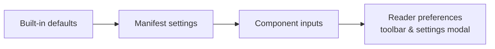

Player behavior is configured on two levels:

1. **Integrator inputs** on `pw-player-shell` — set in your template, per embed.
2. **Manifest settings** — authored into the work (`settings`, `tracking`, `ui` sections), so the same embed behaves per-work.

When both exist for the same concern, the component input represents the reader/integrator side (e.g. the initial locale), while the manifest declares the creator's defaults.

## Component inputs (`pw-player-shell`)

These are all the `@Input()`s the shell accepts (verified in `PlayerShellComponent`):

| Input | Type | Default | Purpose |
|---|---|---|---|
| `manifest` | `PanelWaveManifest` | — | The manifest object to render. **Preferred way to load a work.** |
| `manifestUrl` | `string` | — | URL to a manifest. *Currently not implemented in the shell — passing only a URL produces an error. Fetch the JSON yourself and use `manifest`.* |
| `entitlementAdapter` | `EntitlementAdapter` | — | Hook for paywall/entitlement checks; see [Paywall & Entitlement](/player/paywall-entitlement). |
| `locale` | `LocaleCode` | `'en-US'` | Initial content locale (BCP-47). Also sets the player UI language (mapped to its base language). |
| `initialChapterId` | `string` | — | Start at this chapter instead of the first one. |
| `initialPanelId` | `string` | — | Start at this panel (requires `initialChapterId`). |
| `autoplay` | `boolean` | `false` | Reserved autoplay flag. *Note: in the current build, autoplay is started by the reader via the toolbar; this input does not auto-start it.* |
| `secondsPerPanel` | `number` | `5` | Autoplay dwell time per panel when the panel has no own `durationMs`. Reader-adjustable in the toolbar (0.5–120 s). |
| `reducedMotion` | `boolean` | `false` | Force reduced motion (also honored automatically from the OS `prefers-reduced-motion` setting for video autostart decisions). |
| `showToolbar` | `boolean` | `false` | Show the toolbar initially. Readers can always toggle it (`T`, floating button, viewport click). |

Example with several inputs:

```html
<pw-player-shell
  [manifest]="manifest"
  [locale]="'de-DE'"
  [initialChapterId]="'ch-2'"
  [secondsPerPanel]="8"
  [reducedMotion]="prefersCalm"
  [showToolbar]="true"
  [entitlementAdapter]="entitlements">
</pw-player-shell>
```

For the outputs and public methods, see [Inputs & Outputs](/player/inputs-outputs).

<Callout kind="info">
The public API also exports a `PlayerOptions` interface (`allowComments`, `allowSocial`, `theme`, `debug`, `className`, `enableKeyboard`, `enableTouch`). It is a type-level definition for future use — the shell does **not** currently consume it. Configure the player through the inputs above.
</Callout>

## Manifest-driven settings

The manifest sections below shape player behavior. They are authored by the creator (in the [CMS](/cms/overview) or by hand) — see the [schema settings reference](/schema/settings) for the authoritative property list.

### `settings.ui` — reader-experience defaults (`UIDefaults`)

| Property | Type | Meaning |
|---|---|---|
| `mangaMode` | `boolean` | Right-to-left reading by default |
| `autoplayDefault` | `boolean` | Autoplay enabled by default |
| `secondsPerPanel` | `number` | Default autoplay dwell time |
| `speechDefault` / `audioDefault` / `sfxDefault` | `boolean` | Default toggle states for speech bubbles, audio, SFX. `speechDefault` is **applied**: it seeds the speech toggle, which implicitly gates every bubble (schema 1.3) |
| `scrollingDefault` | `boolean` | Scrolling mode by default |
| `videoPlayModeDefault` | `VideoPlayMode` | Work-level default for video layers (`once` if absent) — **applied** |
| `videoStartModeDefault` | `VideoStartMode` | Work-level default start trigger (`on-view` if absent) — **applied** |
| `videoMutedDefault` | `boolean` | Work-level default muted state (`true` if absent) — **applied** |

<Callout kind="alert">
In the current build the shell **applies the three video defaults** (they cascade into every video layer via `resolveVideoConfig`) and **`speechDefault`** (it seeds the speech toggle, which hides/shows all bubbles). The remaining non-video defaults (`autoplayDefault`, `audioDefault`, …) are declared in the type but not yet read at startup — treat those as forward-looking manifest data.
</Callout>

### `settings.typography.balloon_config`

Work-level default styling for all speech bubbles (`BalloonConfig`): balloon type, corner radius, font family/size, stroke and fill colors, tail geometry, hide-border effect. The player merges this with per-character, per-preset (`styleRef`, schema 1.3+), and per-bubble overrides via `mergeBalloonConfig` — see [Speech Bubbles](/schema/speech-bubbles) and [Balloon Renderer](/player/balloon-renderer).

### `settings.typography.textStyles` and `balloonPresets` (schema 1.3+)

Named, reusable style presets. Text layers resolve `styleRef` against `textStyles` in the layer renderer (inline `style` fields win); speech bubbles resolve `styleRef` against `balloonPresets` inside the balloon cascade. Unknown `styleRef`s are ignored. See [Settings](/schema/settings#reusable-style-presets).

### `settings.preload`

Preload strategy hints: `strategy` (`none` | `lookahead` | `aggressive`), `panelsAhead` (default 2), `maxConcurrent` (default 4). The preload/image-cache services expose matching knobs (`PreloadService.setMaxConcurrent`, network-aware mode); see [Performance](/player/performance).

### `tracking`

Fully wired: on load, the shell configures the `TrackingService` from `tracking.consent.required` (default `true`), `tracking.consent.defaultOptIn`, `tracking.eventWhitelist`, and `tracking.endpoint`. Details on [Tracking](/player/tracking).

### `paywall`

`paywall.rules` declare which scopes (`work` | `chapter` | `panel`) require which entitlement and how many preview panels are allowed. Enforcement runs through your entitlement adapter — see [Paywall & Entitlement](/player/paywall-entitlement).

### `ui` (top-level `UISettings`)

Branding (`primaryColor`, `accentColor`, `logo`) and control visibility (`showLanguageToggle`, `showAutoplayToggle`, `showSfxToggle`). Declared in the manifest type; the current toolbar shows its standard control set and hides the language button automatically when the work has a single locale.

## Per-panel configuration

Individual panels can carry behavior that overrides globals:

- `durationMs` — autoplay dwell time for that panel (takes precedence over `secondsPerPanel`).
- Video layers can override `playMode`, `startMode`, `muted` per layer (cascade: layer → `settings.ui` defaults → built-in defaults).
- `formatViews` — which view modes a panel allows per output format.

## Precedence summary



Built-in defaults are overridden by the work's manifest, which the integrator can override per embed, and readers have the last word for their own session via the toolbar and settings modal.
