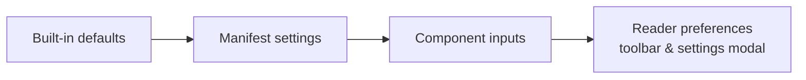

Player behavior is configured on two levels:

1. **Integrator inputs** on `pw-player-shell` — set in your template, per embed.
2. **Manifest settings** — authored into the work (`settings`, `tracking`, `ui` sections), so the same embed behaves per-work.

When both exist for the same concern, the component input represents the reader/integrator side (e.g. the initial locale), while the manifest declares the creator's defaults.

## Component inputs (`pw-player-shell`)

These are all the `@Input()`s the shell accepts (verified in `PlayerShellComponent`). They may change after the shell has initialized: a new `manifestUrl` / `manifest` reloads the work (re-reading the initial position, `initialVariables` and entitlement inputs), a new `entitlementSnapshot` re-evaluates the paywall, and `locale`, `viewModeOverride`, `showToolbar`, `autoplay`, `secondsPerPanel` and `reducedMotion` apply live. Details: [Inputs & Outputs](/player/inputs-outputs).

| Input | Type | Default | Purpose |
|---|---|---|---|
| `manifestUrl` | `string` | — | URL of the manifest to load (fetched with `HttpClient`). Wins over `manifest` when both are set. |
| `manifest` | `PanelWaveManifest` | — | The manifest object, when you load or transform the JSON yourself. |
| `locale` | `LocaleCode` | `'en-US'` | Content locale (BCP-47). Also sets the player UI language (mapped to its base language). |
| `initialChapterId` | `string` | — | Start at this chapter instead of the first one (or the reader's bookmark). |
| `initialPanelId` | `string` | — | Start at this panel (requires `initialChapterId`). |
| `initialVariables` | `Record<string, unknown>` | — | Seed story variables once at start; may set `readOnly` variables (e.g. a verified `user.age`). |
| `showToolbar` | `boolean` | `false` | Show the toolbar. Readers can always toggle it (`T`, floating button, viewport click). |
| `viewModeOverride` | `'auto' \| 'panel' \| 'canvas'` | `'auto'` | Force panel or [canvas](/player/canvas-view) view. |
| `reducedMotion` | `boolean` | `false` | Force reduced motion. The OS `prefers-reduced-motion` setting and the reader's Settings switch also turn it on. |
| `secondsPerPanel` | `number` | `5` | Autoplay dwell time per panel when the panel has no own `durationMs`. Reader-adjustable in the toolbar (0.5–120 s). |
| `autoplay` | `boolean` | `false` | Start in autoplay once the work is ready; the reader's toolbar toggle takes over afterwards. |
| `entitlementSnapshot` | `EntitlementSnapshot` | anonymous | What the reader owns; evaluated against the manifest's `paywall.rules`. See [Paywall & Entitlement](/player/paywall-entitlement). |
| `entitlementEndpoint` / `readerToken` | `string` | — | Let the player fetch the snapshot itself (`{workId}` is substituted; token sent as a Bearer header). |
| `entitlementAdapter` | shell adapter | — | Lower-level per-panel access check that replaces the manifest rules; see [Custom access checks](/player/paywall-entitlement#custom-access-checks). |

Example with several inputs:

```html
<pw-player-shell
  manifestUrl="/stories/my-story/panelwave.json"
  locale="de-DE"
  [initialChapterId]="'ch-2'"
  [secondsPerPanel]="8"
  [reducedMotion]="prefersCalm"
  [showToolbar]="true"
  [entitlementSnapshot]="snapshot">
</pw-player-shell>
```

For the outputs and public methods, see [Inputs & Outputs](/player/inputs-outputs).

<Callout kind="info">
The public API also exports a `PlayerOptions` interface (`allowComments`, `allowSocial`, `theme`, `debug`, `className`, `enableKeyboard`, `enableTouch`). It is a type-level definition for future use — the shell does **not** currently consume it. Configure the player through the inputs above.
</Callout>

## Manifest-driven settings

The manifest sections below shape player behavior. They are authored by the creator (in the [CMS](/cms/overview) or by hand) — see the [schema settings reference](/schema/settings) for the authoritative property list.

### `settings.ui` — reader-experience defaults (`UIDefaults`)

| Property | Type | Meaning |
|---|---|---|
| `mangaMode` | `boolean` | Right-to-left reading by default |
| `autoplayDefault` | `boolean` | Autoplay enabled by default |
| `secondsPerPanel` | `number` | Default autoplay dwell time |
| `speechDefault` / `audioDefault` / `sfxDefault` | `boolean` | Default toggle states for speech bubbles, audio, SFX — **applied** (a preference the reader set explicitly wins). `speechDefault` implicitly gates every bubble (schema 1.3) |
| `scrollingDefault` | `boolean` | Scrolling mode by default |
| `videoPlayModeDefault` | `VideoPlayMode` | Work-level default for video layers (`once` if absent) — **applied** |
| `videoStartModeDefault` | `VideoStartMode` | Work-level default start trigger (`on-view` if absent) — **applied** |
| `videoMutedDefault` | `boolean` | Work-level default muted state (`true` if absent) — **applied** |

<Callout kind="alert">
In the current build the shell **applies the three video defaults** (they cascade into every video layer via `resolveVideoConfig`) and **`speechDefault` / `audioDefault` / `sfxDefault`** (they seed the three sound toggles unless the reader set them). `autoplayDefault`, `secondsPerPanel`, `mangaMode` and `scrollingDefault` are declared in the type but not yet read at startup — treat those as forward-looking manifest data.
</Callout>

### `settings.typography.balloon_config`

Work-level default styling for all speech bubbles (`BalloonConfig`): balloon type, corner radius, font family/size, stroke and fill colors, tail geometry, hide-border effect. The player merges this with per-character, per-preset (`styleRef`, schema 1.3+), and per-bubble overrides via `mergeBalloonConfig` — see [Speech Bubbles](/schema/speech-bubbles) and [Balloon Renderer](/player/balloon-renderer).

### `settings.typography.textStyles` and `balloonPresets` (schema 1.3+)

Named, reusable style presets. Text layers resolve `styleRef` against `textStyles` in the layer renderer (inline `style` fields win); speech bubbles resolve `styleRef` against `balloonPresets` inside the balloon cascade. Unknown `styleRef`s are ignored. See [Settings](/schema/settings#reusable-style-presets).

### `settings.preload`

Preload strategy hints: `strategy` (`none` | `lookahead` | `aggressive`), `panelsAhead` (default 2), `maxConcurrent` (default 4). The preload/image-cache services expose matching knobs (`PreloadService.setMaxConcurrent`, network-aware mode); see [Performance](/player/performance).

### `tracking`

Fully wired: on load, the shell configures the `TrackingService` from `tracking.consent.required` (default `true`), `tracking.consent.defaultOptIn`, `tracking.eventWhitelist`, and `tracking.endpoint`. Details on [Tracking](/player/tracking).

### `paywall`

`paywall.rules` declare which parts of the work require a subscription, a purchase or a minimum age, and how many preview panels are free. The player evaluates them against the entitlement snapshot you supply and shows the paywall overlay or age gate at a locked panel — see [Paywall & Entitlement](/player/paywall-entitlement#how-rules-are-evaluated) for exactly which rule fields are honoured.

### `ui` (top-level `UISettings`)

Branding (`primaryColor`, `accentColor`, `logo`) and control visibility (`showLanguageToggle`, `showAutoplayToggle`, `showSfxToggle`). Declared in the manifest type; the current toolbar shows its standard control set and hides the language button automatically when the work has a single locale.

## Per-panel configuration

Individual panels can carry behavior that overrides globals:

- `durationMs` — autoplay dwell time for that panel (takes precedence over `secondsPerPanel`).
- Video layers can override `playMode`, `startMode`, `muted` per layer (cascade: layer → `settings.ui` defaults → built-in defaults).
- `formatViews` — which view modes a panel allows per output format.

## Precedence summary


```mermaid
graph LR
    A[Built-in defaults] --> B[Manifest settings]
    B --> C[Component inputs]
    C --> D[Reader preferences<br/>toolbar & settings modal]
```

Built-in defaults are overridden by the work's manifest, which the integrator can override per embed, and readers have the last word for their own session via the toolbar and settings modal.
