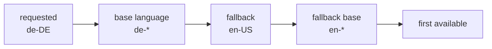

PanelWave works are multilingual by design: every user-facing string in a manifest is a [`LocalizedString`](/concepts/localization) keyed by BCP-47 locale (`en-US`, `de-DE`, …), and assets can ship per-locale variants. The player resolves both at render time and can switch language without a reload.

## Two localization layers

| Layer | What it covers | Mechanism |
|---|---|---|
| **Content locale** | Manifest content: titles, speech-bubble text, localized assets | `LocalizedString` resolution + `pickLocalizedAsset` |
| **UI language** | Player chrome: toolbar labels, modals, loading/error text | `@ngx-translate` with JSON files the host app serves (`assets/i18n/<lang>.json`) |

Both follow the same selection: setting the content locale also switches the UI language to the locale's **base language** (`de-DE` → `de`). The host app must provide the UI translation files — see [Installation](/player/installation); English and German files ship with the demo app.

## Setting and switching the locale

- **Initially:** the `locale` input on `pw-player-shell` (default `'en-US'`).
- **At runtime by the reader:** the globe button in the toolbar opens the language modal, listing the work's `meta.locales`. It only appears when the work has more than one locale.
- **At runtime programmatically:** call `changeLocale(locale)` on the shell.
- **Observing changes:** the `localeChange` output fires with the new `LocaleCode`.

```html
<pw-player-shell
  [manifest]="manifest"
  [locale]="'de-DE'"
  (localeChange)="onLocale($event)">
</pw-player-shell>
```

Switching is instant — components re-resolve their strings and assets against the new locale; no manifest reload occurs.

## The fallback chain

Text resolution (`resolveLocalizedString(value, requestedLocale, fallbackLocale)`) tries, in order:

1. **Exact match** — `de-DE` entry for requested `de-DE`.
2. **Base-language match** — any entry whose base language matches (`de-AT` satisfies `de-DE`).
3. **Fallback locale** — exact match of the fallback (typically the work's `meta.default_locale`).
4. **Base language of the fallback.**
5. **First available entry** — last resort, so text never disappears entirely.

The helper `createLocaleFallbackChain('en-GB', 'en-US')` materializes this as `['en-GB', 'en', 'en-US']` (base languages deduplicated).



## Localized assets

Asset catalog entries can carry multiple variants, each optionally tagged with a `locale` — e.g. a voice-over in several languages, or artwork containing burned-in text. `pickLocalizedAsset(variants, requestedLocale, fallbackLocale)` selects:

1. exact locale match,
2. base-language match,
3. fallback locale match,
4. fallback base-language match,
5. a variant **without** `locale` (universal),
6. the first variant.

```typescript
import { pickLocalizedAsset } from '@panelwave/player';

const variants = [
  { src: 'vo-en.mp3', mime: 'audio/mpeg', locale: 'en-US' },
  { src: 'vo-de.mp3', mime: 'audio/mpeg', locale: 'de-DE' },
  { src: 'vo.mp3', mime: 'audio/mpeg' }, // universal fallback
];

const chosen = pickLocalizedAsset(variants, 'de-DE', 'en-US');
// → { src: 'vo-de.mp3', … }
```

See [Assets](/schema/assets) for how variants are declared in the manifest.

## Utility functions

All exported from the package for host-application use:

| Function | Purpose |
|---|---|
| `resolveLocalizedString(ls, requested, fallback)` | Resolve one `LocalizedString` with the full fallback chain |
| `pickLocalizedAsset(variants, requested, fallback)` | Pick the best asset variant |
| `getBaseLanguage(locale)` | `'zh-Hans-CN'` → `'zh'` |
| `isLocaleSupported(locale, supported)` | Exact or base-language membership test |
| `createLocaleFallbackChain(requested, fallback)` | Ordered candidate list |
| `normalizeLocaleCode(locale)` | `'en_us'` → `'en-US'` |
| `getLocalizationCompleteness(strings, locale)` | % of strings translated into a locale |

## Choosing a sensible initial locale

Match the browser language against the work's locales and fall back to the work's default:

```typescript
import { isLocaleSupported, normalizeLocaleCode } from '@panelwave/player';
import type { PanelWaveManifest, LocaleCode } from '@panelwave/player';

function pickInitialLocale(manifest: PanelWaveManifest): LocaleCode {
  const wanted = normalizeLocaleCode(navigator.language); // e.g. 'de-DE'
  return isLocaleSupported(wanted, manifest.meta.locales)
    ? wanted
    : manifest.meta.default_locale;
}
```

## Related pages

- [Localization concepts](/concepts/localization) — the format-level model shared by schema, player, and CMS.
- [CMS Localization](/cms/localization) — how creators produce translations.
- [Reader Interface](/player/reader-interface) — where the language switch lives in the UI.
