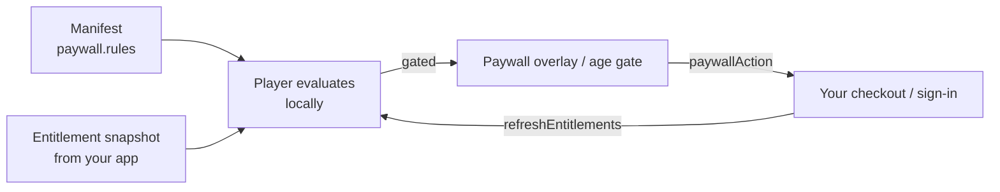

The player never processes payments. The manifest declares *what* is gated ([`paywall.rules`](/schema/paywall)); your application tells the player *what the reader owns*; the player evaluates the rules locally, stops navigation at a gate and shows the paywall overlay (or the age gate). Checkout, sign-in and accounts stay entirely in your app.



<Callout kind="alert">
Client-side gating is a **reading-experience layer, not a security boundary.** A determined reader can edit client state. Anything that must not leak — full-resolution art of paid chapters, downloads — has to be withheld by your backend (for example with signed URLs) until the reader is entitled. See [Monetization](/concepts/monetization).
</Callout>

## The entitlement snapshot

Everything the player needs to know about the reader fits in one object:

```typescript
import type { EntitlementSnapshot } from '@panelwave/player';

const snapshot: EntitlementSnapshot = {
  subscriptionTier: 'supporter',        // active tier, or null when not subscribed
  purchasedProductIds: ['chapter-2'],   // products the reader bought
  ageVerified: true,                    // did your account system verify the age?
  age: 34,                              // optional, used by age gates
};
```

Without a snapshot the player treats the reader as anonymous (`ANONYMOUS_READER`: no tier, no purchases, not age-verified) — they see the free preview and the gate. A work **without** paywall rules is unaffected either way.

### Option 1: pass the snapshot (recommended)

If your app already knows what the reader owns, bind it directly:

```html
<pw-player-shell
  [manifestUrl]="url"
  [entitlementSnapshot]="snapshot"
  (paywallAction)="onPaywall($event)" />
```

### Option 2: let the player fetch it

Give the shell an endpoint and the reader's token; it fetches the snapshot once at startup:

```html
<pw-player-shell
  [manifestUrl]="url"
  entitlementEndpoint="https://api.example.com/works/{workId}/entitlement"
  [readerToken]="sessionToken"
  (paywallAction)="onPaywall($event)" />
```

- `{workId}` is replaced with the manifest's `meta.id`.
- The request carries `Authorization: Bearer <readerToken>` when a token is set.
- The endpoint answers with `{ "ok": true, "data": { "subscriptionTier": …, "purchasedProductIds": […], "ageVerified": …, "age"?: … } }`.
- If the request fails, the reader stays anonymous — a backend outage shows the gate, never paid content.
- An explicit `entitlementSnapshot` wins over the endpoint when both are set.

The same logic is available outside the shell as the exported `HttpEntitlementAdapter` (config: `endpoint`, `readerToken`, optional `signedUrlEndpoint` for `getSignedUrl()`, `ttlMs` — snapshots stay fresh for 5 minutes by default).

## How rules are evaluated

The player normalizes each manifest rule and checks it against the snapshot. Manifests carry two generations of field names side by side (the original format's and the CMS exporter's); both work:

| Requirement | Written as | Satisfied when |
|---|---|---|
| Subscription | `entitlementType: "subscription"` (+ optional `subscriptionTiers`), or `requireEntitlement: "premium"` | The reader has a tier — any tier, or one listed in `subscriptionTiers` |
| Purchase | `entitlementType: "purchase"` (+ optional `requiredProductIds`), or any other `requireEntitlement` value | The reader bought one of the listed products (or anything, when none are listed) |
| Age gate | `entitlementType: "age_gate"`, or a rule with `minimumAge` / `ageGate` | `ageVerified` is true and `age` ≥ the minimum (default 18) |
| Free | `entitlementType: "free"` | Always |

Which panels a rule gates:

- **Panel rules** (`scope: "panel"`) gate exactly their `targetPanelIds` (or their `refId`). They take precedence, and a free preview never unlocks them.
- **Work rules** (`scope: "work"` or `"global"`) gate the whole work. The first one wins. `previewPanelCount` / `previewPanels` keeps the first *n* panels readable, counted in reading order across the **whole work** (chapters in order, panels in declaration order).

<Callout kind="alert">
**Current limitations (1.0.x):** rules with `scope: "chapter"` are not enforced by the player — gate a chapter with a panel rule listing its panels, or with a work rule and a preview length. Rules with `scope: "extras"` are currently treated as a work-level gate.
</Callout>

## What readers see at a gate

When the reader tries to move onto a gated panel, **navigation stops** — they stay on the last panel they were entitled to see — and the player shows:

- the **age gate** for age-gate rules (see [below](#age-gates)), or
- the **paywall overlay** for everything else: a title for the gated scope, the reason (e.g. *"This part of the story is included with a subscription."*), and two buttons, **Sign in** and **Maybe later**. Titles and buttons are translated (English and German ship with the package); the reason sentence is English-only in 1.0.x.

Clicking a button emits `paywallAction` with `{ action, gate }` and closes the overlay. In the built-in overlay `action` is `'login'` or `'dismiss'`; the `PaywallAction` type also includes `'purchase'` and `'subscribe'` for custom overlays. Run your sign-in or checkout, then hand the player the new state:

```typescript
import { Component, ViewChild } from '@angular/core';
import { PlayerShellComponent } from '@panelwave/player';
import type { PaywallAction, PaywallGate } from '@panelwave/player';

@Component({ /* … */ })
export class ReaderComponent {
  @ViewChild(PlayerShellComponent) player!: PlayerShellComponent;

  async onPaywall(e: { action: PaywallAction; gate: PaywallGate }): Promise<void> {
    if (e.action === 'dismiss') return;
    const snapshot = await this.checkout.run(e.gate);   // your flow
    await this.player.refreshEntitlements(snapshot);    // closes the overlay if the gate is now open
  }
}
```

Called without an argument, `refreshEntitlements()` re-fetches from `entitlementEndpoint`.

## Age gates

Age-gate rules are answered **inside the player** — no checkout involved:

<Steps>
  <Step title="The reader hits an age-gated panel">
    Navigation pauses and `pw-age-gate` asks for a birth date (month, day, year). The minimum age comes from the rule (`minimumAge` / `ageGate`, default 18). Impossible dates such as 31 February are rejected.
  </Step>
  <Step title="The reader passes">
    The result is stored on the device (`localStorage` key `pw-age-verified`), folded into the entitlement snapshot, and the interrupted navigation continues — including its transition. Returning readers on the same device are not asked again.
  </Step>
  <Step title="Or fails, or closes the dialog">
    A too-young answer keeps the dialog open with an explanation; closing it leaves the reader where they were.
  </Step>
</Steps>

Every answer emits `ageVerified` (`{ verified, age?, birthDate? }`) so you can record it. If your account system already verified the reader's age, pass `ageVerified: true` and `age` in the snapshot and the prompt never appears.

<Callout kind="info">
The birth-date prompt is a self-declaration, suitable as an age *gate*, not as legal age *verification*. Its texts are English-only in 1.0.x.
</Callout>

## Custom access checks

Two lower-level interfaces exist for integrations the snapshot model doesn't cover. Both are named `EntitlementAdapter` in the source, but they are **different types** — pick the one matching where you plug in.

### The shell's `[entitlementAdapter]` input

The shell accepts a small adapter that **replaces** the manifest-rule check:

```typescript
// Declared in player-shell.component.ts; NOT re-exported under this shape.
interface ShellEntitlementAdapter {
  /** Awaited before every panel navigation; false raises the paywall overlay. */
  hasAccess(panelId: string): Promise<boolean>;
  /** Called once at startup; the key/values are seeded into variables. */
  getContext(): Promise<Record<string, unknown>>;
  /** Declared but not called by the shell. */
  purchase?(productId: string): Promise<boolean>;
}
```

- `getContext()` values are **seeded** (a privileged write that may populate `readOnly` variables, applied after `initialVariables`), so conditions can reference entitlement flags like `{"var": "premium"}` or a verified `{"var": "user.age"}` that in-story content cannot tamper with.
- A `false` from `hasAccess()` stops navigation and raises the paywall overlay for that panel.
- While an adapter is set, the manifest's paywall rules and the age gate are **not** consulted for navigation.

<Callout kind="alert">
The `EntitlementAdapter` type you can import from `@panelwave/player` is the richer interface below (`resolveEntitlement`, …), **not** this one. Declare a structurally identical interface in your app, as above. For most integrations `entitlementSnapshot` is the simpler and better choice.
</Callout>

### The full adapter and `EntitlementService`

The exported `EntitlementAdapter` interface powers the standalone **`EntitlementService`** — useful for custom flows outside the shell (your own paywall screens, signed asset URLs, access checks in a library view):

```typescript
import type {
  EntitlementAdapter,
  EntitlementContext,
  EntitlementStatus,
  PaywallGate,
  UserInfo,
} from '@panelwave/player';

export interface EntitlementAdapter {
  /** Required: resolve entitlements for a work/chapter/panel context. */
  resolveEntitlement(context: EntitlementContext): Promise<EntitlementStatus>;
  /** Optional: return a signed URL for a gated asset. */
  getSignedUrl?(assetId: string, purpose: 'stream' | 'download'): Promise<string>;
  /** Optional: show your paywall UI; resolve when completed/dismissed. */
  showPaywallUI?(gate: PaywallGate): Promise<void>;
  /** Optional: verify age for age-restricted content. */
  verifyAge?(minimumAge: number): Promise<boolean>;
  /** Optional: authentication status. */
  isAuthenticated?(): boolean;
  /** Optional: current user information. */
  getCurrentUser?(): Promise<UserInfo | null>;
}
```

`HttpEntitlementAdapter` implements it. Supporting types:

<ResponseField name="EntitlementContext" field-type="object">
  `workId` (required), optional `chapterId`, `panelId`, `userToken`, `metadata`.
</ResponseField>

<ResponseField name="EntitlementStatus" field-type="object">
  `ok: boolean` (access granted), `entitlements: Record<string, boolean>` (flag dictionary, e.g. `{ premium: true }`), optional `user: UserInfo`, `reason` (denial explanation), `expiresAt` (epoch ms — controls cache lifetime).
</ResponseField>

<ResponseField name="UserInfo" field-type="object">
  `id` (hashed/pseudonymous), optional `displayName`, `email`, `age`, `tier`, `purchased: string[]`, `tokens: number`, plus custom properties.
</ResponseField>

<ResponseField name="PaywallGate" field-type="object">
  `scope: 'work' | 'chapter' | 'panel'`, optional `refId`, `requireEntitlement`, required `reason`, optional `preview` (`previewPanels`, `mode: 'blur' | 'low-res' | 'watermark' | 'time-limited'`, `durationSeconds`).
</ResponseField>

```typescript
import { inject } from '@angular/core';
import { EntitlementService } from '@panelwave/player';

const entitlements = inject(EntitlementService);
entitlements.setAdapter(new MyFullAdapter());

await entitlements.hasAccessToWork('work-1');
await entitlements.hasAccessToChapter('work-1', 'ch-2');
await entitlements.hasAccessToPanel('work-1', 'ch-2', 'p-9');
```

`EntitlementService` behavior worth knowing:

- **It is independent of the shell.** Registering an adapter here does not change what `pw-player-shell` gates — the shell uses the snapshot (or its own `[entitlementAdapter]` input).
- **Caching:** results are cached per `workId:chapterId:panelId` key until the status's `expiresAt`, otherwise 5 minutes. `clearCache()` resets; `showPaywall(gate)` clears the cache afterwards so a completed purchase is re-checked.
- **Defaults:** with no adapter registered, the service uses `NullEntitlementAdapter`, which **denies everything**. `MockEntitlementAdapter` grants everything with a fake premium user — handy in tests.
- **Observables:** `getEntitlementStatus$()` and `getCurrentUser$()` for reactive UI.
- **Age checks:** `verifyAge(minimumAge)` delegates to the adapter or falls back to `user.age`; without either it denies.

The pure evaluation functions are exported too (`evaluatePanelAccess`, `evaluateWorkAccess`, `rulesFromManifest`, `satisfiesRule`, …) — for example to render lock icons in your own chapter list with exactly the player's semantics.

## Paywall UI components

Both overlays are exported and can be used on their own:

- **`pw-paywall-overlay`** (`PaywallOverlayComponent`) — inputs `visible`, `gate: PaywallGate`, `purchaseOptions: PurchaseInfo[]` (renders a product list instead of *Sign in*), `locale`, `title`/`message` (LocalizedString), `allowPreview`, `showLogin` (default `true`); outputs `action: PaywallAction`, `purchase: string` (product id), `close`. Escape and a backdrop click dismiss it.
- **`pw-age-gate`** (`AgeGateComponent`) — inputs `visible`, `minimumAge` (default 18), `locale`, `warningMessage`, `allowDismiss`; outputs `verify: AgeVerificationResult`, `close`.

`PurchaseInfo` describes an offer: `productId`, `name`, `price: { amount, currency }`, `type: 'one-time' | 'subscription' | 'token'`, optional `description`. The shell does not pass purchase options to its overlay; build your own overlay (or checkout page) when you want a product list.

## Which integration should I use?

- You know what the reader owns → **`[entitlementSnapshot]`** + `(paywallAction)` + `refreshEntitlements()`.
- Your backend can answer "what does this reader own?" per work → **`entitlementEndpoint`** + `readerToken`.
- You need a per-panel yes/no from your own service, or entitlement flags as story variables → the shell's **`[entitlementAdapter]`** (note it bypasses manifest rules and the age gate), or `initialVariables` for the flags alone.
- You're building screens outside the player (library, store, signed downloads) → the **full adapter** with `EntitlementService`, or the exported evaluator functions.
