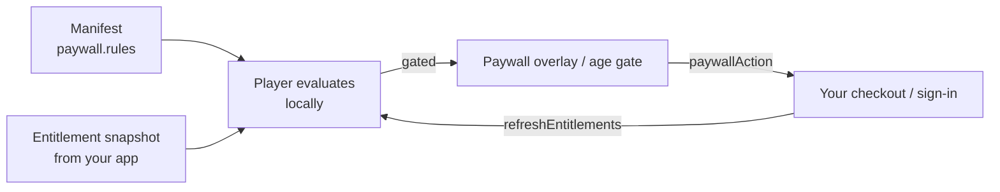

The player never processes payments. The manifest declares *what* is gated ([`paywall.rules`](/schema/paywall)); your application tells the player *what the reader owns*; the player evaluates the rules locally, stops navigation at a gate and shows the paywall overlay (or the age gate). Checkout, sign-in and accounts stay entirely in your app.



<Callout kind="alert">
Client-side gating is a **reading-experience layer, not a security boundary.** A determined reader can edit client state. Anything that must not leak — full-resolution art of paid chapters, downloads — has to be withheld by your backend (for example with signed URLs) until the reader is entitled. See [Monetization](/concepts/monetization).
</Callout>

## The entitlement snapshot

Everything the player needs to know about the reader fits in one object:

```typescript
import type { EntitlementSnapshot } from '@panelwave/player';

const snapshot: EntitlementSnapshot = {
  subscriptionTier: 'supporter',        // active tier, or null when not subscribed
  purchasedProductIds: ['chapter-2'],   // products the reader bought
  ageVerified: true,                    // did your account system verify the age?
  age: 34,                              // optional, used by age gates
};
```

Without a snapshot the player treats the reader as anonymous (`ANONYMOUS_READER`: no tier, no purchases, not age-verified) — they see the free preview and the gate. A work **without** paywall rules is unaffected either way.

### Option 1: pass the snapshot (recommended)

If your app already knows what the reader owns, bind it directly:

```html
<pw-player-shell
  [manifestUrl]="url"
  [entitlementSnapshot]="snapshot"
  (paywallAction)="onPaywall($event)" />
```

### Option 2: let the player fetch it

Give the shell an endpoint and the reader's token; it fetches the snapshot once at startup:

```html
<pw-player-shell
  [manifestUrl]="url"
  entitlementEndpoint="https://api.example.com/works/{workId}/entitlement"
  [readerToken]="sessionToken"
  (paywallAction)="onPaywall($event)" />
```

- `{workId}` is replaced with the manifest's `meta.id`.
- The request carries `Authorization: Bearer <readerToken>` when a token is set.
- The endpoint answers with `{ "ok": true, "data": { "subscriptionTier": …, "purchasedProductIds": […], "ageVerified": …, "age"?: … } }`.
- If the request fails, the reader stays anonymous — a backend outage shows the gate, never paid content.
- An explicit `entitlementSnapshot` wins over the endpoint when both are set.

The same logic is available outside the shell as the exported `HttpEntitlementAdapter` (config: `endpoint`, `readerToken`, optional `signedUrlEndpoint` for `getSignedUrl()`, `ttlMs` — snapshots stay fresh for 5 minutes by default).

## How rules are evaluated

The player normalizes each manifest rule and checks it against the snapshot. Manifests carry two generations of field names side by side (the original format's and the CMS exporter's); both work:

| Requirement | Written as | Satisfied when |
|---|---|---|
| Subscription | `entitlementType: "subscription"` (+ optional `subscriptionTiers`), or `requireEntitlement: "premium"` | The reader has a tier — any tier, or one listed in `subscriptionTiers` |
| Purchase | `entitlementType: "purchase"` (+ optional `requiredProductIds`, a schema field since format 1.6), or any other `requireEntitlement` value | The reader bought any one of the listed products (or anything, when none are listed) |
| Age gate | `entitlementType: "age_gate"`, or a rule with `minimumAge` / `ageGate` and no other requirement | `ageVerified` is true and `age` ≥ the minimum (default 18) |
| Free | `entitlementType: "free"` | Always |

An age on a subscription or purchase rule (`ageGate` / `minimumAge` next to `requireEntitlement` or `entitlementType`) is an **extra** check: the reader needs both. The player asks for the age first (`lockReason: "age_verification_required"`), then shows the paywall with its Buy / Subscribe options (`purchase_required` / `subscription_required`) until the entitlement is there.

Which panels a rule gates:

- **Panel rules** (`scope: "panel"`) gate exactly their `targetPanelIds` (or their `refId`). They take precedence, and a free preview never unlocks them.
- **Chapter rules** (`scope: "chapter"`) gate only the panels of the chapter named in `refId`. `previewPanelCount` / `previewPanels` is counted **within that chapter** (its panels in declaration order), so `previewPanelCount: 2` keeps the chapter's first two panels free. For its panels a chapter rule wins over a work rule.
- **Work rules** (`scope: "work"` or `"global"`) gate the whole work. The first one wins. `previewPanelCount` / `previewPanels` keeps the first *n* panels readable, counted in reading order across the **whole work** (chapters in order, panels in declaration order).
- **Extras rules** (`scope: "extras"`) never gate panels. They lock the [extras](/schema/extras) block named in `refId`: the extras viewer shows that block with a lock and does not open it until the reader satisfies the rule.

Precedence for a panel: panel rule → chapter rule for its chapter → work rule → free.

```json
"paywall": {
  "rules": [
    { "id": "work-sub", "scope": "work", "requireEntitlement": "subscription", "previewPanelCount": 6 },
    { "id": "ch3-buy", "scope": "chapter", "refId": "ch-3", "requireEntitlement": "chapter-3",
      "name": "Chapter 3", "price": { "amount": 2.99, "currency": "EUR" }, "previewPanelCount": 1 },
    { "id": "art-book", "scope": "extras", "refId": "concept-art", "requireEntitlement": "art-book" }
  ]
}
```

Here the first six panels of the work are free and the rest needs a subscription — except chapter `ch-3`: its first panel is free and its other panels need a purchase (a subscription does not unlock them, because the chapter rule wins for its panels). The `concept-art` extras block needs a purchase too; it never blocks reading.

<Callout kind="info">
`chapter-3` and `art-book` are not entitlement type names, so both rules are purchase gates. Without `requiredProductIds`, a purchase gate is satisfied by **any** product in `purchasedProductIds` — pass only the purchases that belong to this work in the snapshot. The key still names the product the overlay offers (see [below](#what-readers-see-at-a-gate)). To require specific products, list them in `requiredProductIds` (format 1.6+, e.g. `"requiredProductIds": ["chapter-3", "complete-edition"]`): then only those unlock the rule, any one of them is enough. The CMS exports every unlocking product this way.
</Callout>

To check an extras block yourself, use `PaywallService.isExtraLocked(extraId)` or the pure `isExtraLocked(rules, snapshot, extraId)`.

## What readers see at a gate

When the reader tries to move onto a gated panel, **navigation stops** — they stay on the last panel they were entitled to see — and the player shows:

- the **age gate** for age-gate rules (see [below](#age-gates)), or
- the **paywall overlay** for everything else: a title for the gated scope, the reason (e.g. *"This part of the story is included with a subscription."*), the **Buy** / **Subscribe** options the rule offers, **Sign in** and **Maybe later**. All texts, including the reason, are translated (English and German ship with the package).

While the paywall or the age gate is open, the story behind it does not move: arrow keys, `T` and swipes are ignored. **Escape** still works — it dismisses the paywall (like *Maybe later*) and closes the age gate, leaving the reader on the panel they were on.

### Buy and Subscribe options

The options come from the rule that blocks the panel:

| Rule | Options |
|---|---|
| Purchase | One **Buy** option per entry in `requiredProductIds` (format 1.6) |
| Subscription | One **Subscribe** option per entry in `subscriptionTiers` |
| Neither list set | One option whose product id is the rule's `requireEntitlement` key — or the rule `id` when the key is just the type name (`"purchase"`, `"subscription"`) |
| Age gate, free | No options (age gates use the [age gate](#age-gates) instead) |

Each option is labelled from the manifest's [`paywall.products`](/schema/paywall#products-paywallproduct) (format 1.6): the entry with the option's id supplies its name and description — in the reader's locale, falling back to the work's default locale — and its price. Options without an entry fall back to the rule's `name` (a single option) or the product id / tier (several options), and to the rule's `description` and `price`. Rules without any price still get their options. The options are also on the gate as `gate.options` (a `PurchaseInfo[]`), so a custom overlay can render the same list.

### Handling the reader's choice

Clicking a button emits `paywallAction` and closes the overlay. The payload is `{ action, gate, productId? }`:

| `action` | When | `productId` |
|---|---|---|
| `'purchase'` | A Buy option | The chosen product id |
| `'subscribe'` | A Subscribe option | The chosen subscription tier |
| `'login'` | *Sign in* | — |
| `'dismiss'` | *Maybe later*, close, Escape or backdrop | — |

Run your sign-in or checkout, then hand the player the new state:

```typescript
import { Component, ViewChild } from '@angular/core';
import { PlayerShellComponent } from '@panelwave/player';
import type { PaywallAction, PaywallGate } from '@panelwave/player';

@Component({ /* … */ })
export class ReaderComponent {
  @ViewChild(PlayerShellComponent) player!: PlayerShellComponent;

  async onPaywall(e: { action: PaywallAction; gate: PaywallGate; productId?: string }): Promise<void> {
    if (e.action === 'dismiss') return;
    const snapshot = e.action === 'login'
      ? await this.auth.signIn()                              // your flow
      : await this.checkout.run(e.productId!, e.action);      // 'purchase' | 'subscribe'
    await this.player.refreshEntitlements(snapshot);          // closes the overlay if the gate is now open
  }
}
```

Called without an argument, `refreshEntitlements()` re-fetches from `entitlementEndpoint`. Binding a new `[entitlementSnapshot]` has the same effect.

### Edge mutations wait for the gate

An edge's `action` mutations (for example a counter the move increments) are applied only once the paywall or age gate lets the move through. A blocked attempt changes no variables; a move held by the age gate applies its mutations when the reader passes.

## Age gates

Age-gate rules are answered **inside the player** — no checkout involved:

<Steps>
  <Step title="The reader hits an age-gated panel">
    Navigation pauses and `pw-age-gate` asks for a birth date (month, day, year; month names in the reader's language). The minimum age comes from the rule (`minimumAge` / `ageGate`, default 18). Impossible dates such as 31 February are rejected. Keys typed into the date fields never reach the story.
  </Step>
  <Step title="The reader passes">
    The result is stored on the device (`localStorage` key `pw-age-verified`), folded into the entitlement snapshot, and the interrupted navigation is retried — including its transition. If the rule also requires a purchase or subscription the reader doesn't have, the paywall opens next with its Buy / Subscribe options and the reader stays where they were. Returning readers on the same device are not asked again.
  </Step>
  <Step title="Or fails, or closes the dialog">
    A too-young answer keeps the dialog open with an explanation; closing it (or pressing Escape) leaves the reader where they were.
  </Step>
</Steps>

Every answer emits `ageVerified` (`{ verified, age?, birthDate? }`) so you can record it. If your account system already verified the reader's age, pass `ageVerified: true` and `age` in the snapshot and the prompt never appears.

<Callout kind="info">
The birth-date prompt is a self-declaration, suitable as an age *gate*, not as legal age *verification*. Its texts are translated (`age_gate.*` keys, see [Localization](/player/localization)).
</Callout>

## Custom access checks

Two lower-level interfaces exist for integrations the snapshot model doesn't cover. Both are named `EntitlementAdapter` in the source, but they are **different types** — pick the one matching where you plug in.

### The shell's `[entitlementAdapter]` input

The shell accepts a small adapter that **replaces** the manifest-rule check:

```typescript
// Declared in player-shell.component.ts; NOT re-exported under this shape.
interface ShellEntitlementAdapter {
  /** Awaited before every panel navigation; false raises the paywall overlay. */
  hasAccess(panelId: string): Promise<boolean>;
  /** Called once at startup; the key/values are seeded into variables. */
  getContext(): Promise<Record<string, unknown>>;
  /** Declared but not called by the shell. */
  purchase?(productId: string): Promise<boolean>;
}
```

- `getContext()` values are **seeded** (a privileged write that may populate `readOnly` variables, applied after `initialVariables`), so conditions can reference entitlement flags like `{"var": "premium"}` or a verified `{"var": "user.age"}` that in-story content cannot tamper with.
- A `false` from `hasAccess()` stops navigation and raises the paywall overlay for that panel.
- While an adapter is set, the manifest's paywall rules and the age gate are **not** consulted for navigation.

<Callout kind="alert">
The `EntitlementAdapter` type you can import from `@panelwave/player` is the richer interface below (`resolveEntitlement`, …), **not** this one. Declare a structurally identical interface in your app, as above. For most integrations `entitlementSnapshot` is the simpler and better choice.
</Callout>

### The full adapter and `EntitlementService`

The exported `EntitlementAdapter` interface powers the standalone **`EntitlementService`** — useful for custom flows outside the shell (your own paywall screens, signed asset URLs, access checks in a library view):

```typescript
import type {
  EntitlementAdapter,
  EntitlementContext,
  EntitlementStatus,
  PaywallGate,
  UserInfo,
} from '@panelwave/player';

export interface EntitlementAdapter {
  /** Required: resolve entitlements for a work/chapter/panel context. */
  resolveEntitlement(context: EntitlementContext): Promise<EntitlementStatus>;
  /** Optional: return a signed URL for a gated asset. */
  getSignedUrl?(assetId: string, purpose: 'stream' | 'download'): Promise<string>;
  /** Optional: show your paywall UI; resolve when completed/dismissed. */
  showPaywallUI?(gate: PaywallGate): Promise<void>;
  /** Optional: verify age for age-restricted content. */
  verifyAge?(minimumAge: number): Promise<boolean>;
  /** Optional: authentication status. */
  isAuthenticated?(): boolean;
  /** Optional: current user information. */
  getCurrentUser?(): Promise<UserInfo | null>;
}
```

`HttpEntitlementAdapter` implements it. Supporting types:

<ResponseField name="EntitlementContext" field-type="object">
  `workId` (required), optional `chapterId`, `panelId`, `userToken`, `metadata`.
</ResponseField>

<ResponseField name="EntitlementStatus" field-type="object">
  `ok: boolean` (access granted), `entitlements: Record<string, boolean>` (flag dictionary, e.g. `{ premium: true }`), optional `user: UserInfo`, `reason` (denial explanation), `expiresAt` (epoch ms — controls cache lifetime).
</ResponseField>

<ResponseField name="UserInfo" field-type="object">
  `id` (hashed/pseudonymous), optional `displayName`, `email`, `age`, `tier`, `purchased: string[]`, `tokens: number`, plus custom properties.
</ResponseField>

<ResponseField name="PaywallGate" field-type="object">
  `scope: 'work' | 'chapter' | 'panel'`, optional `refId` (the chapter id for chapter gates, the panel id for panel gates), `requireEntitlement`, required `reason` (English sentence), optional `preview` (`previewPanels`, `mode: 'blur' | 'low-res' | 'watermark' | 'time-limited'`, `durationSeconds`), `ruleId` (the manifest rule that raised the gate), `lockReason` (`subscription_required`, `purchase_required`, `age_verification_required` or `entitlement_required` — the overlay translates it), and `options: PurchaseInfo[]` (what the rule offers, see [Buy and Subscribe options](#buy-and-subscribe-options)).
</ResponseField>

```typescript
import { inject } from '@angular/core';
import { EntitlementService } from '@panelwave/player';

const entitlements = inject(EntitlementService);
entitlements.setAdapter(new MyFullAdapter());

await entitlements.hasAccessToWork('work-1');
await entitlements.hasAccessToChapter('work-1', 'ch-2');
await entitlements.hasAccessToPanel('work-1', 'ch-2', 'p-9');
```

`EntitlementService` behavior worth knowing:

- **It is independent of the shell.** Registering an adapter here does not change what `pw-player-shell` gates — the shell uses the snapshot (or its own `[entitlementAdapter]` input).
- **Caching:** results are cached per `workId:chapterId:panelId` key until the status's `expiresAt`, otherwise 5 minutes. `clearCache()` resets; `showPaywall(gate)` clears the cache afterwards so a completed purchase is re-checked.
- **Defaults:** with no adapter registered, the service uses `NullEntitlementAdapter`, which **denies everything**. `MockEntitlementAdapter` grants everything with a fake premium user — handy in tests.
- **Observables:** `getEntitlementStatus$()` and `getCurrentUser$()` for reactive UI.
- **Age checks:** `verifyAge(minimumAge)` delegates to the adapter or falls back to `user.age`; without either it denies.

The pure evaluation functions are exported too (`evaluatePanelAccess`, `evaluateWorkAccess`, `rulesFromManifest`, `satisfiesRule`, `isExtraLocked`, `chapterOrderFromManifest` — the chapter id and within-chapter index per panel, which chapter rules need, …) — for example to render lock icons in your own chapter list with exactly the player's semantics.

## Paywall UI components

Both overlays are exported and can be used on their own:

- **`pw-paywall-overlay`** (`PaywallOverlayComponent`) — inputs `visible`, `gate: PaywallGate`, `purchaseOptions: PurchaseInfo[]` (renders the options above *Sign in*), `locale`, `title`/`message` (LocalizedString), `allowPreview`, `showLogin` (default `true`); outputs `action: PaywallAction`, `purchase: string` (product id), `close`. Escape and a backdrop click dismiss it.
- **`pw-age-gate`** (`AgeGateComponent`) — inputs `visible`, `minimumAge` (default 18), `locale`, `warningMessage`, `allowDismiss`; outputs `verify: AgeVerificationResult`, `close`.

`PurchaseInfo` describes an offer: `productId`, `name`, optional `price: { amount, currency }`, `type: 'one-time' | 'subscription' | 'token'`, optional `description`. The shell passes `gate.options` to its overlay; when you use the overlay on its own, pass your own list.

<Callout kind="alert">
`PurchaseInfo.price` is **optional** since 2026-09-27 (rules without a price still offer Buy / Subscribe). Code that reads `option.price.amount` must handle a missing price, or it no longer type-checks.
</Callout>

## Which integration should I use?

- You know what the reader owns → **`[entitlementSnapshot]`** + `(paywallAction)` + `refreshEntitlements()`.
- Your backend can answer "what does this reader own?" per work → **`entitlementEndpoint`** + `readerToken`.
- You need a per-panel yes/no from your own service, or entitlement flags as story variables → the shell's **`[entitlementAdapter]`** (note it bypasses manifest rules and the age gate), or `initialVariables` for the flags alone.
- You're building screens outside the player (library, store, signed downloads) → the **full adapter** with `EntitlementService`, or the exported evaluator functions.
