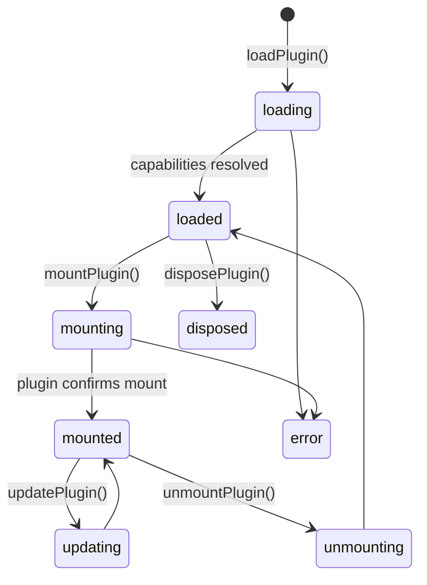

The plugin system lets third parties extend the player without touching its code. Plugins are ordinary web pages that run in **sandboxed iframes** and talk to the host via a **postMessage protocol**, governed by a **capability model**. The host side is the exported `PluginHostService`; panels can also embed plugin content directly through `plugin` layers.

## Two ways plugin content appears

1. **Hosted plugins** — loaded and managed by `PluginHostService` (lifecycle, capabilities, API calls, events). This is the full plugin system described on this page.
2. **Plugin layers** — a panel layer of `kind: "plugin"` rendered by `pw-plugin-layer` (inputs `src`, `baseUrl`, `sandbox` — default `allow-scripts` —, `allowFullscreen`; outputs `pluginReady`, `pluginMessage`, `pluginError`). Use this for per-panel interactive content such as a 360° viewer; see [Layers](/schema/layers).

There is also a standalone `pw-plugin-sandbox` component (`PluginSandboxComponent`, input `manifest: PluginManifest`, outputs `loaded`/`failed`) for embedding one managed plugin in your own UI.

## The plugin manifest

Every plugin is described by a `PluginManifest`:

```typescript
import type { PluginManifest } from '@panelwave/player';

const manifest: PluginManifest = {
  id: 'reading-stats',
  name: 'Reading Stats',
  version: '1.0.0',
  author: 'Example Co',
  description: 'Shows live reading statistics',
  url: 'https://plugins.example.com/reading-stats/index.html',
  capabilities: ['read-manifest', 'read-state'],       // required
  optionalCapabilities: ['storage'],                    // user may deny
  allowedOrigins: ['https://plugins.example.com'],
};
```

`id`, `name`, `version`, `url`, and `capabilities` are required (validated on load).

## Capabilities

Twelve granular permissions (`PluginCapability`):

| Capability | Grants |
|---|---|
| `read-manifest` | Read the work's manifest |
| `read-state` / `write-state` | Read / modify player state |
| `read-variables` / `write-variables` | Read / modify the variable store |
| `navigation` | Control navigation |
| `ui-overlay` / `ui-toolbar` | Render overlays / add toolbar buttons |
| `tracking` | Access tracking data |
| `storage` | Persistent plugin storage |
| `network` | Network requests |
| `clipboard` | Clipboard access |

By default the host **auto-grants** only `read-manifest` and `read-state` (configurable via `autoGrantCapabilities`).

<Callout kind="alert">
**Current limitation:** the interactive permission prompt is not implemented yet — capabilities that are not in `autoGrantCapabilities` are denied, and a *required* non-auto-granted capability makes `loadPlugin()` throw. Until the prompt lands, add the capabilities your plugins need to `autoGrantCapabilities` via `configure()`.
</Callout>

## Host API (`PluginHostService`)

```typescript
import { Component, ElementRef, ViewChild, inject } from '@angular/core';
import { PluginHostService } from '@panelwave/player';

@Component({
  selector: 'app-plugin-panel',
  standalone: true,
  template: `<div #pluginContainer class="plugin-container"></div>`,
})
export class PluginPanelComponent {
  @ViewChild('pluginContainer') container!: ElementRef<HTMLElement>;
  private pluginHost = inject(PluginHostService);

  async start(): Promise<void> {
    // Allow the capabilities this plugin needs (see limitation above)
    this.pluginHost.configure({
      autoGrantCapabilities: ['read-manifest', 'read-state', 'storage'],
    });

    await this.pluginHost.loadPlugin(manifest);                    // register + capability check
    await this.pluginHost.mountPlugin('reading-stats', this.container.nativeElement); // iframe + handshake
  }

  async stop(): Promise<void> {
    await this.pluginHost.unmountPlugin('reading-stats'); // back to 'loaded'
    await this.pluginHost.disposePlugin('reading-stats'); // full cleanup
  }
}
```

| Method | Purpose |
|---|---|
| `configure(config)` | Set `enabled`, `maxPlugins` (default 10), `loadTimeout` (default 10 000 ms), `sandboxAttributes` (default `allow-scripts allow-same-origin`), `autoGrantCapabilities` |
| `loadPlugin(manifest)` | Validate and register; resolves capabilities → state `loaded` |
| `mountPlugin(id, container)` | Create the sandboxed iframe in `container`, wait for `plugin:ready`, send `plugin:mount`, wait for `plugin:mounted` → state `mounted` |
| `updatePlugin(id, data)` | Push new data (`plugin:update`) |
| `unmountPlugin(id)` | Send `plugin:unmount`, remove the iframe, clean event subscriptions |
| `disposePlugin(id)` | Unmount if needed, send `plugin:dispose`, deregister |
| `getPlugins()` / `getPlugins$()` / `getPlugin(id)` | Registry access (sync / observable) |
| `grantPermission(id, cap)` / `denyPermission(id, cap)` | Adjust capabilities at runtime |
| `getPermissionRequests$()` | Observable of pending permission requests (for building a prompt UI) |
| `registerAPIHandler(method, handler)` | Implement an API method plugins can call |
| `emitEventToPlugins(eventType, data)` | Broadcast an event to subscribed plugins |

### Lifecycle states

`PluginState` progresses through:



## The postMessage protocol

All traffic uses one envelope (`PluginMessage`): `{ type, pluginId, requestId?, payload?, error? }`. Message types:

- **Lifecycle:** `plugin:init`, `plugin:ready`, `plugin:mount`, `plugin:mounted`, `plugin:update`, `plugin:unmount`, `plugin:dispose`, `plugin:error`
- **Capabilities:** `request:capability`, `grant:capability`, `deny:capability`
- **API calls:** `api:call` (payload `{ method, params }`), answered with `api:response` (`{ result }`) or `api:error`
- **Events:** `event:subscribe`, `event:unsubscribe`, `event:emit`

The host answers `api:call` messages through handlers registered with `registerAPIHandler`. Three placeholder handlers exist out of the box (`getManifest`, `getPlayerState`, `getCurrentPanel` — currently returning empty data); register your own implementations to expose real functionality. The intended method surface is defined by the exported `PluginAPI` interface (manifest/state/variable access, navigation, notifications, toolbar buttons, events, storage).

## Writing a plugin

A plugin is a plain HTML page. Minimum viable handshake:

```html
<!DOCTYPE html>
<html>
  <body>
    <h1>Hello from the plugin</h1>
    <script>
      const PLUGIN_ID = 'reading-stats';

      function send(type, payload) {
        window.parent.postMessage({ type, pluginId: PLUGIN_ID, payload }, '*');
      }

      window.addEventListener('message', (event) => {
        const msg = event.data;
        if (msg.type === 'plugin:mount') {
          // msg.payload.context: { manifest, capabilities, playerVersion, sessionId }
          send('plugin:mounted', {});
        }
        if (msg.type === 'plugin:update') {
          // re-render with msg.payload
        }
        if (msg.type === 'plugin:unmount') {
          // cleanup
        }
        if (msg.type === 'api:response' || msg.type === 'api:error') {
          // resolve your pending api:call by msg.requestId
        }
      });

      // Announce readiness — the host waits for this before mounting.
      send('plugin:ready', {});

      // Calling a host API method:
      send('api:call', { method: 'getCurrentPanel', params: [] });

      // Subscribing to host events:
      send('event:subscribe', { eventType: 'panelChange' });
    </script>
  </body>
</html>
```

A complete runnable example ships in the player repository as `SAMPLE_PLUGIN.html`.

## Security model

- Plugins run in iframes with a **sandbox** (`allow-scripts allow-same-origin` by default; `allow-same-origin` is required for postMessage) and are visually confined to the container you mount them into.
- Capabilities gate what a plugin may do; required capabilities are checked at load time.
- Timeouts (`loadTimeout`, default 10 s) fail plugins that never report `plugin:ready` / `plugin:mounted`.
- `maxPlugins` (default 10) caps the number of simultaneously registered plugins.

<Callout kind="tip">
Treat plugin URLs like any third-party embed: serve them from an origin you trust, pin `allowedOrigins`, and grant the minimum capability set.
</Callout>
