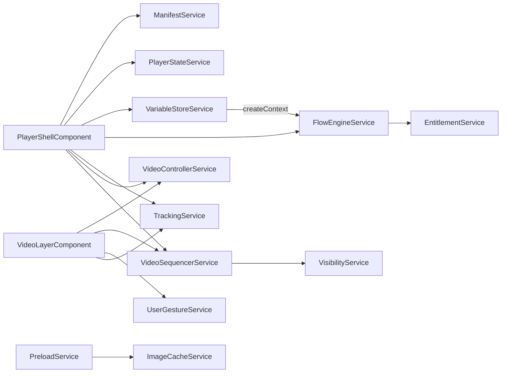

All services live in `projects/player/src/lib/services/` and are `@Injectable({ providedIn: 'root' })` singletons. The ones listed here are exported from the library's public API (`src/public-api.ts`) unless noted otherwise. See [Player Architecture](/player/architecture) for how they fit into the overall layering.

## Overview

| Service | Owns |
|---|---|
| `ManifestService` | Loading, validating, and indexing the manifest |
| `PlayerStateService` | Current panel and locale (reactive) |
| `VariableStoreService` | Scoped variables, mutations, persistence |
| `FlowEngineService` | Graph traversal and edge condition evaluation |
| `VariantService` | Panel/layer variant selection |
| `ImageCacheService` | LRU image cache with memory budget |
| `PreloadService` | Priority-based, network-aware asset preloading |
| `AudioEngineService` | Web Audio playback with per-role buses |
| `VideoControllerService` | Video concurrency ("one unmuted video") and pass signals |
| `VideoSequencerService` | Page-view sequential video playback |
| `VisibilityService` | IntersectionObserver wrapper (50% threshold) |
| `UserGestureService` | Autoplay-policy gesture tracking |
| `TrackingService` | Consent-gated, batched analytics events |
| `EntitlementService` | Paywall/entitlement checks via adapter |
| `PluginHostService` | Plugin lifecycle, sandboxing, messaging |
| `ExportService` | EDL/JSON/CSV timing exports |
| `TranslationService` | GUI string translation (ngx-translate wrapper) |

## ManifestService

`services/manifest.service.ts` — loads a manifest, asserts its structure, and builds `Map` indexes for constant-time lookups.

Key methods:

- `loadManifestFromUrl(url): Observable<PanelWaveManifest>` — HTTP fetch + validation (uses Angular `HttpClient`).
- `loadManifestFromObject(manifest): Observable<PanelWaveManifest>` — validate an in-memory manifest.
- `getManifest()`, `hasManifest()`, `clearManifest()`.
- Indexed lookups: `getPanel(panelId)` (returns `{ panel, chapterId }`), `getChapter(chapterId)`, `getAsset(assetId)`, plus `has*`/`get*Ids`/`get*Count` helpers, `getPanelsInChapter(chapterId)`, and `getChapterEntry(chapterId)`.

Validation is structural, not full JSON Schema validation: it requires `panelwave.version`, `meta.id`/`title`/`locales`/`default_locale`, a non-empty `chapters` array, and per chapter non-empty `panels`, a `graph` with `entry`, and an `edges` array. Full schema validation belongs to the [CLI](/schema/cli) and the CMS.

## PlayerStateService

`services/player-state.service.ts` — the reactive store the shell subscribes to.

- `currentPanel$: Observable<Panel | null>` / `setCurrentPanel(panel)` / `getCurrentPanel()`
- `locale$: Observable<LocaleCode>` / `setLocale(locale)` / `getLocale()`

<Callout kind="info">
A second, extended implementation exists at `src/lib/state/player-state.service.ts` with the full `PlayerState` shape (navigation history, preferences, overlay visibility, paywall gate, an event bus emitting `PlayerEvent`s, and `localStorage` persistence of preferences and tracking consent). It is not exported from the public API and is not injected by the shell today — contributions that extend player state should be aware of both files.
</Callout>

## VariableStoreService

`services/variable-store.service.ts` — scoped variable storage backing all condition evaluation. Covered in depth in [State & Conditions](/player/state-and-conditions).

- `setDefinitions(definitions)` — register `VariableDefinition`s and initialize defaults; enforces `readOnly` and per-type validation (`boolean`, `number`/`integer` with `min`/`max`, `string` with `pattern`, `enum`, date/time types) on later writes.
- `get(id, scope, scopeId?)` / `set(id, value, scope, scopeId?)` / `has(...)` — the five scopes are `global`, `chapter`, `page`, `session`, `persistent`; chapter/page scopes are keyed by a `scopeId`.
- `applyMutation(mutation, scope, scopeId?)` — applies `set`, `increment`, `decrement`, `toggle`, `append`, `remove`, `clear`.
- `createContext(chapterId?, pageId?)` — flattens all scopes into one object for JSON Logic evaluation.
- `resetScope(scope, scopeId?)`, `resetAll()` — reset and re-apply defaults; `persistent` scope round-trips through `localStorage` (`pw-variables-persistent`).
- `store: Observable<VariableStore>` — reactive snapshot stream.

## FlowEngineService

`services/flow-engine.service.ts` — pure graph traversal over a chapter's `Graph` (`entry` + `edges`).

- `getNextPanel(graph, currentPanelId, context): NavigationResult` — filters outgoing edges by JSON Logic `condition`, sorts by numeric `priority` (highest value wins), and returns `{ nextPanelId, transition, action }`.
- `getPreviousPanels(graph, panelId)` — reverse lookup over incoming edges.
- Analysis helpers: `getPossibleNextPanels`, `getEdgesToPanel`, `hasOutgoingEdges`, `isEndpoint`, `isEntry`, `getEntry`, `findEndpoints`, `hasPath` (BFS, bounded depth), `findPath` (BFS shortest path), `hasCycles` (DFS), `getReachablePanels`.
- Entitlement bridges: `checkPanelEntitlement`, `checkChapterEntitlement`, `checkWorkEntitlement` delegate to `EntitlementService`.

## VariantService

`services/variant.service.ts` — selects panel/layer variants from a `VariantGroup` using its own condition vocabulary (`always`, `age`, `choice`, `variable`, `random`, `time`, `playthrough`, `achievement`, combinable with `and`/`or`/`not`) and selection modes `first-match`, `highest-priority`, `random-match`. Also applies variants (`applyVariantToPanel`, `applyVariantToLayer`), supports manual overrides, and keeps a selection history. Details in [State & Conditions](/player/state-and-conditions#variants).

## ImageCacheService

`services/image-cache.service.ts` — LRU cache for decoded images (`ImageBitmap` where supported, `HTMLImageElement` fallback) with a 100 MB memory budget and in-flight request deduplication. Key methods: `load(url)`, `preload(url)`, `preloadBatch(urls)`, `has(url)`, `remove(url)`, `clear()`, `getStats()`, `setMemoryBudget(bytes)`. See [Performance](/player/performance#image-caching).

## PreloadService

`services/preload.service.ts` — priority queue (`high`/`medium`/`low`) that preloads images (through `ImageCacheService`), audio, and video metadata, with network-aware concurrency and `requestIdleCallback` scheduling for low-priority items. Key methods: `add(item)`, `addBatch(items)`, `preloadNext(...)`, `predictAndPreload(...)`, `setMaxConcurrent(max)`, `setNetworkAware(enabled)`, `getQueueStatus()`, plus a `status$` stream. See [Performance](/player/performance#preloading).

## AudioEngineService

`services/audio-engine.service.ts` — Web Audio playback with a master `GainNode` and one gain bus per role: `ambient`, `music`, `voiceover`, `sfx`.

- `initialize()` / `resumeContext()` — creates the `AudioContext` and probes the browser autoplay policy; call `resumeContext()` on user interaction.
- `play(track: AudioTrack)` / `stop(id, fadeOutMs?)` / `pause(id)` / `resume(id)` / `stopAll(fadeOutMs?)` — tracks are `HTMLAudioElement`s routed through `createMediaElementSource` into their role bus; `fadeIn`/`fadeOut` use linear gain ramps.
- `setMasterVolume(v)` / `setRoleVolume(role, v)` and getters.
- `playSequenceTracks(tracks, currentTimeMs, assetBaseUrl)` / `stopSequenceTracks(ids?)` — plays chapter timeline audio (`SequenceAudioTrack`) from the correct offset.
- `isAutoplayAllowed()`, `getPlaybackState(id)`, `getActiveTracks()`, `destroy()`.

See [Audio](/player/audio) for the integrator-facing behavior.

## Video services

Four services cooperate to implement video panels (see [Video](/schema/video) for the format):

- **`VideoControllerService`** (`video-controller.service.ts`) — enforces the concurrency rule *at most one unmuted video at a time* (any number of muted videos may play) via a registry of playing videos, preempting the previous unmuted one. Exposes `events$` (`play`/`pause`/`ended`/`error`/…), and `passComplete$` — emitted when a video completes one full pass (`once` → ended; `loop`/`pingpong`/`loop-from` → one cycle). The shell uses `passComplete$` for media-driven autoplay advance in panel view.
- **`VideoSequencerService`** (`video-sequencer.service.ts`) — page view only: visible `on-view` video panels play one after another in `Page.readingOrder` (fallback ordering: placement z-index, then y, then x). One queue slot = one panel (all its video layers start together; the slot completes when the longest pass completes). Emits `queueComplete` when the last slot finishes; has a configurable stall-skip timeout (`DEFAULT_STALL_TIMEOUT_MS` = 10 000 ms) so a stalled video cannot block the queue. Video layer components register a `SequencedVideo` handle — the sequencer never touches the DOM.
- **`VisibilityService`** (`visibility.service.ts`) — thin `IntersectionObserver` wrapper; a target counts as visible at `VISIBILITY_THRESHOLD` = 0.5 (50%). SSR-safe (no-ops without `IntersectionObserver`).
- **`UserGestureService`** (`user-gesture.service.ts`) — tracks whether a click/tap/keydown happened this session (`hasInteracted()`, `userHasInteracted$`). Browsers block autoplay with audio before a gesture, so programmatically started videos begin muted until this flag flips. Hover deliberately does not count.

## TrackingService

`services/tracking.service.ts` — privacy-conscious analytics pipeline:

- `configure(config)` — endpoint, `consentRequired` (default `true`), `eventWhitelist`, batch size/interval, debounce.
- `setConsent(consent)` / `getConsent()` — revoking consent clears the queue.
- `track(type, data?)` — drops events without consent or outside the whitelist; debounces high-frequency types (`scroll`, `mousemove`, `resize`, `progress`); batches (default: 10 events or every 5 s) and POSTs JSON to the configured endpoint with an anonymized session ID.
- `flush()`, `clear()`, `getSessionId()`, `getQueueSize()`, `destroy()`.

The shell wires the manifest's `tracking` section into this service on startup (consent requirement, whitelist, endpoint, `consent.defaultOptIn`). See [Tracking](/player/tracking).

## EntitlementService

`services/entitlement.service.ts` — access control behind a pluggable **adapter** (`EntitlementAdapter` from `types/entitlement.types.ts`; the default is a `NullEntitlementAdapter` that allows everything):

- `setAdapter(adapter)` / `getAdapter()`.
- `checkEntitlement(context): Promise<EntitlementStatus>` — resolves through the adapter with a 5-minute result cache keyed by `workId:chapterId:panelId`.
- Convenience checks: `hasAccessToPanel`, `hasAccessToChapter`, `hasAccessToWork`.
- `getSignedUrl(assetId, purpose)`, `showPaywall(gate)`, `verifyAge(minimumAge)`, `isAuthenticated()`, `getCurrentUser()` / `getCurrentUser$()`, `getEntitlementStatus$()`, `clearCache()`.

<Callout kind="alert">
`PlayerShellComponent` additionally declares its own, simpler `EntitlementAdapter` interface (`hasAccess(panelId)`, `getContext()`, optional `purchase(productId)`) as an `@Input`. That input drives navigation gating and seeds entitlement context variables; the richer `EntitlementService` adapter drives the paywall overlay and signed URLs. See [Paywall & Entitlement](/player/paywall-entitlement).
</Callout>

## PluginHostService, ExportService, TranslationService

- **`PluginHostService`** (`plugin-host.service.ts`) — registers plugins (max 10 by default), sandboxes them in iframes (`allow-scripts`, `allow-same-origin`), routes `postMessage` traffic, and manages capability grants (auto-granted: `read-manifest`, `read-state`). See [Plugins](/player/plugins).
- **`ExportService`** (`export.service.ts`) — converts chapters into timing exports: EDL documents, JSON, and timing/layer CSV rows (default framerate 24). Used by production tooling rather than the reading experience.
- **`TranslationService`** (`translation.service.ts`) — wraps `@ngx-translate/core` for player GUI strings (buttons, labels). Maps content locales (`en-US`) to GUI language codes (`en`). Content localization is separate — see [Localization](/player/localization).

## How they interact

Reading the arrows: the shell orchestrates navigation and configuration; `FlowEngineService` consumes the flattened variable context from `VariableStoreService` and consults `EntitlementService`; the video trio (`VideoControllerService`, `VideoSequencerService`, `VisibilityService`) is driven by `VideoLayerComponent` instances registering themselves; `PreloadService` delegates image work to `ImageCacheService`.

## Related pages

- [Player Architecture](/player/architecture) — layering and data flow
- [Components](/player/components) — who injects what
- [State & Conditions](/player/state-and-conditions) — the evaluation pipeline in detail
- [Performance](/player/performance) — preload and cache behavior
