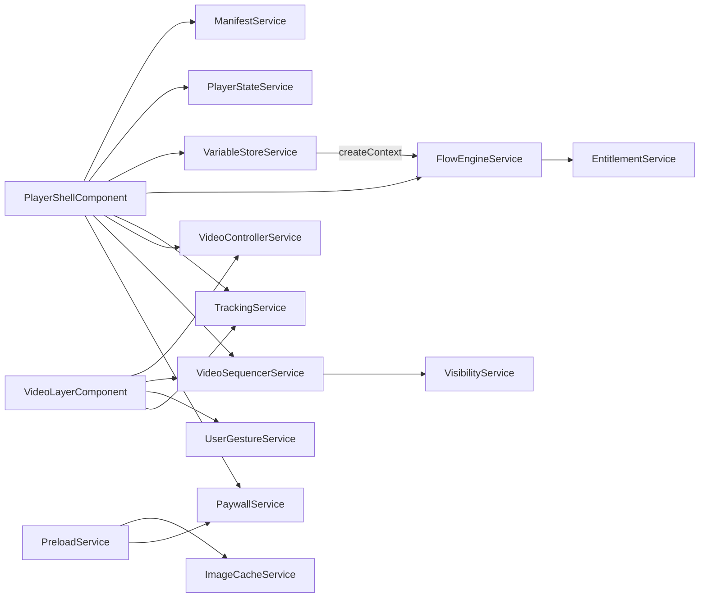

All services live in `projects/player/src/lib/services/` and are `@Injectable({ providedIn: 'root' })` singletons. The ones listed here are exported from the library's public API (`src/public-api.ts`) unless noted otherwise. See [Player Architecture](/player/architecture) for how they fit into the overall layering.

## Overview

| Service | Owns |
|---|---|
| `ManifestService` | Loading, validating, and indexing the manifest |
| `PlayerStateService` | Current panel, locale and reader preferences (reactive, preferences persisted) |
| `PanelAudioService` | Starts/stops the current panel's manifest audio through the engine |
| `VariableStoreService` | Scoped variables, mutations, persistence |
| `FlowEngineService` | Graph traversal and edge condition evaluation |
| `HotspotActionService` | Executes hotspot actions (mutations, plugin events) and returns UI effects |
| `variant-utils` (pure functions) | Panel variant selection & override application |
| `page-format-utils`, `thumbnail-utils` (pure functions) | Page sequence per screen, navigation thumbnails and the cover image |
| `ImageCacheService` | LRU image cache with memory budget |
| `PreloadService` | Priority-based, network-aware asset preloading |
| `AudioEngineService` | Web Audio playback with per-role buses |
| `VideoControllerService` | Video concurrency ("one unmuted video") and pass signals |
| `VideoSequencerService` | Page-view sequential video playback |
| `VisibilityService` | IntersectionObserver wrapper (50% threshold) |
| `UserGestureService` | Autoplay-policy gesture tracking |
| `TrackingService` | Consent-gated, batched analytics events |
| `PaywallService` | Evaluates the manifest's `paywall.rules` (and `x-locked` stubs) against the reader's entitlement snapshot; drives the shell's paywall overlay and age gate and tells renderers which panels to lock |
| `EntitlementService` | Standalone entitlement checks via the full adapter (signed URLs, custom flows) |
| `PluginHostService` | Plugin lifecycle, sandboxing, messaging |
| `ExportService` | EDL/JSON/CSV timing exports |
| `TranslationService` | GUI string translation (ngx-translate wrapper) |

## ManifestService

`services/manifest.service.ts` — loads a manifest, asserts its structure, and builds `Map` indexes for constant-time lookups.

Key methods:

- `loadManifestFromUrl(url): Observable<PanelWaveManifest>` — HTTP fetch + validation (uses Angular `HttpClient`).
- `loadManifestFromObject(manifest): Observable<PanelWaveManifest>` — validate an in-memory manifest.
- `getManifest()`, `hasManifest()`, `clearManifest()`.
- Indexed lookups: `getPanel(panelId)` (returns `{ panel, chapterId }`), `getChapter(chapterId)`, `getAsset(assetId)`, plus `has*`/`get*Ids`/`get*Count` helpers, `getPanelsInChapter(chapterId)`, and `getChapterEntry(chapterId)`.

Validation is structural, not full JSON Schema validation: it requires `panelwave.version`, `meta.id`/`title`/`locales`/`default_locale`, a non-empty `chapters` array, and per chapter non-empty `panels`, a `graph` with `entry`, and an `edges` array. Full schema validation belongs to the [CLI](/schema/cli) and the CMS.

## PlayerStateService

`services/player-state.service.ts` — the reactive store the shell subscribes to.

- `currentPanel$: Observable<Panel | null>` / `setCurrentPanel(panel)` / `getCurrentPanel()`
- `locale$: Observable<LocaleCode>` / `setLocale(locale)` / `getLocale()`
- `preferences$: Observable<PlayerPreferences>` / `getPreferences()` / `updatePreference(key, value)` / `updatePreferences(patch)` — the reader's preferences (`speech`, `audio`, `sfx`, `autoplay`, `secondsPerPanel`, `mangaMode`, `reducedMotion`, `highContrast`, `masterVolume`, `sfxVolume`; defaults in `DEFAULT_PLAYER_PREFERENCES`). Only keys the reader set explicitly are written to `localStorage` (`PREFERENCES_STORAGE_KEY` = `pw-preferences`) and reloaded on construction; `hasPersistedPreference(key)` tells the shell whether to honour the reader's choice or a work's `settings.ui.*Default`.

<Callout kind="info">
A second, extended implementation exists at `src/lib/state/player-state.service.ts` with the full `PlayerState` shape (navigation history, overlay visibility, paywall gate, an event bus emitting `PlayerEvent`s, tracking consent). It is not exported from the public API and is not injected by the shell — contributions that extend player state should be aware of both files and target the exported one.
</Callout>

## PanelAudioService

`services/panel-audio.service.ts` — the manifest-to-engine bridge the shell calls on every panel / variable-context change.

- `syncPanel(panelId, panel, variableContext)` — resolves the panel's `audio[]` tracks and `kind: "audio"` layers against the asset catalog and makes the engine's playing set match: starts new tracks (honouring `startAtMs`, `gain`, `loop`, `visibleIf`), stops tracks the panel no longer wants (loops with a 250 ms fade), keeps a looping track shared with the previous panel running, and re-evaluates `visibleIf` without restarting anything when only variables changed. Idempotent for an unchanged panel.
- `stopAll()` — shell teardown; `getDesiredTrackIds()` for diagnostics.
- From the release after 1.2.0 the shell syncs **no panel** while the current one is locked for the reader (paywall rule or `x-locked` stub) or the cover is shown, so a gated panel's audio starts only once the lock lifts.
- `busForRole(role)` (exported function) — manifest role → engine bus (`ui` → `sfx`, `none` → `music`).
- Tracks refused by the browser's autoplay policy are retried, and the `AudioContext` resumed, on the first gesture reported by `UserGestureService`.

See [Audio](/player/audio#what-the-shell-plays-automatically).

## VariableStoreService

`services/variable-store.service.ts` — scoped variable storage backing all condition evaluation. Covered in depth in [State & Conditions](/player/state-and-conditions).

- `setDefinitions(definitions)` — register `VariableDefinition`s and initialize defaults; enforces `readOnly` and per-type validation (`boolean`, `number`/`integer` with `min`/`max`, `string` with `pattern`, `enum`, date/time types) on later writes.
- `get(id, scope, scopeId?)` / `set(id, value, scope, scopeId?)` / `has(...)` — the five scopes are `global`, `chapter`, `page`, `session`, `persistent`; chapter/page scopes are keyed by a `scopeId`.
- `applyMutation(mutation, scope, scopeId?)` — applies `set`, `increment`, `decrement`, `toggle`, `append`, `remove`, `clear`.
- `applyMutations(mutations, { chapterId?, pageId? })` — batch-applies manifest-shaped `Mutation[]` (as carried by hotspot and edge actions), resolving each variable's scope from its definition; variables without a definition fall back to `session` scope.
- `createContext(chapterId?, pageId?)` — flattens all scopes into one object for JSON Logic evaluation.
- `resetScope(scope, scopeId?)`, `resetAll()` — reset and re-apply defaults; `persistent` scope round-trips through `localStorage` (`pw-variables-persistent`).
- `store: Observable<VariableStore>` — reactive snapshot stream.

## FlowEngineService

`services/flow-engine.service.ts` — pure graph traversal over a chapter's `Graph` (`entry` + `edges`).

- `getNextPanel(graph, currentPanelId, context): NavigationResult` — filters outgoing edges by JSON Logic `condition`, sorts by numeric `priority` (highest value wins), and returns `{ nextPanelId, transition, action }`.
- `getPreviousPanels(graph, panelId)` — reverse lookup over incoming edges.
- `getNextInChapter(chapter, currentPanelId, context, defaultTransition?, defaultCameraMove?)` / `getPreviousInChapter(chapter, currentPanelId)` (from the release after 1.2.0) — what the shell calls: a chapter **with** edges uses `getNextPanel` / `getPreviousPanels`; a chapter **without any edges** (allowed since format 1.7) follows its reading order — the entry panel, then the remaining panels in `chapter.panels` key order — with the default transition and camera move passed in; `{ nextPanelId: null }` / `[]` past either end.
- Analysis helpers: `getPossibleNextPanels`, `getEdgesToPanel`, `hasOutgoingEdges`, `isEndpoint`, `isEntry`, `getEntry`, `findEndpoints`, `hasPath` (BFS, bounded depth), `findPath` (BFS shortest path), `hasCycles` (DFS), `getReachablePanels`.
- Entitlement bridges: `checkPanelEntitlement`, `checkChapterEntitlement`, `checkWorkEntitlement` delegate to `EntitlementService`.

## HotspotActionService

`services/hotspot-action.service.ts` — executes a hotspot's [action](/schema/hotspots#hotspotaction) when the reader activates it. Pure side effects happen inside the service; UI side effects come back as a typed effect the shell applies — which keeps the service fully unit-testable.

- `execute(action, { chapterId?, pageId? }): HotspotUiEffect` — behavior per action type:
  - `goTo` — applies the action's `mutations` first (via `VariableStoreService.applyMutations`), then returns `{ kind: 'navigate', to, transition? }`; the shell navigates with the transition.
  - `setVariables` — applies the mutations; returns `{ kind: 'none' }`.
  - `openExtras` — returns `{ kind: 'openExtras', extrasId }`; the shell opens the extras viewer at that item.
  - `openModal` — returns `{ kind: 'openModal', title, content }` (both `LocalizedString`s); the shell shows `pw-action-modal`.
  - `pluginEvent` — forwards to `PluginHostService.emitEventToPlugins(event, { pluginId, payload })`; returns `{ kind: 'none' }`.

After every activation the shell rebuilds the variable context, so `visibleIf`-gated hotspots, edges, and variants react immediately. Every activation is also recorded as a `hotspot_click` tracking event — see [Tracking](/player/tracking#reading-session-and-hotspot-events).

## Variant resolution (variant-utils)

Panel variants are resolved by the pure helpers in `utils/variant-utils.ts` (`selectVariant`, `applyVariantOverrides`, `resolvePanelVariant`, `resolvePanels`) — first matching JSON Logic `when` in manifest order wins, overrides replace fields wholesale. The shell owns the wiring (effective panel, manual Alt-button overrides, `.variant-active` indicator). Details in [State & Conditions](/player/state-and-conditions#variants).

## Page formats and thumbnails (page-format-utils, thumbnail-utils)

From the release after 1.2.0, the pure helpers the shell uses for page view, the thumbnail strip and the table of contents are exported, so a host can build its own chapter list or page picker with the same results:

- `pickPageFormat(available, width, height, dpr?, preferred?)` — the output format page view shows for a box of that size (CSS px) and device pixel ratio, or `null` when the pages carry no format; `preferred` wins when pages exist for it. Built on `screenClassFor(width, height, dpr?)` (`'phone' | 'tablet' | 'desktop' | 'bigscreen'` — a 4K panel at 150 % or 200 % scaling still counts as a big screen) and `rankPageFormats(available, screen, aspect?)` (the screen class's preference list, then unknown formats by closest aspect ratio).
- `pageFormatOf(page)` / `pageFormatsOf(pages)` — a page's `layout.format` / the distinct formats of a page list.
- `pagesForFormat(pages, format)` — one format's page sequence; pages without a format belong to every sequence.
- `pageAspectRatio(page)` — width / height of a page's frame: its canvas size, else its format's aspect, else 16:9.
- `panelThumbnailSrc(panel, lookup, width = THUMBNAIL_WIDTH)` — a panel's thumbnail: an explicit `thumbnail`, else the catalog rendition (for `THUMBNAIL_WIDTH` = 320 px) of its bottom-most visible image layer, else the poster of its first video layer; empty when it has no artwork. `lookup` maps an asset id to its catalog item.
- `coverImageSrc(manifest, lookup, width?)` — the work's cover: `meta.cover`, else the `extras.cover` block's image, link or thumbnail (a gated cover block is skipped); empty when there is none.

The returned sources are unresolved; pass them through `AssetUrlService.resolve(src, 'image')` before rendering.

## ImageCacheService

`services/image-cache.service.ts` — LRU cache for decoded images (`ImageBitmap` where supported, `HTMLImageElement` fallback) with a 100 MB memory budget and in-flight request deduplication. Key methods: `load(url)`, `preload(url)`, `preloadBatch(urls)`, `has(url)`, `remove(url)`, `clear()`, `getStats()`, `setMemoryBudget(bytes)`. From the release after 1.2.0, `preload(url)` warms an image for an upcoming `` instead: it loads and decodes it through an `Image` element (the same request an `` makes, no CORS request) and keeps the last 48 warmed elements referenced. See [Performance](/player/performance#image-caching).

## PreloadService

`services/preload.service.ts` — priority queue (`high`/`medium`/`low`) that preloads images (through `ImageCacheService`), audio, and video metadata, with network-aware concurrency and `requestIdleCallback` scheduling for low-priority items. Key methods: `add(item)`, `addBatch(items)`, `preloadNext(...)`, `predictAndPreload(...)`, `setMaxConcurrent(max)`, `setNetworkAware(enabled)`, `getQueueStatus()`, plus a `status$` stream. From the release after 1.2.0, `add()` skips items whose `panelId` the paywall locks for the reader (`PaywallService.isPanelLocked`), so gated artwork is not fetched ahead of the gate; a later call after the lock lifts loads them. Items without a panel id, or with one the paywall doesn't know, load as before. See [Performance](/player/performance#preloading).

## AudioEngineService

`services/audio-engine.service.ts` — Web Audio playback with a master `GainNode` and one gain bus per role: `ambient`, `music`, `voiceover`, `sfx`.

- `initialize()` / `resumeContext()` — creates the `AudioContext` and probes the browser autoplay policy; call `resumeContext()` on user interaction.
- `play(track: AudioTrack)` / `stop(id, fadeOutMs?)` / `pause(id)` / `resume(id)` / `stopAll(fadeOutMs?)` — tracks are `HTMLAudioElement`s routed through `createMediaElementSource` into a per-track `GainNode` (`volume` 0–2, fades as linear ramps on that node) and from there into their role bus; one-shot tracks release themselves on `ended`.
- `setMasterVolume(v)` / `setRoleVolume(role, v)` and getters; `setMasterMuted(bool)` / `isMasterMuted()` / `masterMuted$` and `setRoleMuted(role, bool)` / `isRoleMuted(role)` — mutes are independent of volumes (what the toolbar toggles drive); `setTrackVolume(id, v)`, `isActive(id)`.
- `playSequenceTracks(tracks, currentTimeMs, assetBaseUrl)` / `stopSequenceTracks(ids?)` — plays chapter timeline audio (`SequenceAudioTrack`) from the correct offset.
- `isAutoplayAllowed()`, `getPlaybackState(id)`, `getActiveTracks()`, `destroy()`.

See [Audio](/player/audio) for the integrator-facing behavior.

## Video services

Four services cooperate to implement video panels (see [Video](/schema/video) for the format):

- **`VideoControllerService`** (`video-controller.service.ts`) — enforces the concurrency rule *at most one unmuted video at a time* (any number of muted videos may play) via a registry of playing videos, preempting the previous unmuted one. Exposes `events$` (`play`/`pause`/`ended`/`error`/…), and `passComplete$` — emitted when a video completes one full pass (`once` → ended; `loop`/`pingpong`/`loop-from` → one cycle). The shell uses `passComplete$` for media-driven autoplay advance in panel view.
- **`VideoSequencerService`** (`video-sequencer.service.ts`) — page view only: visible `on-view` video panels play one after another in `Page.readingOrder` (fallback ordering: placement z-index, then y, then x). One queue slot = one panel (all its video layers start together; the slot completes when the longest pass completes). Emits `queueComplete` when the last slot finishes; has a configurable stall-skip timeout (`DEFAULT_STALL_TIMEOUT_MS` = 10 000 ms) so a stalled video cannot block the queue. Video layer components register a `SequencedVideo` handle — the sequencer never touches the DOM.
- **`VisibilityService`** (`visibility.service.ts`) — thin `IntersectionObserver` wrapper; a target counts as visible at `VISIBILITY_THRESHOLD` = 0.5 (50%). SSR-safe (no-ops without `IntersectionObserver`).
- **`UserGestureService`** (`user-gesture.service.ts`) — tracks whether a click/tap/keydown happened this session (`hasInteracted()`, `userHasInteracted$`). Browsers block autoplay with audio before a gesture, so programmatically started videos begin muted until this flag flips. Hover deliberately does not count.

## TrackingService

`services/tracking.service.ts` — privacy-conscious analytics pipeline:

- `configure(config)` — endpoint, `consentRequired` (default `true`), `eventWhitelist`, batch size/interval, debounce.
- `setConsent(consent)` / `getConsent()` — revoking consent clears the queue.
- `track(type, data?)` — drops events without consent or outside the whitelist; debounces high-frequency types (`scroll`, `mousemove`, `resize`, `progress`); batches (default: 10 events or every 5 s) and POSTs JSON to the configured endpoint with an anonymized session ID.
- `flush()`, `clear()`, `getSessionId()`, `getQueueSize()`, `destroy()`.

The shell wires the manifest's `tracking` section into this service on startup (consent requirement, whitelist, endpoint, `consent.defaultOptIn`). See [Tracking](/player/tracking).

## PaywallService

`services/paywall.service.ts` — the shell's gatekeeper. `setManifest(manifest)` loads the rules (via the pure functions in `entitlement/paywall-evaluator.ts`) and the reading order used for free-preview counting (work-wide for work rules, within the chapter for chapter rules); `setSnapshot(snapshot)` / `getSnapshot()` hold what the reader owns (anonymous by default). `canAccess(panelId)`, `evaluate(panelId)` (an `AccessDecision` with the lock reason), `gateFor(panelId)` (a `PaywallGate` for the overlay, including the rule's Buy / Subscribe `options`) and `ruleFor(panelId)` answer per panel; `isExtraLocked(extraId)` answers for an extras block, and the static `PaywallService.purchaseOptions(rule)` derives a rule's options. A work without rules reports every panel accessible. See [Paywall & Entitlement](/player/paywall-entitlement).

From the release after 1.2.0:

- `isPanelLocked(panelId)` — should renderers show the locked placeholder for this panel? `evaluate()` is memoized per rules + snapshot, so it is cheap to call from templates; viewport, canvas stage, thumbnail strip, table of contents and `PreloadService` all ask it.
- `changes$: Observable<void>` — fires whenever a lock can flip (new manifest, new snapshot, enforcement change, `clear()`); renderers re-check `isPanelLocked` on it.
- `setEnforced(enforced)` — the shell turns enforcement off while a host `entitlementAdapter` decides access; the rules then still describe gates but no longer lock rendering.
- Panels marked `"x-locked": true` are locked whatever the rules say: `evaluate()` reports them locked (keeping the applying rule's lock reason while it locks, else `subscription_required` / `purchase_required`, never the age), and the renderers check `isLockedPanel(panel)` themselves, so stubs stay locked with enforcement off too. `isFreeWork` is `false` when the manifest has such panels. See [Server-stripped panels](/player/paywall-entitlement#server-stripped-panels).
- Age requirements combine across every rule that applies to a panel (see [How rules are evaluated](/player/paywall-entitlement#how-rules-are-evaluated)).

## EntitlementService

`services/entitlement.service.ts` — standalone access control behind a pluggable **adapter** (`EntitlementAdapter` from `types/entitlement.types.ts`; the default is a `NullEntitlementAdapter` that **denies** everything). The embedded shell does not use it for gating:

- `setAdapter(adapter)` / `getAdapter()`.
- `checkEntitlement(context): Promise<EntitlementStatus>` — resolves through the adapter with a 5-minute result cache keyed by `workId:chapterId:panelId`.
- Convenience checks: `hasAccessToPanel`, `hasAccessToChapter`, `hasAccessToWork`.
- `getSignedUrl(assetId, purpose)`, `showPaywall(gate)`, `verifyAge(minimumAge)`, `isAuthenticated()`, `getCurrentUser()` / `getCurrentUser$()`, `getEntitlementStatus$()`, `clearCache()`.

<Callout kind="alert">
`PlayerShellComponent` additionally declares its own, simpler `EntitlementAdapter` interface (`hasAccess(panelId)`, `getContext()`, optional `purchase(productId)`) as an `@Input`. When set, it replaces the `PaywallService` check for navigation and seeds entitlement context variables; it does not lock rendering (the shell calls `PaywallService.setEnforced(false)`), so don't rely on it to hide content. The exported `EntitlementAdapter` type is the richer one used by `EntitlementService` (and implemented by `HttpEntitlementAdapter`). See [Paywall & Entitlement](/player/paywall-entitlement#custom-access-checks).
</Callout>

## PluginHostService, ExportService, TranslationService

- **`PluginHostService`** (`plugin-host.service.ts`) — registers plugins (max 10 by default), sandboxes them in iframes (`allow-scripts`, plus `allow-same-origin` for cross-origin plugins only), routes `postMessage` traffic — accepting messages only from each plugin's own frame and origin — and manages capability grants (auto-granted: `read-manifest`, `read-state`). See [Plugins](/player/plugins#security-model).
- **`ExportService`** (`export.service.ts`) — converts chapters into timing exports: EDL documents, JSON, and timing/layer CSV rows (default framerate 24). Used by production tooling rather than the reading experience.
- **`TranslationService`** (`translation.service.ts`) — wraps `@ngx-translate/core` for player GUI strings (buttons, labels). Maps content locales (`en-US`) to GUI language codes (`en`). Content localization is separate — see [Localization](/player/localization).

## How they interact

```mermaid
graph LR
    SHELL[PlayerShellComponent] --> MS[ManifestService]
    SHELL --> PS[PlayerStateService]
    SHELL --> VS[VariableStoreService]
    SHELL --> FE[FlowEngineService]
    SHELL --> TR[TrackingService]
    SHELL --> VC[VideoControllerService]
    SHELL --> SEQ[VideoSequencerService]
    FE --> ENT[EntitlementService]
    VS -->|createContext| FE
    SEQ --> VIS[VisibilityService]
    VL[VideoLayerComponent] --> VC
    VL --> SEQ
    VL --> UG[UserGestureService]
    VL --> TR
    PRE[PreloadService] --> IC[ImageCacheService]
    SHELL --> PW[PaywallService]
    PRE --> PW
```

Reading the arrows: the shell orchestrates navigation and configuration; `FlowEngineService` consumes the flattened variable context from `VariableStoreService` and consults `EntitlementService`; the video trio (`VideoControllerService`, `VideoSequencerService`, `VisibilityService`) is driven by `VideoLayerComponent` instances registering themselves; `PreloadService` delegates image work to `ImageCacheService` and skips panels `PaywallService` locks.

## Related pages

- [Player Architecture](/player/architecture) — layering and data flow
- [Components](/player/components) — who injects what
- [State & Conditions](/player/state-and-conditions) — the evaluation pipeline in detail
- [Performance](/player/performance) — preload and cache behavior

