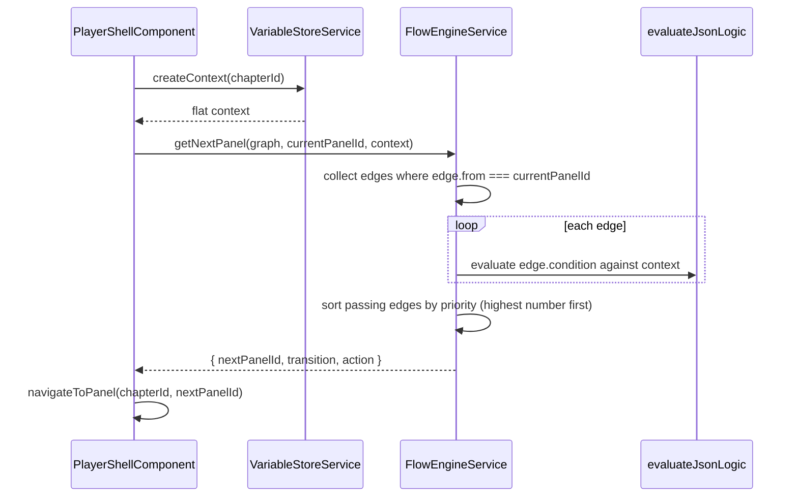

Branching stories in PanelWave are driven by three cooperating pieces: the **variable store** (state), **JSON Logic** (conditions on graph edges), and the **flow engine** (graph traversal). A separate **variant system** selects alternative panel/layer content. This page explains the runtime mechanics; the format itself is specified in [Graph](/schema/graph), [Variables](/schema/variables), and [Variants](/schema/variants).

## Variables: scopes, defaults, validation

`VariableStoreService` keeps values in five scopes matching the schema:

| Scope | Keyed by | Lifetime |
|---|---|---|
| `global` | — | Whole work, current run |
| `chapter` | `scopeId` (chapter ID) | Per chapter |
| `page` | `scopeId` (page ID) | Per page |
| `session` | — | Current browser session |
| `persistent` | — | Survives reloads (`localStorage` key `pw-variables-persistent`) |

`setDefinitions(definitions)` registers the manifest's `VariableDefinition`s and initializes defaults. After that, every `set()` is checked:

- **Read-only** definitions reject writes (with a console warning; the write is dropped).
- **Type validation** per definition: `boolean`; `number`/`integer` with optional `min`/`max`; `string` with optional regex `pattern`; `enum` against the allowed list; `date`/`time`/`datetime` as strings. Invalid writes are dropped.

## Mutations

State changes are expressed as mutations (`VariableMutation` — `{ op, var, value?, amount? }`) applied through `applyMutation(mutation, scope, scopeId?)`:

| `op` | Effect |
|---|---|
| `set` | Assign `value` |
| `increment` / `decrement` | Add/subtract `amount` (default 1); only applies to numbers |
| `toggle` | Flip a boolean |
| `append` | Push `value` onto an array (creates the array if needed) |
| `remove` | Filter `value` out of an array |
| `clear` | Reset to the definition's default (or `null`) |

Graph edges may carry `action?: Mutation[]` — mutations meant to run when the edge is traversed. `FlowEngineService.getNextPanel()` returns these in its `NavigationResult.action`, but note that **`PlayerShellComponent` does not currently apply them automatically**; applying edge actions is up to the navigation host (via `VariableStoreService.applyMutation`).

## The evaluation context

Conditions never see the scoped store directly. `VariableStoreService.createContext(chapterId?, pageId?)` flattens the scopes into a single object, merged in this order (later wins on key collisions):

1. `global`
2. `session`
3. `persistent`
4. `chapter[chapterId]`
5. `page[pageId]`

So a chapter- or page-scoped variable shadows a global of the same name while you are inside that chapter/page.

## JSON Logic conditions

Edge conditions are [JSON Logic](https://jsonlogic.com/) expressions evaluated by `evaluateJsonLogic(logic, context)` in `utils/json-logic-utils.ts` (backed by `json-logic-js`):

- `undefined`/`null` condition → **`true`** (an unconditioned edge is always traversable).
- A literal boolean is returned as-is.
- Evaluation errors are caught, logged, and return **`false`** — conditions fail closed.

```json
{
  "from": "panel-12",
  "to": "panel-13-secret",
  "condition": { "and": [
    { ">=": [{ "var": "trust" }, 3] },
    { "==": [{ "var": "metTheStranger" }, true] }
  ]},
  "priority": 10
}
```

The utils module also provides `validateJsonLogic()`, `extractVariableNames()` (find every `{ "var": ... }` reference), `evaluateAll()`/`evaluateAny()`, and `addCustomOperator()`. Calling `registerPanelWaveOperators()` registers convenience operators: `in`, `contains`, `matches` (regex), `between`, `length`, and `isEmpty`.

## Graph traversal

`FlowEngineService` implements navigation over a chapter's `Graph` (`entry: string | string[]` plus `edges`):



Selection rules in `getNextPanel()`:

1. Collect all edges with `from === currentPanelId`. No edges → `{ nextPanelId: null }` (the panel is an endpoint).
2. Keep edges whose `condition` evaluates truthy against the context.
3. Sort survivors by `priority` **descending** — a missing priority counts as `0`, and the numerically highest priority wins.
4. Return the first edge's `to`, `transition`, and `action`.

Backwards navigation (`navigatePrevious` in the shell) uses `getPreviousPanels()` — the `from` ends of edges pointing *to* the current panel — and takes the first one. There is no persistent history stack in the active state service.

Beyond stepping, the engine offers graph analysis used by tooling and the shell: `isEntry`/`isEndpoint`, `findEndpoints`, `hasPath(graph, a, b, maxDepth = 100)` and `findPath` (both BFS, ignoring conditions), `hasCycles` (DFS with a recursion stack), and `getReachablePanels`.

### Entitlement gating

Navigation is also gated by monetization: the shell checks its `entitlementAdapter.hasAccess(panelId)` before entering a panel, and `FlowEngineService` exposes `checkPanelEntitlement` / `checkChapterEntitlement` / `checkWorkEntitlement`, which delegate to `EntitlementService` (with its 5-minute cache). See [Paywall & Entitlement](/player/paywall-entitlement).

## Variants

Panel and layer **variants** are alternative content selected at render time by `VariantService` — a system separate from edge conditions, with its own declarative condition vocabulary (`VariantCondition`):

| Condition `type` | Matches when |
|---|---|
| `always` | Always |
| `age` | `context.userAge` is within `minAge`/`maxAge` |
| `choice` | All `requiredChoices` are in `choiceHistory` and no `excludedChoices` are |
| `variable` | `variables[variableKey]` compares to `variableValue` via `variableOperator` (`eq`, `ne`, `gt`, `gte`, `lt`, `lte`, `contains`) |
| `random` | A random roll is below `probability` (deterministic when `context.randomSeed` is set) |
| `time` | Now is inside `timeRange` (HH:MM) and/or `dateRange` |
| `playthrough` | `playthroughCount` is within `playthroughMin`/`playthroughMax` |
| `achievement` | All `requiredAchievements` are in `context.achievements` |

Conditions compose with `and` / `or` / `not`. A `VariantGroup` is resolved by `selectVariant(group, context?)`:

1. Every variant's condition is evaluated against the `VariantContext` (choice history, variables, playthrough count, achievements, user age, seed).
2. If nothing matches, the group's `defaultVariant` is used when present.
3. Otherwise the group `mode` picks among the matches: `first-match`, `highest-priority`, or `random-match`.

Applying a selection: `applyVariantToPanel(panel, variant)` overrides `layers`, `duration`, `transition`, and `audio`; `applyVariantToLayer(layer, variant)` either merges `layerOverrides` or swaps in a full `layerReplacement`. The service records every application (`getAppliedOverrides()`, `getHistory()`), supports `debugMode`/`logSelections`, and allows manual per-panel overrides when `allowManualOverride` is enabled (used by `pw-variant-selector`).

<Callout kind="info">
Keep the two condition systems apart: **edges** use raw JSON Logic against the flattened variable context; **variants** use the typed `VariantCondition` objects above. A variable can drive both.
</Callout>

## Putting it together

A typical interactive beat — the reader clicks a hotspot that represents a choice:

1. The hotspot handler applies mutations, e.g. `applyMutation({ op: 'set', var: 'doorChoice', value: 'left' }, 'chapter', chapterId)`.
2. The host navigates: `createContext(chapterId)` flattens state, `getNextPanel()` finds the edge whose condition `{ "==": [{ "var": "doorChoice" }, "left"] }` now passes.
3. The next panel renders; if it defines variants, `VariantService` may swap layers based on the same variables.
4. State that should outlive the session (achievements, unlocked endings) lives in the `persistent` scope and survives reloads.
