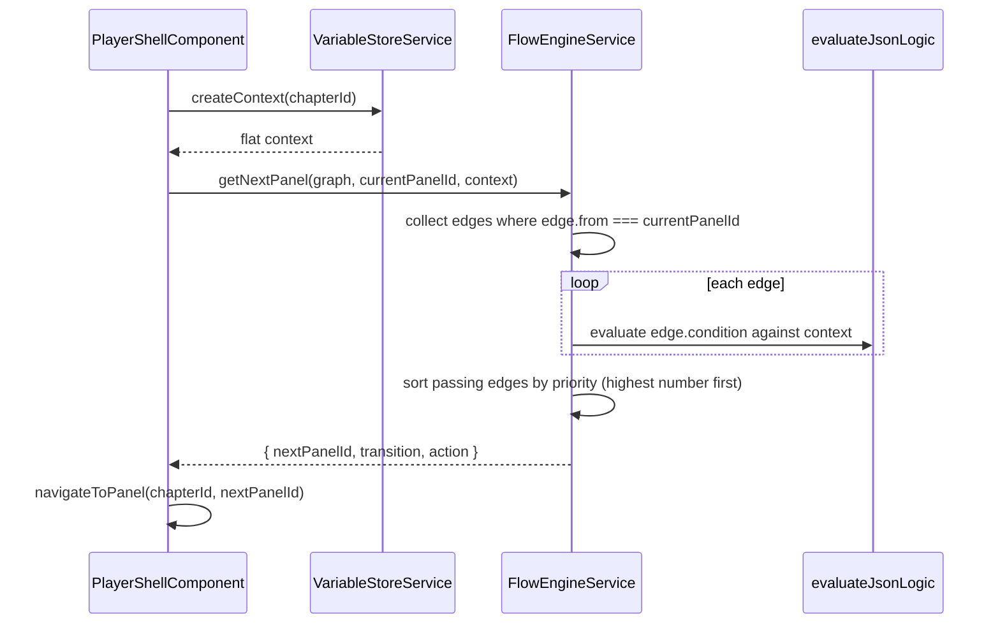

Branching stories in PanelWave are driven by three cooperating pieces: the **variable store** (state), **JSON Logic** (conditions on graph edges), and the **flow engine** (graph traversal). Panel **variants** reuse the same variables and JSON Logic to select alternative panel content. This page explains the runtime mechanics; the format itself is specified in [Graph](/schema/graph), [Variables](/schema/variables), and [Variants](/schema/variants).

## Variables: scopes, defaults, validation

`VariableStoreService` keeps values in five scopes matching the schema:

| Scope | Keyed by | Lifetime |
|---|---|---|
| `global` | — | Whole work, current run |
| `chapter` | `scopeId` (chapter ID) | Per chapter |
| `page` | `scopeId` (page ID) | Per page |
| `session` | — | Current browser session |
| `persistent` | — | Survives reloads (`localStorage` key `pw-variables-persistent`) |

`setDefinitions(definitions)` registers the manifest's `VariableDefinition`s and initializes defaults — the shell does this automatically at startup from `manifest.variables.definitions`. After that, every `set()` is checked:

- **Read-only** definitions reject writes (with a console warning; the write is dropped).
- **Type validation** per definition: `boolean`; `number`/`integer` with optional `min`/`max`; `string` with optional regex `pattern`; `enum` against the allowed list; `date`/`time`/`datetime` as strings. Invalid writes are dropped.

### How values get set

In order at startup, then at runtime:

1. **Manifest defaults** — each definition's `default` initializes its declared scope.
2. **Host seeding** — the shell's `initialVariables` input, then the entitlement adapter's `getContext()`, go through the privileged `seed()`: types are still validated, but `readOnly` variables MAY be populated. This is the channel for externally-verified facts (an account system's `user.age`, entitlement flags): declare the variable `readOnly` + `visibility: 'private'` and no hotspot mutation or settings edit can ever change it.
3. **In-story mutations** — hotspot `setVariables`/`goTo` mutations and edge actions, via `set()` (read-only and type guards apply).
4. **Reader edits** — the settings modal's Variables tab lists variables that are public (the default when `visibility` is omitted) and not read-only; saved edits apply through `set()` and re-resolve conditional content immediately.
5. **Host API** — `PlayerShellComponent.setVariable(key, value, scope)` at any time (same guards).

## Mutations

State changes are expressed as mutations (`VariableMutation` — `{ op, var, value?, amount? }`) applied through `applyMutation(mutation, scope, scopeId?)`:

| `op` | Effect |
|---|---|
| `set` | Assign `value` |
| `increment` / `decrement` | Add/subtract `amount` (default 1); only applies to numbers |
| `toggle` | Flip a boolean |
| `append` | Push `value` onto an array (creates the array if needed) |
| `remove` | Filter `value` out of an array |
| `clear` | Reset to the definition's default (or `null`) |

Graph edges may carry `action?: Mutation[]` — mutations meant to run when the edge is traversed. `FlowEngineService.getNextPanel()` returns these in its `NavigationResult.action`, but note that **`PlayerShellComponent` does not currently apply them automatically**; applying edge actions is up to the navigation host (via `VariableStoreService.applyMutation`).

## The evaluation context

Conditions never see the scoped store directly. `VariableStoreService.createContext(chapterId?, pageId?)` flattens the scopes into a single object, merged in this order (later wins on key collisions):

1. `global`
2. `session`
3. `persistent`
4. `chapter[chapterId]`
5. `page[pageId]`

So a chapter- or page-scoped variable shadows a global of the same name while you are inside that chapter/page.

## JSON Logic conditions

Edge conditions are [JSON Logic](https://jsonlogic.com/) expressions evaluated by `evaluateJsonLogic(logic, context)` in `utils/json-logic-utils.ts` (backed by `json-logic-js`):

- `undefined`/`null` condition → **`true`** (an unconditioned edge is always traversable).
- A literal boolean is returned as-is.
- Evaluation errors are caught, logged, and return **`false`** — conditions fail closed.

```json
{
  "from": "panel-12",
  "to": "panel-13-secret",
  "condition": { "and": [
    { ">=": [{ "var": "trust" }, 3] },
    { "==": [{ "var": "metTheStranger" }, true] }
  ]},
  "priority": 10
}
```

The utils module also provides `validateJsonLogic()`, `extractVariableNames()` (find every `{ "var": ... }` reference), `evaluateAll()`/`evaluateAny()`, and `addCustomOperator()`. Calling `registerPanelWaveOperators()` registers convenience operators: `in`, `contains`, `matches` (regex), `between`, `length`, and `isEmpty`.

## Graph traversal

`FlowEngineService` implements navigation over a chapter's `Graph` (`entry: string | string[]` plus `edges`):


```mermaid
sequenceDiagram
    participant Shell as PlayerShellComponent
    participant VS as VariableStoreService
    participant FE as FlowEngineService
    participant JL as evaluateJsonLogic

    Shell->>VS: createContext(chapterId)
    VS-->>Shell: flat context
    Shell->>FE: getNextPanel(graph, currentPanelId, context)
    FE->>FE: collect edges where edge.from === currentPanelId
    loop each edge
        FE->>JL: evaluate edge.condition against context
    end
    FE->>FE: sort passing edges by priority (highest number first)
    FE-->>Shell: { nextPanelId, transition, action }
    Shell->>Shell: navigateToPanel(chapterId, nextPanelId)
```

Selection rules in `getNextPanel()`:

1. Collect all edges with `from === currentPanelId`. No edges → `{ nextPanelId: null }` (the panel is an endpoint).
2. Keep edges whose `condition` evaluates truthy against the context.
3. Sort survivors by `priority` **descending** — a missing priority counts as `0`, and the numerically highest priority wins.
4. Return the first edge's `to`, `transition`, and `action`.

Backwards navigation (`navigatePrevious` in the shell) uses `getPreviousPanels()` — the `from` ends of edges pointing *to* the current panel — and takes the first one. There is no persistent history stack in the active state service.

Beyond stepping, the engine offers graph analysis used by tooling and the shell: `isEntry`/`isEndpoint`, `findEndpoints`, `hasPath(graph, a, b, maxDepth = 100)` and `findPath` (both BFS, ignoring conditions), `hasCycles` (DFS with a recursion stack), and `getReachablePanels`.

### Entitlement gating

Navigation is also gated by monetization: the shell checks its `entitlementAdapter.hasAccess(panelId)` before entering a panel, and `FlowEngineService` exposes `checkPanelEntitlement` / `checkChapterEntitlement` / `checkWorkEntitlement`, which delegate to `EntitlementService` (with its 5-minute cache). See [Paywall & Entitlement](/player/paywall-entitlement).

## Variants

Panel **variants** are the manifest's [`PanelVariant`](/schema/variants) objects, resolved at render time by the pure `variant-utils` helpers (exported from the package):

- `selectVariant(panel, context)` — evaluates each variant's JSON Logic `when` against the flattened variable context, **in manifest order**; the first truthy match is selected. Evaluation errors count as false (fail closed).
- `applyVariantOverrides(panel, variant)` — replaces the overridden fields wholesale, restricted to the schema's `PanelPartial` keys (a variant can never swap ids or nest further variants). Returns a new object; the base panel is never mutated.
- `resolvePanelVariant(panel, context, forcedVariantId?)` — combines both, with an optional forced selection (a variant id forces that variant, `null` forces the base panel) used by the manual toggle. When nothing applies, the *same* panel reference is returned, keeping identity comparisons and `OnPush` bindings stable.
- `resolvePanels(panels, context)` — resolves a whole chapter's panel record (page and canvas views).

The shell derives an **effective panel** from the raw manifest state with these helpers and re-resolves whenever the variable context changes — hotspot mutations, edge mutations, and host `setVariable()` calls all take effect immediately. Autoplay `durationMs` and video-layer logic read the effective panel, so variants can retime a panel or swap its media.

Reader-facing UI: the toolbar's **Alt** button appears on panels with variants and cycles a session-scoped shadow override (automatic → each variant → base → automatic); a `.variant-active` chip shows the applied variant's id whenever one is in effect.

<Callout kind="info">
Edges, `visibleIf` and variants all share **one** condition language — JSON Logic over the flattened variable context. Dot-namespaced variable ids (`path.choice`) resolve as nested paths in that context.
</Callout>

## Putting it together

A typical interactive beat — the reader clicks a hotspot that represents a choice:

1. The hotspot handler applies mutations, e.g. `applyMutation({ op: 'set', var: 'doorChoice', value: 'left' }, 'chapter', chapterId)`.
2. The host navigates: `createContext(chapterId)` flattens state, `getNextPanel()` finds the edge whose condition `{ "==": [{ "var": "doorChoice" }, "left"] }` now passes.
3. The next panel renders; if it defines variants, the shell re-resolves them against the same variables and renders the effective panel.
4. State that should outlive the session (achievements, unlocked endings) lives in the `persistent` scope and survives reloads.
