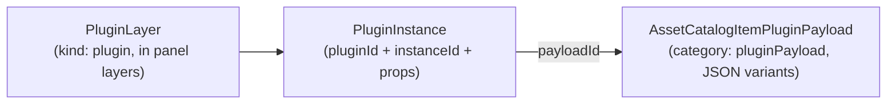

PanelWave is designed to be extended without breaking the format: **`x-` extension fields** carry tool-specific data, and the **plugin system** embeds interactive third-party content in panels.

## `x-` extension fields

Custom properties whose names start with `x-` are reserved for extensions. The root manifest schema declares:

```json
"patternProperties": { "^x-": {} }
```

so any `x-`-prefixed property with **any value** is valid at the **top level** of a manifest:

```json
{
  "panelwave": { "version": "1.1.0", "schema": "https://panelwave.org/schema/1.0/panelwave.schema.json" },
  "meta": { "id": "demo", "title": { "en-US": "Demo" }, "locales": ["en-US"], "default_locale": "en-US" },
  "chapters": [ { "id": "ch-1", "panels": { "p1": {} }, "graph": { "entry": "p1", "edges": [{ "from": "p1", "to": "p1" }] } } ],
  "x-studio-editor-state": { "collapsed": false },
  "x-acme-pipeline": { "buildId": "2026-07-01.3" }
}
```

<Callout kind="alert">
**Strict-validation caveat:** in schema 1.1, the `^x-` pattern is declared only on the **manifest root**. Most nested objects (`Meta`, `Panel`, `Layer` types, `Hotspot`, …) are closed with `additionalProperties: false` / `unevaluatedProperties: false`, so an `x-` field inside them fails strict AJV validation. If you need structured custom data deeper in the tree, use the places the schema leaves open — root-level `x-` fields, `PluginInstance.props`, plugin payload assets, or the open `ExtraBlock` object — rather than ad-hoc nested `x-` keys.
</Callout>

Naming convention: `x-` followed by a vendor/tool identifier, e.g. `x-panelwave-cms-…`, `x-mytool-…`. Consumers must ignore extension fields they do not understand.

## Plugin system

Plugins embed custom interactive content (mini-games, 3D viewers, quizzes…) into panels. Three schema types cooperate:



### `PluginInstance`

Defined as `$defs/PluginInstance`. Appears in `panels.<id>.plugins[]`, inside a `PluginLayer`, and in [variant overrides](/schema/variants).

| Property | Type | Required | Description |
|---|---|---|---|
| `pluginId` | `Identifier` | Yes | Which plugin to load. |
| `instanceId` | `Identifier` | Yes | Unique instance ID (a plugin can appear multiple times). |
| `payloadId` | `Identifier` | No | Asset catalog ID of a `pluginPayload` item holding the instance's data. |
| `props` | `JsonValue` | No | Arbitrary JSON configuration passed to the plugin. |
| `sandbox` | `"iframe"` \| `"worker"` | No | Requested sandboxing model. |
| `stateVariables` | string[] (unique) | No | Variable IDs the plugin may read/write; each must match the pattern `^plugin\.` (e.g. `plugin.quiz.score`). |

<Callout kind="tip">
Restricting plugins to the `plugin.` variable namespace keeps them from mutating story state they do not own. Wire plugin outcomes into the story with [variables](/schema/variables) and [conditional edges](/schema/graph).
</Callout>

Plugins can also receive events from [hotspots](/schema/hotspots) via the `pluginEvent` action (`pluginId`, `event`, optional `payload`).

### `PluginLayer`

Defined as `$defs/PluginLayer` — a panel layer hosting a plugin. It extends the shared layer base (`LayerCommon`: `id`, `z`, `opacity`, `visibleIf`, transform, … — see [Layers](/schema/layers)) with:

| Property | Type | Required | Description |
|---|---|---|---|
| `kind` | `"plugin"` | Yes | Layer discriminator. |
| `plugin` | `PluginInstance` | Yes | The plugin instance rendered by this layer. |

### `AssetCatalogItemPluginPayload`

Defined as `$defs/AssetCatalogItemPluginPayload` — an [asset catalog](/schema/assets) entry carrying plugin data as JSON. Like all catalog items it inherits `AssetCommon` (`id` required; optional `locale`, `alt`, `caption`, `transcript`, `durationMs`, `sha256`, `tags`) plus:

| Property | Type | Required | Description |
|---|---|---|---|
| `category` | `"pluginPayload"` | Yes | Catalog discriminator. |
| `variants` | `JsonVariant[]` (min 1) | Yes | Each variant: `{ "src": string, "mime": "application/json" }`. |

### `JsonValue`

Defined as `$defs/JsonValue` — "any JSON value": `null`, boolean, number, string, an array of `JsonValue`, or an object whose values are `JsonValue`. Used for `PluginInstance.props`, mutation values, hotspot `pluginEvent` payloads, and variable defaults.

## Example

A panel with a plugin layer whose data lives in the asset catalog:

```json
{
  "assets": {
    "catalog": [
      {
        "id": "payload-quiz-ch1",
        "category": "pluginPayload",
        "variants": [
          { "src": "https://cdn.example.com/plugins/quiz-ch1.json", "mime": "application/json" }
        ]
      }
    ]
  },
  "chapters": [
    {
      "id": "ch-1",
      "panels": {
        "p-quiz": {
          "layers": [
            { "kind": "image", "id": "ly-bg", "assetId": "img-classroom", "z": 0 },
            {
              "kind": "plugin",
              "id": "ly-quiz",
              "z": 1,
              "plugin": {
                "pluginId": "quiz",
                "instanceId": "quiz-ch1-1",
                "payloadId": "payload-quiz-ch1",
                "props": { "shuffle": true, "maxAttempts": 2 },
                "sandbox": "iframe",
                "stateVariables": ["plugin.quiz.score", "plugin.quiz.completed"]
              }
            }
          ]
        }
      },
      "graph": { "entry": "p-quiz", "edges": [{ "from": "p-quiz", "to": "p-quiz" }] }
    }
  ]
}
```

## Related pages

- [Layers](/schema/layers) — the layer union including `PluginLayer`
- [Assets](/schema/assets) — the full catalog item family
- [Player: Plugins](/player/plugins) — the runtime plugin API
