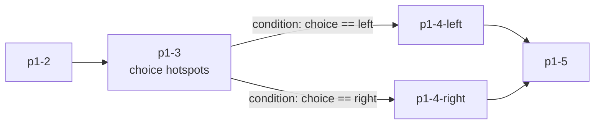

Every [chapter](/schema/chapters-and-pages) has a required `graph`: panels are **nodes**, and directed **edges** define how the reader moves between them. Edges can carry a [transition](/schema/manifest-structure#transition), a [JSON Logic](https://jsonlogic.com/) condition for branching, and variable mutations that run when the edge is taken. This is what turns a linear comic into an interactive one.



## `Graph`

| Property | Type | Required | Description |
|----------|------|:--:|-------------|
| `entry` | [`Identifier`](/schema/manifest-structure#identifier) \| `Identifier[]` (min 1, unique) | Yes | The panel where the chapter starts. An array declares multiple possible entry points |
| `edges` | `Edge[]` (min 1) | Yes | Directed connections between panels |
| `nodes` | object (ID → `{ label: LocalizedString }`) | — | Optional per-node metadata (display labels, e.g. for a chapter map) |

All panel references (`entry`, `from`, `to`) are keys of the chapter's `panels` map. A graph needs at least one edge — even a two-panel chapter connects them explicitly.

## `Edge`

| Property | Type | Required | Description |
|----------|------|:--:|-------------|
| `from` | `Identifier` | Yes | Source panel ID |
| `to` | `Identifier` | Yes | Target panel ID |
| `condition` | [`JsonLogic`](/schema/manifest-structure#jsonvalue-and-jsonlogic) | — | The edge is only eligible when this evaluates truthy against the current [variable](/schema/variables) state |
| `priority` | integer ≥ 0 | — | Ordering hint when multiple edges from the same panel are eligible |
| `transition` | [`Transition`](/schema/manifest-structure#transition) | — | Animation when traversing this edge; overrides the format preset's `defaultTransition` |
| `cameraMove` | [`CameraMove`](/schema/canvas#edgecameramove--trail-dynamics) | — | Camera travel when this edge is taken in [canvas view](/schema/canvas) (1.4+); inherits the format preset's `defaultCameraMove`. Coexists with `transition` (which still applies in panel view) |
| `action` | `Mutation[]` | — | Variable mutations executed when the edge is taken |
| `mutations` | `object[]` | — | **Editor metadata** — free-form edge descriptors written by the CMS (e.g. hotspot/edge-type markers). Not variable mutations |

<Callout kind="alert">
Naming gotcha: on an `Edge`, variable writes go in **`action`** (an array of typed `Mutation` objects). The `mutations` property on an edge is unvalidated editor metadata. Hotspot actions, by contrast, do use a property named `mutations` for variable writes — see [Hotspots](/schema/hotspots).
</Callout>

### Branching

A panel with several outgoing edges branches on their `condition`s. Typically a choice panel sets a variable via [hotspots](/schema/hotspots), and downstream edges route on it:

```json
{
  "graph": {
    "entry": "p1-1",
    "edges": [
      {
        "from": "p1-1",
        "to": "p1-2",
        "transition": { "type": "slide", "dir": "left", "durationMs": 350 }
      },
      {
        "from": "p1-2",
        "to": "p1-3-left",
        "condition": { "==": [ { "var": "path.choice" }, "left" ] },
        "priority": 1
      },
      {
        "from": "p1-2",
        "to": "p1-3-right",
        "condition": { "==": [ { "var": "path.choice" }, "right" ] },
        "priority": 1
      },
      {
        "from": "p1-2",
        "to": "p1-3-default",
        "priority": 0
      }
    ]
  }
}
```

An unconditional edge acts as the fallback when no conditional edge matches. How the player evaluates eligibility and order at runtime is described in [Graph Navigation](/concepts/graph-navigation) and [State & Conditions](/player/state-and-conditions).

## `Mutation`

A typed write to a [variable](/schema/variables), used in `Edge.action` and in hotspot `goTo`/`setVariables` actions:

| Property | Type | Required | Description |
|----------|------|:--:|-------------|
| `op` | string | Yes | `set` \| `increment` \| `toggle` \| `append` \| `remove` |
| `var` | string | Yes | Target variable ID, e.g. `"path.choice"` |
| `value` | [`JsonValue`](/schema/manifest-structure#jsonvalue-and-jsonlogic) | — | Operand — the value to set / increment by / append / remove |

```json
{
  "from": "p2-4",
  "to": "p2-5",
  "action": [
    { "op": "set", "var": "story.metCourier", "value": true },
    { "op": "increment", "var": "story.visits", "value": 1 }
  ]
}
```

| `op` | Effect |
|------|--------|
| `set` | Assign `value` to the variable |
| `increment` | Add `value` to a numeric variable |
| `toggle` | Flip a boolean variable |
| `append` | Add `value` to a list-valued variable |
| `remove` | Remove `value` from a list-valued variable |

<Callout kind="tip">
Mutations on `readOnly` variables are invalid at runtime (the schema cannot cross-check this). Keep decision state in `session` or `chapter` scope and preferences in `persistent` scope — see [Variables](/schema/variables).
</Callout>

## Node labels

`nodes` attaches display labels to panels without touching the panel definitions — useful for authoring tools and reader-facing chapter maps:

```json
{
  "graph": {
    "entry": "p1",
    "nodes": {
      "p1": { "label": { "en-US": "Opening", "de-DE": "Auftakt" } },
      "p9": { "label": { "en-US": "Good ending" } }
    },
    "edges": [ { "from": "p1", "to": "p9" } ]
  }
}
```

## Validation notes

- The schema does **not** verify that `entry`, `from`, and `to` reference existing panels, or that every panel is reachable — run graph checks in your pipeline (the CMS does this in [Validation](/cms/validation)).
- `condition` accepts any JSON shape; malformed JSON Logic only fails at runtime.
- Cycles are legal (loops, hubs, replayable scenes).
