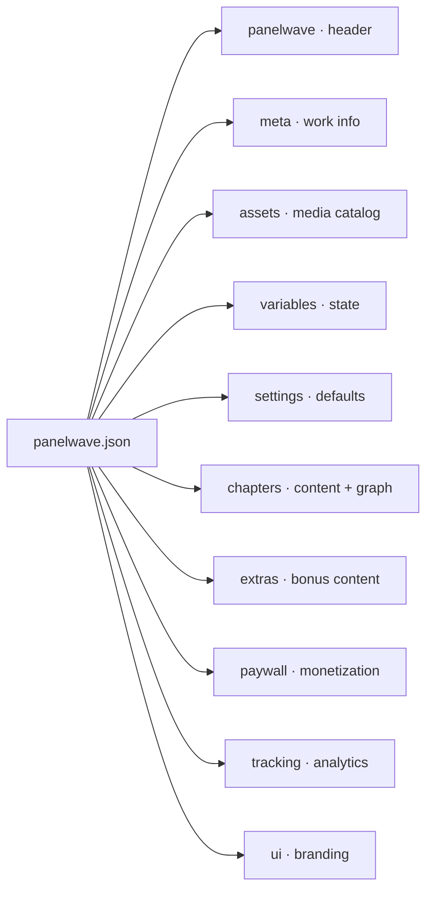

A PanelWave manifest is one JSON object. This page walks through its anatomy, shows the smallest valid manifest, defines the shared primitive types used throughout the schema, and explains how the sections reference each other.

## Top-level sections



`panelwave`, `meta`, and `chapters` are required; everything else is optional. The root object rejects unknown properties except `x-` prefixed [extension fields](/schema/extensions). See the [Overview](/schema/overview) for the full top-level table.

## A minimal valid manifest

The smallest useful manifest has a header, metadata, one asset, and one chapter with two panels connected by one edge (`graph.edges` requires at least one entry):

```json
{
  "panelwave": {
    "version": "1.3.0",
    "schema": "https://panelwave.org/schema/1.0/panelwave.schema.json"
  },
  "meta": {
    "id": "work-minimal",
    "title": { "en-US": "Minimal Example" },
    "locales": ["en-US"],
    "default_locale": "en-US"
  },
  "assets": {
    "catalog": [
      {
        "id": "img-p1",
        "category": "image",
        "alt": { "en-US": "Opening panel" },
        "variants": [
          { "src": "https://cdn.example.com/p1.jpg", "w": 1280, "h": 720, "mime": "image/jpeg" }
        ]
      },
      {
        "id": "img-p2",
        "category": "image",
        "alt": { "en-US": "Second panel" },
        "variants": [
          { "src": "https://cdn.example.com/p2.jpg", "w": 1280, "h": 720, "mime": "image/jpeg" }
        ]
      }
    ]
  },
  "chapters": [
    {
      "id": "ch-1",
      "title": { "en-US": "Chapter One" },
      "panels": {
        "p1": {
          "layers": [
            { "kind": "image", "id": "ly-p1-bg", "assetId": "img-p1", "z": 0 }
          ]
        },
        "p2": {
          "layers": [
            { "kind": "image", "id": "ly-p2-bg", "assetId": "img-p2", "z": 0 }
          ]
        }
      },
      "graph": {
        "entry": "p1",
        "edges": [
          { "from": "p1", "to": "p2", "transition": { "type": "slide", "dir": "left", "durationMs": 300 } }
        ]
      }
    }
  ]
}
```

Reading it top to bottom:

1. **`panelwave`** pins the format version and schema URI — see [Versioning](/schema/versioning).
2. **`meta`** identifies the work and declares its locales. `title` is a `LocalizedString`, not a plain string — see [Meta](/schema/meta).
3. **`assets.catalog`** registers every media file once, keyed by `id`, each with one or more `variants` — see [Assets](/schema/assets).
4. **`chapters[].panels`** is a **map** of panel ID → [Panel](/schema/panels). Panel IDs are the map keys (validated as `Identifier`s), and layers point at catalog entries via `assetId`.
5. **`chapters[].graph`** defines reading flow: an `entry` panel and directed `edges` between panel IDs — see [Graph](/schema/graph).

<Callout kind="tip">
Larger manifests add `pages` (print/page layouts), `variables` (branching state), `settings`, `extras`, `paywall`, `tracking`, and `ui`. Each has its own reference page.
</Callout>

## Shared primitives

These `$defs` are reused across the entire schema. Other reference pages link back here instead of repeating them.

### Identifier

Every ID in the manifest (works, chapters, panels, assets, characters, layers, …).

- Type: `string`, pattern `^[a-zA-Z0-9][a-zA-Z0-9._:-]*$`, length 1–200.
- Starts with a letter or digit; may contain `.`, `_`, `:`, `-`.
- IDs are **strings, never array indices** — references stay stable when arrays are reordered.

```json
"img-cover"        ✅
"ch-1"             ✅
"panel:alt.v2"     ✅
"-leading-dash"    ❌ (must start alphanumeric)
"has spaces"       ❌
```

### LocaleCode

BCP-47-like locale tag: pattern `^[A-Za-z]{2,8}(-[A-Za-z0-9]{2,8})*$`. Examples: `en-US`, `de-DE`, `ja`, `pt-BR`.

### LocalizedString

An object mapping locale codes to strings; at least one entry required, no non-locale keys allowed. Used for **all** user-facing text.

```json
{
  "en-US": "Night Shift",
  "de-DE": "Nachtschicht"
}
```

Consumers resolve the reader's locale against `meta.locales` with fallback to `meta.default_locale` — see [Localization](/concepts/localization).

### Uri, ColorHex, Timestamp

| Type | Definition | Example |
|------|-----------|---------|
| `Uri` | string with `format: "uri"` (absolute URI) | `https://cdn.example.com/a.jpg` |
| `ColorHex` | `^#([A-Fa-f0-9]{6}\|[A-Fa-f0-9]{3})$` | `#0055ff`, `#f00` |
| `Timestamp` | ISO 8601 `date-time` string | `2026-07-01T12:00:00Z` |

### NormalizedNumber, NormalizedPoint, NormalizedRect

Geometry is resolution-independent — coordinates are fractions of the containing box:

- **`NormalizedNumber`** — number in `[0, 1]`.
- **`NormalizedPoint`** — `[x, y]` tuple of two normalized numbers.
- **`NormalizedRect`** — `{ "x": 0.1, "y": 0.1, "w": 0.8, "h": 0.8 }`, all four required, all normalized. `x`/`y` is the top-left corner (0 = left/top edge, 1 = right/bottom edge).

Used for focus rects, clip rects, viewport animations, hotspot shapes, and bubble bounding boxes.

### JsonValue and JsonLogic

- **`JsonValue`** — any JSON value (null, boolean, number, string, array, object). Used for variable defaults, mutation values, and plugin props.
- **`JsonLogic`** — a [JSON Logic](https://jsonlogic.com/) expression. The schema accepts any JSON shape here (it is not strictly validated); evaluation happens at runtime against the variable state. Used by edge `condition`, layer/bubble/hotspot `visibleIf`, and panel variant `when`.

```json
{ "and": [ { ">=": [ { "var": "user.age" }, 16 ] }, { "==": [ { "var": "path.choice" }, "left" ] } ] }
```

### Transition

Animation between panels, used on edges, hotspot actions, page in/out, and format preset defaults:

| Property | Type | Constraints | Description |
|----------|------|-------------|-------------|
| `type` | string | `none`, `cut`, `fade`, `slide`, `zoom`, `push`, `cover` | Transition kind |
| `dir` | string | `left`, `right`, `up`, `down` | Direction (for directional types) |
| `durationMs` | integer | 0–60000 | Duration in milliseconds |
| `easing` | string | `linear`, `ease`, `ease-in`, `ease-out`, `ease-in-out` | Timing function |

### OutputFormat

Enum of target formats: `flex-landscape`, `mobile-portrait`, `bigscreen-landscape`, `a4-portrait`, `a4-landscape`, `us-portrait`, `us-landscape`, `video-16-9`, `square`, `desktop-landscape`, `tablet-portrait`. Used by page layouts, panel `formatViews`, and [settings output presets](/schema/settings).

## How the pieces reference each other

All cross-references are by `Identifier` string:

| Reference | Points to |
|-----------|-----------|
| Layer / audio track / video layer `assetId` | `assets.catalog[].id` |
| `meta.cover` | Catalog asset ID (preferred) or an absolute URI for static bundles |
| Speech bubble `characterId` | `meta.characters[].id` |
| `graph.entry`, edge `from` / `to`, hotspot `goTo.to` | Panel keys in the same chapter's `panels` map |
| `pages[].layout.placements[].panelId`, `pages[].readingOrder[]` | Panel keys in the same chapter's `panels` map |
| Panel `contentWarnings[]` | `meta.content_warnings[].id` |
| Panel `preloadHints[]` | Asset catalog IDs to prefetch |
| `paywall.rules[].refId` | Chapter, panel, or extras ID depending on rule `scope` |
| `extras.character_sheets[].characterId` | `meta.characters[].id` |
| Mutation / condition `var` | `variables.definitions[].id` |

<Callout kind="alert">
JSON Schema validation does **not** verify that these references resolve — a manifest with a dangling `assetId` is schema-valid but broken at runtime. Run reference checks in your pipeline; see [Validation](/schema/validation).
</Callout>

There is also a general-purpose **`AssetRef`** definition (plain ID, URI, or `{ "assetId", "variant", "locale" }` object) for pinning a specific variant or locale of an asset — see [Layers](/schema/layers#assetref) for details.
