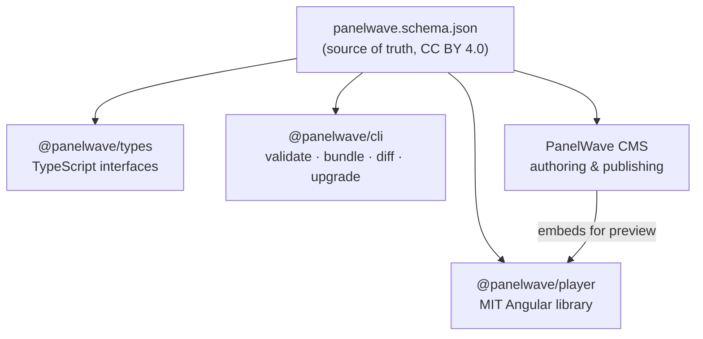

The **PanelWave manifest** is a single JSON document (`panelwave.json`) that describes an entire interactive graphic novel: its metadata, media assets, chapters, panels, layered artwork, speech bubbles, branching flow graph, variables, and monetization rules. The manifest is the contract between every tool in the PanelWave ecosystem — whatever reads or writes PanelWave content validates against the same schema.

## The schema at a glance

| | |
|---|---|
| **Schema draft** | [JSON Schema 2020-12](https://json-schema.org/draft/2020-12/schema) |
| **Schema `$id`** | `https://panelwave.org/schema/1.0/panelwave.schema.json` |
| **Current format version** | `1.3.0` (published in-place in the `1.0/` major-version directory) |
| **License** | [CC BY 4.0](https://creativecommons.org/licenses/by/4.0/) — free to share and adapt with attribution |
| **File** | `schema/1.0/panelwave.schema.json` |

<Callout kind="info">
The schema license covers the format definition itself. It does not restrict content you create in the PanelWave format (your work remains yours) or software that reads or writes manifests.
</Callout>

## Design goals

- **Human-readable and writable JSON.** You can author a manifest by hand; string IDs are used everywhere instead of array indices.
- **Graph-based storytelling.** Panels are nodes in a directed graph; edges carry transitions and [JSON Logic](https://jsonlogic.com/) conditions for branching narratives. See [Graph](/schema/graph).
- **Localization first.** All user-facing text is a `LocalizedString` keyed by BCP-47 locale; assets can be localized too. See [Manifest Structure](/schema/manifest-structure) for the shared primitives.
- **Multiple output formats.** One manifest targets web (portrait/landscape), print (A4/US), and video (16:9) via format presets and per-panel format views. See [Settings](/schema/settings).
- **Extensibility.** Custom properties prefixed with `x-` are allowed at the manifest root (and pattern-allowed throughout the format); a plugin system covers specialized content. See [Extensions](/schema/extensions).
- **Robustness.** Locale fallback chains, conditional content via variables, preload strategies, and memory budget hints support graceful degradation.
- **Monetization and accessibility built in.** Paywall rules, entitlements, age gates, alt texts, captions, and transcripts are part of the format, not bolted on.

## Top-level structure

A manifest is an object with three **required** and seven **optional** top-level properties. Unknown properties are rejected (`additionalProperties: false`), except custom ones matching `^x-`.

| Property | Type | Required | Description |
|----------|------|:--:|-------------|
| `panelwave` | `PanelwaveHeader` | Yes | Format version and schema URI. See [Versioning](/schema/versioning) |
| `meta` | `Meta` | Yes | Work metadata: title, creators, locales, characters. See [Meta](/schema/meta) |
| `chapters` | `Chapter[]` (min 1) | Yes | Chapters with panels, pages, and the flow graph. See [Chapters & Pages](/schema/chapters-and-pages) |
| `assets` | `Assets` | — | Asset catalog and base URLs. See [Assets](/schema/assets) |
| `variables` | `Variables` | — | Variable definitions for conditional logic. See [Variables](/schema/variables) |
| `settings` | `Settings` | — | Typography, UI defaults, preload, output presets. See [Settings](/schema/settings) |
| `extras` | `Extras` | — | Bonus content: covers, character sheets, art. See [Extras](/schema/extras) |
| `paywall` | `Paywall` | — | Entitlement and paywall rules. See [Paywall](/schema/paywall) |
| `tracking` | `Tracking` | — | Analytics events and consent configuration. See [Tracking](/schema/tracking) |
| `ui` | `UISettings` | — | Branding colors and reader control toggles. See [UI](/schema/ui) |

A minimal but complete annotated example lives in [Manifest Structure](/schema/manifest-structure).

## How the ecosystem consumes the schema

- **`@panelwave/types`** mirrors every schema `$defs` entry as a TypeScript interface (`PanelwaveManifest`, `Meta`, `Chapter`, `Panel`, `Layer`, …) with the same names used throughout this reference.
- **`@panelwave/cli`** validates manifests against the bundled schema (see [Validation](/schema/validation) and [CLI](/schema/cli)), bundles manifest directories, diffs two manifests, and upgrades older manifests.
- **The player** (`@panelwave/player`) renders a validated manifest in the browser. See [Player Overview](/player/overview).
- **The CMS** authors manifests visually and exports them; it embeds the open-source player for preview so rendering behavior is never duplicated. See [CMS Overview](/cms/overview).

<Callout kind="tip">
When the format evolves, the schema changes first — types, CLI, player, and CMS follow. If a tool and this reference ever disagree, the schema file is authoritative.
</Callout>

## Where to go next

<Columns cols={3}>
  <Card title="Manifest Structure" icon="file-json" href="/schema/manifest-structure">
    Full anatomy with an annotated minimal manifest and the shared primitives.
  </Card>
  <Card title="Validation" icon="check-circle" href="/schema/validation">
    Validate with AJV or the PanelWave CLI, and decode common errors.
  </Card>
  <Card title="Versioning" icon="git-branch" href="/schema/versioning">
    Format versions, compatibility rules, and the upgrade path.
  </Card>
</Columns>
