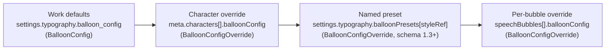

Speech bubbles carry dialogue, thoughts, and narration inside a panel. Each bubble is a `SpeechBubble` object in a panel's `speechBubbles` array. Bubbles are positioned with normalized coordinates, hold localized text, and are styled through a four-level **balloon configuration cascade** rendered by the player's ComicBalloon SVG engine (see [Balloon Renderer](/player/balloon-renderer)).

## `SpeechBubble`

Defined as `$defs/SpeechBubble`. Lives in `chapters[].panels.<panelId>.speechBubbles[]` (and in [variant overrides](/schema/variants)).

| Property | Type | Required | Description |
|---|---|---|---|
| `id` | `Identifier` | Yes | Unique bubble ID within the panel. |
| `text` | `LocalizedString` | Yes | Bubble text keyed by BCP-47 locale, e.g. `{ "en-US": "...", "de-DE": "..." }`. See [Localization](/concepts/localization). |
| `shape` | `BoundingBox` | Yes | Position and size of the bubble in normalized panel coordinates (0–1). |
| `characterId` | `Identifier` | No | Speaker; references a character in `meta.characters`. Pulls in that character's balloon overrides. |
| `audioAssetId` | `Identifier` | No | Voice-over audio asset for this bubble (asset catalog ID). |
| `styleRef` | `Identifier` | No | **Schema 1.3+.** Name of a reusable preset in [`settings.typography.balloonPresets`](/schema/settings#reusable-style-presets). Unknown names are ignored. |
| `balloonConfig` | `BalloonConfigOverride` | No | Per-bubble style overrides, merged last (onto the `styleRef` preset, character, or work-level defaults). |
| `visibleIf` | `JsonLogic` | No | **Story-logic** visibility condition, evaluated against [variables](/schema/variables). Do **not** use it to honor the reader's speech preference — that gating is implicit since schema 1.3 (see below). |
| `tail` | object | No | Editor-computed balloon tail geometry (tip/anchor points, width). Free-form. |
| `tailStyle` | string | No | Editor tail style preset (e.g. `"normal"`). |
| `textStyle` | object | No | Editor text styling (font, color, alignment, padding). Free-form. |
| `data` | object | No | Editor-computed shape geometry (e.g. ellipse `cx`/`cy`/`rx`/`ry`). Free-form. |
| `style` | object | No | Editor bubble style (font, colors, stroke). Free-form. |
| `locked` | boolean | No | Editor state: bubble locked from selection/edits. |
| `visible` | boolean | No | Editor state: bubble visibility toggle. |

<Callout kind="info">
The `tail`, `tailStyle`, `textStyle`, `data`, `style`, `locked`, and `visible` properties are **authoring aids** written by the CMS editor. Players should render bubbles from `shape` + the merged balloon configuration; runtime styling belongs in `balloonConfig`, not `style`.
</Callout>

### `BoundingBox`

Axis-aligned bounding box using normalized coordinates (0–1), relative to the panel.

| Property | Type | Required | Description |
|---|---|---|---|
| `x` | number (0–1) | Yes | Left edge (0 = left, 1 = right). |
| `y` | number (0–1) | Yes | Top edge (0 = top, 1 = bottom). |
| `w` | number (0–1) | Yes | Width as a fraction of the panel. |
| `h` | number (0–1) | Yes | Height as a fraction of the panel. |

<Callout kind="info">
The coordinates are **panel-relative**: `0/0` is the panel artwork's top-left corner, `1/1` its bottom-right. Players map the box onto the rendered panel container, so a bubble keeps its position on the artwork regardless of the device format. (The CMS editor serializes bubbles in exactly this space — a caption glued to the panel's top border has `y: 0` in every format.)

For **display**, the box acts as the position anchor: the reference player centers the balloon on the box center, keeps border-flush edges glued to the panel border, and sizes the balloon from its measured text at a per-screen reading scale — lettering stays comfortably readable on every screen instead of scaling with the panel.
</Callout>

<Callout kind="alert">
`BoundingBox` sets `additionalProperties: false` — a bubble `shape` must contain **only** `x`, `y`, `w`, `h`. A `type` property (as used by the hotspot `Shape` union) is not valid here.
</Callout>

## The implicit speech toggle

Since schema 1.3, **every speech bubble is inherently subject to the reader's global speech toggle**. The toggle's initial state comes from [`settings.ui.speechDefault`](/schema/settings#settingsui) (default: on), and the player ANDs it on top of any `visibleIf` — a bubble renders only when *both* the toggle is on *and* its `visibleIf` (if any) is truthy.

<Callout kind="alert">
Do **not** write `visibleIf: { "var": "prefs.speech" }` (or similar) on bubbles to honor the speech preference. That pre-1.3 boilerplate is obsolete — and it was a bug waiting to happen: forgetting it on a single bubble made that bubble immune to the toggle. `visibleIf` is reserved for actual story logic, like sample 09's clue bubbles that appear once `{ "var": "band.clue.vent" }` is set.
</Callout>

## The styling cascade

Balloon styling merges four levels, most specific wins:



1. **Work defaults** — a complete `BalloonConfig` at `settings.typography.balloon_config` (see [Settings](/schema/settings)). Anything unset falls back to the schema defaults below.
2. **Character override** — a partial `BalloonConfigOverride` on the character (`meta.characters[].balloonConfig`), merged onto the work defaults for every bubble spoken by that character.
3. **Named preset** (schema 1.3+) — the `BalloonConfigOverride` from `settings.typography.balloonPresets` that the bubble references via `styleRef`. Lets many bubbles share one editable definition instead of repeating identical overrides.
4. **Per-bubble override** — a partial `BalloonConfigOverride` on the bubble itself, merged last. With a preset in play this is only needed for true one-offs (e.g. a single whisper on top of a shared tail preset).

The merge is field-by-field, and the nested `tail` and `hideBorder` objects merge field-by-field too (a character can set `tail.curve` without losing the work-level `tail.length`). The player implements this in `mergeBalloonConfig`.

## `BalloonConfig`

Complete balloon styling configuration, used at the work level as defaults (`$defs/BalloonConfig`).

| Property | Type | Default | Description |
|---|---|---|---|
| `balloonType` | enum | `"normal"` | Visual type of the balloon shape — see the 10 types below. |
| `cornerRadius` | number (0–1) | `0.5` | Shape roundness (0 = rectangle, 1 = ellipse). |
| `maxWidth` | number (40–800) | `120` | Maximum balloon width in pixels (balloon auto-sizes to text). |
| `maxHeight` | number (30–600) | `80` | Maximum balloon height in pixels. |
| `fontFamily` | string | `"'Ames Italic', sans-serif"` | CSS font-family for balloon text. |
| `fontSize` | number (4–200) | `12` | Font size in pixels. |
| `strokeWidth` | number (0–20) | `2` | Balloon border stroke width in pixels. |
| `strokeColor` | hex color | `"#000000"` | Balloon border stroke color. |
| `fillColor` | hex color | `"#ffffff"` | Balloon fill/background color. |
| `tail` | `TailConfig` | — | Tail (pointer from balloon toward the speaker). |
| `hideBorder` | `HideBorderConfig` | — | Border-hiding segment for layered balloon effects. |

### The 10 balloon types

`balloonType` accepts exactly these enum values:

| Type | Rendering |
|---|---|
| `normal` | Standard balloon; roundness controlled by `cornerRadius`. |
| `rectangle` | Rectangular balloon (corner radius forced to 0, keeping a subtle 8&nbsp;px rounding). |
| `narrator` | True sharp-cornered rectangle for narration caption boxes — unlike `rectangle`, the corners have **no** rounding at all. Additive extension, mid-1.3. |
| `cutTop` | Balloon with a cut/flattened top edge. |
| `cutTopRight` | Cut top with the cut biased to the right. |
| `cutTopLeft` | Cut top with the cut biased to the left. |
| `thought` | Cloud shape with a bumpy outline; the tail is rendered as a trail of small ellipses. |
| `shout` | Jagged/burst edges (spiked outline) for shouting. |
| `whisper` | Standard shape with a dashed border. |
| `connector` | Open-tailed balloon used to connect/chain balloons. |

## `BalloonConfigOverride`

Partial styling for character-level or bubble-level overrides (`$defs/BalloonConfigOverride`). It has the **same fields as `BalloonConfig`, all optional and without defaults** — only fields you specify override the parent level. Its nested `tail` and `hideBorder` objects are likewise partial:

- `tail` override fields: `enabled`, `position`, `length`, `curve`, `curveAmount`
- `hideBorder` override fields: `enabled`, `angle`, `arc`

## `TailConfig`

The balloon tail — the pointer from the balloon toward the speaker (`$defs/TailConfig`).

| Property | Type | Default | Description |
|---|---|---|---|
| `enabled` | boolean | `true` | Whether the tail is visible. |
| `position` | number (0–359) | `180` | Tail direction in degrees (compass: 0 = top, 90 = right, 180 = bottom, 270 = left). |
| `length` | number (0–500) | `45` | Tail length in pixels. |
| `curve` | `"straight"` \| `"left"` \| `"right"` | `"straight"` | Tail curve direction. |
| `curveAmount` | number (0–1) | `0.4` | Curve intensity (0 = straight, 1 = maximum curve). |

## `HideBorderConfig`

Hides a segment of the balloon border, useful when stacking balloons so they appear joined (`$defs/HideBorderConfig`).

| Property | Type | Default | Description |
|---|---|---|---|
| `enabled` | boolean | `false` | Whether border hiding is active. |
| `angle` | number (0–359) | `0` | Center angle of the hidden border segment in degrees (compass: 0 = top). |
| `arc` | number (10–180) | `60` | Width of the hidden segment in degrees. |

## Example

A work-level default, a named preset, a character override, and a bubble combining all of them:

```json
{
  "settings": {
    "typography": {
      "balloon_config": {
        "balloonType": "normal",
        "cornerRadius": 0.5,
        "fontFamily": "'Ames Italic', sans-serif",
        "fontSize": 12,
        "strokeWidth": 2,
        "strokeColor": "#000000",
        "fillColor": "#ffffff",
        "tail": { "enabled": true, "position": 180, "length": 45 }
      },
      "balloonPresets": {
        "speech-down-right": { "tail": { "position": 150, "length": 50 } }
      }
    }
  },
  "meta": {
    "id": "work-demo",
    "title": { "en-US": "Demo" },
    "locales": ["en-US", "de-DE"],
    "default_locale": "en-US",
    "characters": [
      {
        "id": "char-villain",
        "name": { "en-US": "The Villain" },
        "balloonConfig": {
          "balloonType": "shout",
          "fillColor": "#ffe0e0",
          "tail": { "curve": "right", "curveAmount": 0.6 }
        }
      }
    ]
  },
  "chapters": [
    {
      "id": "ch-1",
      "panels": {
        "p1": {
          "speechBubbles": [
            {
              "id": "sb-1",
              "characterId": "char-villain",
              "text": {
                "en-US": "You will never escape!",
                "de-DE": "Du wirst niemals entkommen!"
              },
              "shape": { "x": 0.55, "y": 0.1, "w": 0.35, "h": 0.2 },
              "styleRef": "speech-down-right",
              "balloonConfig": { "fontSize": 16 }
            }
          ]
        }
      },
      "graph": { "entry": "p1", "edges": [{ "from": "p1", "to": "p1" }] }
    }
  ],
  "panelwave": {
    "version": "1.3.0",
    "schema": "https://panelwave.org/schema/1.0/panelwave.schema.json"
  }
}
```

The bubble renders as a shout balloon (character), light red (character), 16 px text (bubble), with the preset's tail direction/length on top of the character's right curve — and it disappears automatically whenever the reader turns speech off. No `visibleIf` needed for that.

## Related pages

- [Panels](/schema/panels) — where `speechBubbles` lives
- [Settings](/schema/settings) — `settings.typography.balloon_config`
- [Meta](/schema/meta) — characters and their `balloonConfig`
- [Player balloon renderer](/player/balloon-renderer) — how the SVG engine draws each type
